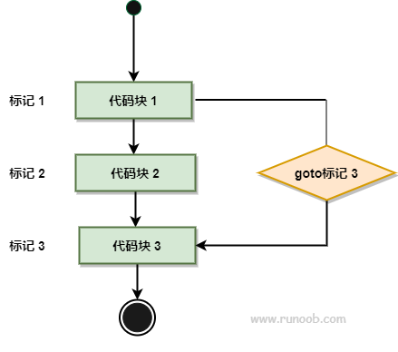

# 1 Hello Word

```go
package main

//package + 包名
import "fmt"

//导入一个包
func main() {
	//定义一个函数
	fmt.Println("Hello Word")
}

```

# 2 基本组成元素

## 2.1 标识符

+ 标识符是编程时所使用的名字，用于给变量、常量、函数、类型、接口、包名等进行命名，以建立名称和使用之间的关系。

+ Go语言标识符的命名规则

  + > 只能由非空字母(Unicode)、数字、下划线(_)组成
    >
    > 只能以字母或下划线开
    >
    > 能Go语言关键字
    >
    > 避免使用Go语言预定义标识符
    >
    > 建议使用驼峰式
    >
    > 标识符区分大小写

+ Go语言提供一些预先定义的标识符用来表示内置的常量、类型、函数。
+ 在自定义标识符时应避免使用：
  + 内置常量：true、false、nil、iota
  + 内置类型：bool、byte、rune、int、int8、int16、int32、int64、uint、uint8、unit16、unit32、unit64、uintptr、float32、float64、complex64、complex128、string、error
  + 内置函数：make、len、cap、new、append、copy、close、delete、complex、real、imag、panic、recover
  + 空白标识符:_

## 2.2 关键字

+ 关键字用于特定的语法结构
+ Go语言定义25关键字：
  + 声明：import、package
  + 实体声明和定义：char、const、func、interface、map、struct、type、var
  + 流程控制：break、case、continue、default、defer、else、fallthrough、for、go、goto、if、range、return、select、switch

## 2.3 字面量

+ 字面量是值的表示方法，常用与对变量/常量进行初始化。
+ 主要分为：
  + 标识基础数据类型值的字面量，例如：0, 1.1, true, 3 + 4i, 'a', "我爱中国"
  + 构造自定义的复合数据类型的类型字面量，例如：type Interval int
  + 用于表示符合数据类型值的复合字面量，用来构造array、slice、map、struct的值，例如：{1, 2, 3}

## 2.4 操作符

+ 算术运算符：+、-、*、/、%、++、--
+ 关系运算符：>、>=、<、<=、==、!=
+ 逻辑运算符：&&、||、!
+ 位运算符：&、|、^、<<、>>、&^
+ 赋值运算符：=、+=、-=、*=、/=、%=、&=、|=、^=、<<=、>>=
+ 其他运算符：&(单目)、*(单目)、.(点)、-(单目)、…、<-

## 2.5 分隔符

+ 小括号(), 中括号[]，大括号()，分号;，逗号,

# 3 基础知识点

## 3.1 变量

### 3.1.1 声明变量

+ 变量是指对一块存储空间定义名称，通过名称对存储空间的内容进行访问或修改，使用var进行变
  量声明，常用的语法为:

> 1. var 变量名 变量类型 = 值
>
> + 定义变量并进行初始化，例如：var name string = "silence"
>
> 2. var 变量名 变量类型
>
> + 定义变量使用零值进行初始化，例如：var age int
>
> 3. var 变量名 = 值
>
> + 定义变量，变量类型通过值类型进行推导 例如： var isBoy = true
>
> 4. var 变量名1, 变量名2 , …, 变量名n 变量类型
>
> + 定义多个相同类型的变量并使用零值进行初始化 例如：var prefix, suffix string
>
> 5. var变量名1, 变量名2 , …, 变量名n 变量类型 = 值1, 值2, …, 值n
>
> + 定义多个相同类型的变量并使用对应的值进行初始化，例如：var prev, next int = 3, 4
>
> 6. var变量名1, 变量名2 , …, 变量名n = 值1, 值2, …, 值n
>
> + 定义多个变量并使用对应的值进行初始化，变量的类型使用值类型进行推导，类型可不相同，
> + 例如：var name, age = "silence", 30

#### 3.1.1.1 在函数内定义变量

```go
package main

import "fmt"

func main() {
	//定义变量
	/*
		变量名称需要满足标识符命名规则
		1. 必须由非空的Unicode字符串组成、数字、_
		2. 不能以数字开头
		3. 不能是go的关键字
		4. 避免和go预定义的标识符冲突
		5. 建议使用驼峰命名法
		6. 标识符区分大小写
	*/
	var me string
	me = "小明"
	fmt.Println(me)
}
```

#### 3.1.1.2 定义全局变量

+ 全局变量可以定义后不使用

```go
package main

import "fmt"

//定义全局变量并赋值
var version string = "cdc"

func main() {
	//全局变量可以定义后不使用
	//fmt.Println(version)
}
```

#### 3.1.1.3 定义多个变量

```go
package main

import "fmt"

func main() {
   //定义多个变量
   var name, user string = "1", "2"
   fmt.Println(name, user)
   //定义多个类型不同的变量
   var (
      age    int
      height float64
   )
   fmt.Println(age, height)
   //声明多个变量同时赋值
   var (
      age1    int     = 1
      height1 float64 = 1.77
   )
   fmt.Println(age1, height1)
}
```

#### 3.1.1.4 自动推导变量类型

```go
package main

import (
   "fmt"
)

func main() {
   //自动推导变量类型
   var a = 1
   var b = 2
   //自动推导多个变量类型
   var c, d = 3, 4
   fmt.Println(a, b)
   fmt.Println(c, d)
}
```

#### 3.1.1.5 简短声明

+ 简短声明只能在函数内使用
+ 变量只能声明一次 

```go
package main

import (
   "fmt"
)

func main() {
   //简短声明,只能在函数内部使用
   isBoy := true
   fmt.Println(isBoy)
}
```

### 3.1.2 变量重新赋值

```go
package main

import (
   "fmt"
)

func main() {
   //自动推导多个变量类型
   var c, d = 3, 4
   fmt.Println(c, d)
   //简短声明,只能在函数内部使用
   isBoy := true
   fmt.Println(isBoy)
   isBoy, c, d = false, 5, 6
   fmt.Println(isBoy, c, d)
   //交换变量的值
   c, d = d, c
   fmt.Println(c, d)
}   
```

## 3.2 常量


### 3.2.1 声明常量

```go
package main

import "fmt"
 
func main() {
   //声明常量
   const NAME string = "kk"
   fmt.Println(NAME)
}
```

#### 3.2.1.1 声明常量省略类型

```
package main

import "fmt"

func main() {
   //声明常量
   const NAME string = "kk"
   fmt.Println(NAME)
   //声明常量（省略类型）
   const C1 = 1
   fmt.Println(C1)
}
```

#### 3.2.1.2 声明多个不同类型常量

```go
package main

import "fmt"

func main() {
	//声明多个类型不同的变量
	const (
		C4 int32   = 1
		C5 float64 = 1.8
	)
	fmt.Println(C4)
	fmt.Println(C5)
}

```

#### 3.2.1.3 声明多个类型相同的常量

```go
package main

import "fmt"

func main() {
	//声明多个类型相同的常量
	const C2, C3 int = 2, 3
    fmt.Println(C2)
	fmt.Println(C3)
}

```

### 3.2.2 枚举

```go
package main

import "fmt"

func main() {
	//批量声明相同值常量
	const (
		C6 int = 9
		C7
		C8
	)
	fmt.Println(C6)
	fmt.Println(C7)
	fmt.Println(C8)
	//枚举
	const (
		E1 int = iota
		E2
		E3 = 4
		E4
	)
	fmt.Println(E1, E2, E3, E4)
	//右侧可以是表达式
	const (
		E5 int = iota + 10
		E6
		E7
	)
	fmt.Println(E5, E6, E7)
}

```

**运行结果**

```
9
9
9
0 1 4 4
10 11 12
```


## 3.3 作用域

+ 作用域用于定义标识符作用范围

```go
package main

import (
	"fmt"
)

func main() {
	/*	作用域：定义标识符可以使用的范围
		在GO中用{}来定义作用域范围
		使用原则：子语句块可以使用父语句块中的标识符*/
	outer := 1
	{
		inner := 2
		fmt.Println(outer)
		fmt.Println(inner)
		//已存在的变量可以在语句块中重新定义，会重新赋值
		outer = 10
		{
			inner2 := 3
			fmt.Println(outer, inner, inner2)
		}
	}
}
```

**运行结果**

```
1
2
10 2 3
```

## 3.4 占位符

### 3.4.1 定义示例类型和变量

type Human struct {
 Name string
 }
 var people = Human{Name:"zhangsan"}

### 3.4.2 普通占位符

| 占位符 |              说明              |         举例          |            输出             |
| :----- | :----------------------------: | :-------------------: | :-------------------------: |
| %v     |       相应值的默认格式。       | Printf("%v", people)  |         {zhangsan}          |
| %+v    |   打印结构体时，会添加字段名   | Printf("%+v", people) |       {Name:zhangsan}       |
| %#v    |       相应值的Go语法表示       | Printf("#v", people)  | main.Human{Name:"zhangsan"} |
| %T     |    相应值的类型的Go语法表示    | Printf("%T", people)  |         main.Human          |
| %%     | 字面上的百分号，并非值的占位符 |     Printf("%%")      |              %              |

### 3.4.3 布尔占位符

| 占位符 |     说明      |        举例        | 输出 |
| :----- | :-----------: | :----------------: | :--: |
| %t     | true 或 false | Printf("%t", true) | true |

### 3.4.4 整数占位符

| 占位符 |                    说明                    |         举例         |  输出  |
| :----- | :----------------------------------------: | :------------------: | :----: |
| %b     |                 二进制表示                 |   Printf("%b", 5)    |  101   |
| %c     |        相应Unicode码点所表示的字符         | Printf("%c", 0x4E2D) |   中   |
| %d     |                 十进制表示                 |  Printf("%d", 0x12)  |   18   |
| %o     |                 八进制表示                 |   Printf("%d", 10)   |   12   |
| %q     | 单引号围绕的字符字面值，由Go语法安全地转义 | Printf("%q", 0x4E2D) |  '中'  |
| %x     |      十六进制表示，字母形式为小写 a-f      |   Printf("%x", 13)   |   d    |
| %X     |      十六进制表示，字母形式为大写 A-F      |   Printf("%x", 13)   |   D    |
| %U     |    Unicode格式：U+1234，等同于 "U+%04X"    | Printf("%U", 0x4E2D) | U+4E2D |

### 3.4.5 浮点数和复数的组成部分（实部和虚部）

| 占位符 |                             说明                             |          举例          |     输出     |
| :----- | :----------------------------------------------------------: | :--------------------: | :----------: |
| %b     | 无小数部分的，指数为二的幂的科学计数法， 与 strconv.FormatFloat 的 'b' 转换格式一致。例如 -123456p-78 |                        |              |
| %e     |                科学计数法，例如 -1234.456e+78                |   Printf("%e", 10.2)   | 1.020000e+01 |
| %E     |                科学计数法，例如 -1234.456E+78                |   Printf("%e", 10.2)   | 1.020000E+01 |
| %f     |                有小数点而无指数，例如 123.456                |   Printf("%f", 10.2)   |  10.200000   |
| %g     |    根据情况选择 %e 或 %f 以产生更紧凑的（无末尾的0）输出     |  Printf("%g", 10.20)   |     10.2     |
| %G     |    根据情况选择 %E 或 %f 以产生更紧凑的（无末尾的0）输出     | Printf("%G", 10.20+2i) |  (10.2+2i)   |

### 3.4.6 字符串与字节切片

| 占位符 |                  说明                  |              举例              |     输出     |
| :----- | :------------------------------------: | :----------------------------: | :----------: |
| %s     |  输出字符串表示（string类型或[]byte)   | Printf("%s", []byte("Go语言")) |    Go语言    |
| %q     | 双引号围绕的字符串，由Go语法安全地转义 |     Printf("%q", "Go语言")     |   "Go语言"   |
| %x     |   十六进制，小写字母，每字节两个字符   |     Printf("%x", "golang")     | 676f6c616e67 |
| %X     |   十六进制，大写字母，每字节两个字符   |     Printf("%X", "golang")     | 676F6C616E67 |

### 3.4.7 指针

| 占位符 |         说明          |         举例          |   输出   |
| :----- | :-------------------: | :-------------------: | :------: |
| %p     | 十六进制表示，前缀 0x | Printf("%p", &people) | 0x4f57f0 |

### 3.4.8 其它标记

| 占位符 |                             说明                             |         举例          |      输出      |
| :----- | :----------------------------------------------------------: | :-------------------: | :------------: |
| +      | 总打印数值的正负号；对于%q（%+q）保证只输出ASCII编码的字符。 | Printf("%+q", "中文") | "\u4e2d\u6587" |
| -      |            在右侧而非左侧填充空格（左对齐该区域）            |                       |                |
| #      | 备用格式：为八进制添加前导 0（%#o）  为十六进制添加前导 0x（%#x）或 0X（%#X），为 %p（%#p）去掉前导 0x；       如果可能的话，%q（%#q）会打印原始 （即反引号围绕的）字符串；  如果是可打印字符，%U（%#U）会写出该字符的       Unicode 编码形式（如字符 x 会被打印成 U+0078 'x'）。 |  Printf("%#U", '中')  |     U+4E2D     |
| ' '    | (空格)为数值中省略的正负号留出空白（% d）；   以十六进制（% x, % X）打印字符串或切片时，在字节之间用空格隔开 |                       |                |
| 0      |   填充前导的0而非空格；对于数字，这会将填充移到正负号之后    |                       |                |

### 3.4.9 其他

+ golang没有 '%u' 点位符，若整数为无符号类型，默认就会被打印成无符号的。

+ 宽度与精度的控制格式以Unicode码点为单位。宽度为该数值占用区域的最小宽度；精度为小数点之后的位数。操作数的类型为int时，宽度与精度都可用字符 '*' 表示。

+ 对于 %g/%G 而言，精度为所有数字的总数，例如：123.45，%.4g 会打印123.5，（而 %6.2f 会打印123.45）。%e 和 %f 的默认精度为6

+ 对大多数的数值类型而言，宽度为输出的最小字符数，如果必要的话会为已格式化的形式填充空格。而以字符串类型，精度为输出的最大字符数，如果必要的话会直接截断。

## 3.5 基本数据类型

### 3.5.1 布尔类型

#### 3.5.1.1 布尔类型概念

+ 布尔类型用于表示真假
+ 类型名为bool
+ 只有两个值true和false
+ 占用一个字节宽度
+ 零值为false

```go
package main

import "fmt"

func main() {
   //布尔类型，表示真假
   //标识符bool
   //可选值true.false
   var zero bool
   isBoy := true
   isGirl := false
   fmt.Println(zero, isBoy, isGirl)
}
```

#### 3.5.1.2 布尔类型操作

##### 3.5.1.2.1 逻辑运算

- 与 &&， 或 || ，非 ！

+ **（&& 与）真值表**

| X     | y     | 返回  |
| ----- | ----- | ----- |
| TRUE  | TRUE  | TRUE  |
| TRUE  | FALSE | FALSE |
| FALSE | TRUE  | FALSE |
| FALSE | FALSE | FALSE |

+ **（|| 或）真值表**

| X     | Y     | 返回  |
| ----- | ----- | ----- |
| TRUE  | TRUE  | TRUE  |
| TRUE  | FALSE | TRUE  |
| FALSE | TRUE  | TRUE  |
| FALSE | FALSE | FALSE |

+ **（!非）真值表**

| 非   | X     | 返回  |
| ---- | ----- | ----- |
| !    | TRUE  | FALSE |
| !    | FALSE | TRUE  |

##### 3.5.1.2.2 关系运算(==、!=)

```
	isBoy := true
	isGirl := false
	fmt.Println(isBoy == isGirl)
	fmt.Println(isBoy != isGirl)
```

### 3.5.2 数值类型

+ 整型： 

+ Go语言提供了5种有符号、5种无符号、1种指针、1种单字节、1种单个unicode字符（unicode码点），共13种整数类型,零值均为0.
  <font color='red'>int, uint, rune, int8, int16, int32, int64, uint8, uint16, uint32, uint64, byte, uintptr</font>

#### 3.5.2.1 int类型

##### 3.5.2.1.1 定义int类型:

```go
package main

import "fmt"

func main() {
	var age int = 21
	fmt.Printf("%T, %d", age, age)
}
```

运行结果：

```
int, 21
```

##### 3.5.2.1.2 字面量:

+ 十进制， 八进制（如0777），十六进制（0x1234）

```go
package main

import "fmt"

func main() {
   var age int = 21
   fmt.Printf("%T, %d\n", age, age)
   fmt.Println(0x777)
   fmt.Println(0777)
}
```

运行结果：

```
1911
511
```

##### 3.5.2.1.3 操作

###### 3.5.2.1.3.1 算数运算(+, -, *, %， ++, --)

```go
package main

import "fmt"

func main() {
   //操作
   //算数运算(+, -, *, %)
   fmt.Println(1 + 2)
   fmt.Println(2 - 2)
   fmt.Println(2 * 2)
   fmt.Println(9 % 2)
   //自增(++)，自减(--)
	a := 1
	a++
	fmt.Println(a)
	a--
	fmt.Println(a)
}
```

运行结果：

```
3
0
4
1
1
2
1
```

###### 3.5.2.1.3.2 关系运算

```go
package main

import "fmt"

func main() {
   //关系运算(<,<=,>,>=,==,!=)
   fmt.Println(2 > 3)
   fmt.Println(2 < 3)
   fmt.Println(2 <= 3)
   fmt.Println(2 >= 3)
   fmt.Println(2 != 3)
   fmt.Println(2 == 3)
}
```

运行结果：

```
false
true
true
false
true
false
```

###### 3.5.2.1.3.3 位运算

```text
&       位运算 AND  
|       位运算 OR  
^       位运算 XOR  
&^      位运算 (AND NOT)
<<      左移
>>      右移    
```

+ **&(AND)**

& 运算：相同位的两个数字都为1，则为1；若有一个不为1，则为0。

```text
0000 0100   4
0000 0110   6
---------
0000 0100   4
```

+ **|(OR)**

| 运算：相同位只要一个为1即为1。

```text
0000 0100   4
0000 0110   6
---------
0000 0110   6
```

+ **^(XOR)**

作为二元运算：相同位不同则为1，相同则为0。

```text
0000 0100   4
0000 0110   6
---------
0000 0010   2
```

作为一元运算：按位取反。
涉及知识点，参考：[博文](https://blog.csdn.net/xiexievv/article/details/8124108)

```text
所有正整数的按位取反是其本身+1的负数
所有负整数的按位取反是其本身+1的绝对值
零的按位取反是 -1

0000 0100   4 原码
0000 0100   4 补码
1111 1011   4的补码取反记为 x
1111 1010   x-1 得到反码记为 y
1111 0101   y 取反得到源码，此为最终结果 -5
```

+ **&^(AND NOT)**

&^ 运算：位清空运算，和被运算变量位置有关系。计算x&^y 如果ybit位上的数是0则取x上对应位置的值， 如果ybit位上为1则取结果位上取0

```text
0000 0100   4 记为 x
0000 0110   6 记为 y
---------
0000 0000   0
```

+ **<< 和 >>**

<< 运算：a << b就表示把a转为二进制后左移b位（在后面添b个0）。
\>> 运算：a >> b表示二进制右移b位（去掉末b位），相当于a除以2的b次方（取整）。

```text
0000 0100   4
0000 1000   4 << 1 = 8
0001 0000   4 << 2 = 16

0000 0110   6
0000 0011   6 >> 1 = 3
0000 0001   6 >> 2 = 1
```

###### 3.5.2.1.3.4 赋值运算符

| 运算符 | 描述                                           | 实例                                  |
| :----- | :--------------------------------------------- | :------------------------------------ |
| =      | 简单的赋值运算符，将一个表达式的值赋给一个左值 | C = A + B 将 A + B 表达式结果赋值给 C |
| +=     | 相加后再赋值                                   | C += A 等于 C = C + A                 |
| -=     | 相减后再赋值                                   | C -= A 等于 C = C - A                 |
| *=     | 相乘后再赋值                                   | C *= A 等于 C = C * A                 |
| /=     | 相除后再赋值                                   | C /= A 等于 C = C / A                 |
| %=     | 求余后再赋值                                   | C %= A 等于 C = C % A                 |
| <<=    | 左移后赋值                                     | C <<= 2 等于 C = C << 2               |
| >>=    | 右移后赋值                                     | C >>= 2 等于 C = C >> 2               |
| &=     | 按位与后赋值                                   | C &= 2 等于 C = C & 2                 |
| ^=     | 按位异或后赋值                                 | C ^= 2 等于 C = C ^ 2                 |
| \|=    | 按位或后赋值                                   | C \|= 2 等于 C = C \| 2               |

```go
package main

import "fmt"

func main() {
   //赋值运算符(= ,+= ,-= ,*= ,/= ,%=  ,<<=  ,>>= ,&= ,^= ,|= )
   a = 1
   a += 1
   fmt.Println(a)
}
```

### 3.5.3 浮点数

#### 3.5.3.1 定义float类型变量

```go
package main

import "fmt"

func main() {
   //float32，float64
   //定义float64类型变量
   var height float64 = 1.68
   fmt.Printf("%T, %f\n", height, height)
   //字面量 ：十进制碧松暗示法 科学记数法表示法
   var weight float64 = 13.05e1
   fmt.Println(weight)
}
```

运行结果

```
float64, 1.680000
130.5
```

#### 3.5.3.2 float类型操作

##### 3.5.3.2.1 算数运算

```go
package main

import "fmt"

func main() {
   //float32，float64
   //定义float64类型变量
   var height float64 = 1.68

   //操作(float类型在存储时，会存在精度损耗)
   //算术运算(+, -, *, /, ++, --)
   fmt.Println(1.1 - 1.2)
   fmt.Println(1.1 + 1.2)
   fmt.Println(1.1 * 1.2)
   fmt.Println(1.1 / 1.2)
   height++
   fmt.Println(height)
   height--
   fmt.Println(height)
}
```

##### 3.5.3.2.2 关系运算

+ 关系运算（> >= < <=）
+ float类型因为有精度损耗，一般不比较是否相等，只进行比较两个小数是否约等于

```go
package main

import "fmt"

func main() {
   //关系运算(> >= < <=)
   fmt.Println(1.1 > 1.2)
   fmt.Println(1.1 >= 1.2)
   fmt.Println(1.1 < 1.2)
   fmt.Println(1.1 <= 1.2)
}
```

运行结果

```
false
false
true
true
```

##### 3.5.3.2.3 赋值运算

```go
package main

import "fmt"

func main() {
   //float32，float64
   //定义float64类型变量
   var height float64 = 1.68
   //赋值运算(=, +=, -=, /=, *=)
   height += 0.5
   fmt.Println(height)

   fmt.Printf("%T, %T\n", 1.1, float32(1.1))

   fmt.Printf("%5.2f\n", height)
}
```

运行结果

```
2.1799999999999997
float64, float32
2.180
```

### 3.5.3 字符串类型

#### 3.5.3.1 字面量

```go
package main

import "fmt"

func main() {
   //"" -> 可解释的字符串
   //`` ->原生字符串
   //特殊字符 \n \r \n \t \f \b \v
   var name string = "a\tb"
   var desc string = `我来\t自中国`
   fmt.Println(name)
   fmt.Println(desc)
}
```

运行结果：

```
a       b
我来\t自中国 
```

#### 3.5.3.2 字符串的操作

###### 3.5.3.2.1 算术运算符

```go
package main

import "fmt"

func main() {
   //操作
   //算术运算符: + (连接)
   fmt.Println("我叫" + "小明")
}
```

运行结果：

```
我叫小明
```

##### 3.5.3.2.2 关系运算

```
package main

import "fmt"

func main() {
   //关系运算 (== != > >= < <=)
   fmt.Println("ab" == "bb")
   fmt.Println("ab" != "bb")
   fmt.Println("ab" < "bb")
   fmt.Println("ab" <= "bb")
   fmt.Println("ab" > "bb")
   fmt.Println("ab" >= "bb")
}
```

运行结果

```
false
true
true
true
false
false
```

##### 3.5.3.2.3 赋值运算

```
package main

import "fmt"

func main() {
   //赋值
   s := "我叫"
   s += "小明"
   fmt.Println(s)
}
```

运行结果

```
我叫小明
```

3.5.3.2.4 索引和切片

```go
package main

import "fmt"

func main() {
   //字符串定义的内容必须是ASCII码
   //索引 0 - n-1 (n 代表字符串的长度)
   desc = "abcdef"
   fmt.Printf("T %c\n", desc[0], desc[0])
   //切片[start:end] start end-1
   fmt.Printf("%T %s\n", desc[0:2], desc[0:2])
   //获取字符串长度
   fmt.Println(len(desc))
}
```

运行结果

```
T a
%!(EXTRA uint8=97)string ab
6
```

## 3.6 类型转换

+ 在go中没有自动类型转换，只有强制类型转换

```go
package main

import "fmt"

func main() {
   //类型转换
   //在go中没有自动类型转换，只有强制类型转换
   var intA int = 10
   var intB uint = 3
   fmt.Println(intA + int(intB))
   fmt.Println(uint(intA) + intB)
   //大 -> 小 转换可能出现溢出
   var intC int = 0XFFFF
   fmt.Println(intC, uint8(intC), int8(intC))
}
```

运行结果

```go
13
13
65535 255 -1
```

## 3.7 指针

Go 语言的取地址符是 &，放到一个变量前使用就会返回相应变量的内存地址。

### 3.7.1 访问指针

```go
package main

import "fmt"

func main() {
   var a int = 10  

   fmt.Printf("变量的地址: %x\n", &a  )
}
```

运行结果

```
变量的地址: 20818a220
```

------

### 3.7.2 什么是指针

一个指针变量指向了一个值的内存地址。

类似于变量和常量，在使用指针前你需要声明指针。指针声明格式如下：

```go
var var_name *var-type
```

var-type 为指针类型，var_name 为指针变量名，* 号用于指定变量是作为一个指针。以下是有效的指针声明：

```go
var ip *int        /* 指向整型*/
var fp *float32    /* 指向浮点型 */
```

### 3.7.3 如何使用指针

指针使用流程：

- 定义指针变量。
- 为指针变量赋值。
- 访问指针变量中指向地址的值。

在指针类型前面加上 * 号（前缀）来获取指针所指向的内容。

```go
package main

import "fmt"

func main() {
   var a int= 20   /* 声明实际变量 */
   var ip *int        /* 声明指针变量 */

   ip = &a  /* 指针变量的存储地址 */

   fmt.Printf("a 变量的地址是: %x\n", &a  )

   /* 指针变量的存储地址 */
   fmt.Printf("ip 变量储存的指针地址: %x\n", ip )

   /* 使用指针访问值 */
   fmt.Printf("*ip 变量的值: %d\n", *ip )
}
```

以上实例执行输出结果为：

```
a 变量的地址是: 20818a220
ip 变量储存的指针地址: 20818a220
*ip 变量的值: 20
```

------

### 3.7.4 Go 空指针

+ 当一个指针被定义后没有分配到任何变量时，它的值为 nil。

```go
package main

import "fmt"

func main() {
   var  ptr *int

   fmt.Printf("ptr 的值为 : %x\n", ptr  )
}
```

以上实例输出结果为：

```
ptr 的值为 : 0
```

空指针判断：

```
if(ptr != nil)     /* ptr 不是空指针 */
if(ptr == nil)    /* ptr 是空指针 */
```

## 3.8 scan输入

```go
package main

import "fmt"

func main() {
	var name string
	fmt.Printf("请输入姓名:")
	//将输入的内容赋值给对应的变量
	fmt.Scan(&name)
	fmt.Println("姓名:" + name)
}
```

# 4 流程控制

## 4.1  if判断

### 4.1.1 if语句

**语法**

```go
if 布尔表达式 {
   /* 在布尔表达式为 true 时执行 */
}
```

+ If 在布尔表达式为 true 时，其后紧跟的语句块执行，如果为 false 则不执行。


**示例**

```go
package main

import (
   "fmt"
)

func main() {
   fmt.Print("是否有卖西瓜的：")
   var yes string
   fmt.Scan(&yes)
   fmt.Println("老婆的想法：")
   fmt.Println("买十个包子")
   if yes == "Y" || yes == "y" {
      fmt.Println("再买一个西瓜")
   }
   fmt.Println("老公的想法：")

   if yes == "Y" || yes == "y" {
      fmt.Println("买一个包子")
   } 
   if yes != "Y" || yes != "y" {
      fmt.Println("买十个包子")
   }
}
```

4.1.2 if else语句

**语法**

```go
if 布尔表达式 {
   /* 在布尔表达式为 true 时执行 */
} else {
  /* 在布尔表达式为 false 时执行 */
}
```

+ If 在布尔表达式为 true 时，其后紧跟的语句块执行，如果为 false 则执行 else 语句块。


```go
package main

import (
   "fmt"
)

func main() {
   //if else
   var score int
   fmt.Print("请输入成绩：")
   fmt.Scan(&score)
   if score >= 90 {
      fmt.Println("A")
   } else if score >= 80 {
      fmt.Println("B")
   } else if score >= 60 {
      fmt.Println("C")
   } else {
      fmt.Println("不及格")
   }
}
```

## 4.2 switch

### 4.2.1 switch单值表达式

**语法**

Go 编程语言中 switch 语句的语法如下：

```go
switch var1 {
    case val1:
        ...
    case val2:
        ...
    default:
        ...
}
```

+ 变量 var1 可以是任何类型，而 val1 和 val2 则可以是同类型的任意值。类型不被局限于常量或整数，但必须是相同的类型；或者最终结果为相同类型的表达式。

+ 您可以同时测试多个可能符合条件的值，使用逗号分割它们，例如：case val1, val2, val3。

流程图：


示例：

```go
package main

import "fmt"

func main() {
   var yes string
   fmt.Print("是否有卖西瓜的：")
   fmt.Scan(&yes)

   fmt.Println("老婆的想法：")
   fmt.Println("卖十个包子")
   switch yes {
   case "y":
      fmt.Println("买一个西瓜")
      case "Y":
      fmt.Println("买一个西瓜")
   }
}
```

### 4.2.2 switch表达式

```go
package main

import "fmt"

func main() {
   var score int
   fmt.Print("请输入成绩：")
   fmt.Scan(&score)

   switch {
   case score >= 90:
      fmt.Println("A")
   case score >= 80:
      fmt.Println("B")
   case score >= 60:
      fmt.Println("C")
   default:
      fmt.Println("不及格")
   }
}
```

# 5 循环

## 5.1 for循环

- init： 一般为赋值表达式，给控制变量赋初值；
- condition： 关系表达式或逻辑表达式，循环控制条件；
- post： 一般为赋值表达式，给控制变量增量或减量。

**语法一：**

```go
for init; condition; post { }
```

**示例：**

```go
package main

import "fmt"

func main() {
   var sum int
   //初始化子语句; 条件子语句; 后置子语句
   for i := 0; i <= 100; i++ {
      sum += i
   }
   fmt.Println(sum)
}
```

**语法二：**

和 C 的 while 一样：

```go
for condition { }
```

```go
package main

import "fmt"

func main() {
   //语法二
   i, sum := 0, 0
   for i <= 100 {
      sum += i
      i++
   }
   fmt.Println(sum)
}
```

**语法三（死循环）**

和 C 的 for(;;) 一样：

```go
for { }
```

**示例**

```go
package main

import "fmt"

func main() {
    i := 0
   //语法三（死循环）
   for {
      i++
      fmt.Println(i)
   }
}
```

## 5.2 for range

+ for 循环的 range 格式可以对 slice、map、数组、字符串等进行迭代循环。格式如下：

```go
for key, value := range oldMap {
    newMap[key] = value
}
```

## 5.3 break和continue

```go
package main

import "fmt"

func main() {
   //breack
   for i := 0; i < 5; i++ {
      if i == 3 {
         continue //跳出本次循环，进入下次循环
      }
      fmt.Println(i)
   }
   //continue
   for i := 0; i < 5; i++ {
      if i == 3 {
         break //结束循环
      }
      fmt.Println(i)
   }
}
```

## 5.4 goto

### 语法

goto 语法格式如下：

```
goto label;
..
.
label: statement;
```

goto 语句流程图如下：



**示例**

```go
package main

import "fmt"

func main() {
   var yes string
   fmt.Print("有卖西瓜的吗：")
   fmt.Scan(&yes)

   fmt.Println("老婆的想法：")
   fmt.Println("买十个包子")

   if yes != "y" && yes != "Y" {
      fmt.Println(yes)
      goto END
   }
   fmt.Println("买一个西瓜")

END:
}
```

## 5.4 break和continue的label 

### 5.4.1 break的label

```go
实例
package main

import "fmt"

func main() {

    // 不使用标记
    fmt.Println("---- break ----")
    for i := 1; i <= 3; i++ {
        fmt.Printf("i: %d\n", i)
                for i2 := 11; i2 <= 13; i2++ {
                        fmt.Printf("i2: %d\n", i2)
                        break
                }
        }

    // 使用标记
    fmt.Println("---- break label ----")
    re:
        for i := 1; i <= 3; i++ {
            fmt.Printf("i: %d\n", i)
            for i2 := 11; i2 <= 13; i2++ {
                fmt.Printf("i2: %d\n", i2)
                break re
            }
        }
}
```

**运行结果：**

```go
---- break ----
i: 1
i2: 11
i: 2
i2: 11
i: 3
i2: 11
---- break label ----
i: 1
i2: 11    
```

### 5.4.2 continue的label

```go
package main

import "fmt"

func main() {

    // 不使用标记
    fmt.Println("---- continue ---- ")
    for i := 1; i <= 3; i++ {
        fmt.Printf("i: %d\n", i)
            for i2 := 11; i2 <= 13; i2++ {
                fmt.Printf("i2: %d\n", i2)
                continue
            }
    }

    // 使用标记
    fmt.Println("---- continue label ----")
    re:
        for i := 1; i <= 3; i++ {
            fmt.Printf("i: %d\n", i)
                for i2 := 11; i2 <= 13; i2++ {
                    fmt.Printf("i2: %d\n", i2)
                    continue re
                }
        }
}
```

**执行结果：**

```
---- continue ---- 
i: 1
i2: 11
i2: 12
i2: 13
i: 2
i2: 11
i2: 12
i2: 13
i: 3
i2: 11
i2: 12
i2: 13
---- continue label ----
i: 1
i2: 11
i: 2
i2: 11
i: 3
i2: 11
```
