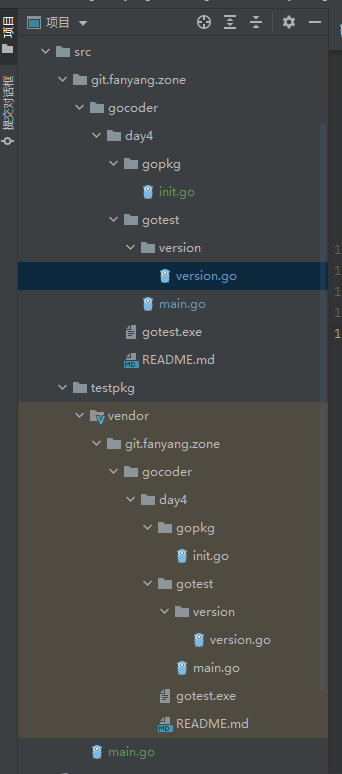
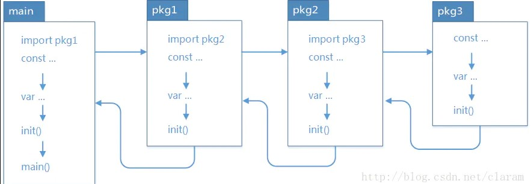

# 1. Go语言包的概念

`Go`语言使用包来组织源代码的，并实现命名空间的管理，任何一个`Go`语言程序必须属于一个包，即每个`go`程序的开头要写上`package <pkg_name>`。

`Go`语言包一般要满足如下三个条件：

- 同一个目录下的**同级**的所有`go`文件应该属于一个包；
- 包的名称可以跟目录不同名，不过建议同名；
- 一个`Go`语言程序有且只有一个`main`函数，他是`Go`语言程序的入口函数，且必须属于`main`包，没有或者多于一个进行`Go语言`程序编译时都会报错；

## 1.1 声明

- Go 源码文件都需要在开头使用package声明所在包，包名告知编译器哪些是包的源代码用于编译库文件，其次，包用于限制包内成员对外的可见性，最后包名用于在包外对公开成员的访问
- 包名使用简短的小写字母，常与所在目录名保持一致，一个包中可以由多个Go源文件，但必须使用相同包名

### 1.1.1 定义包文件

```
package day4
const  VERSION = 1.01
```

### 1.1.2 定义main程序

```
package main
import (
    "day4"
    "fmt"
)
func main() {
    fmt.Println(day4.VERSION)
}
```

### 1.1.3 执行结果 

```
1.01
```

## 1.2 包 导入&调用

go语言对函数名称是分大小写的，首字母大写的函数外面包才可以引用。后面把方法名首字母小写改为大写就可以了。另外go语言要求包名和目录名一致。否则包外无法引用。

### 1.2.1 GOPATH说明

- bin:用于放置发布的二进制程序
- pkg:用于放置发布的库文件
- src:用于放置源代码

### 1.2.2 运行

> a） 将 chapteer08/gv目录添加到GOPATH环境变量
>
> b)    编译&运行
>
> > 使用go build 编译二进制文件
> >
> > - **命令**： go build gpkgmain
> > - **说明**：编译 gpkgmain下的包，main包，则在当前目录产生以 gpkgmain命名的二进制程序
> >
> > 使用go run 运行二进制文件
> >
> > - **命令**： go run gpkgmain
> >
> > 使用go insstall 编译并发布二进制文件
> >
> > - **命令**： go install gpkgmain
> > - **说明**：编译并发布 gpkgmain下的包，非main包，则在将编译后的以 gpkgmain命名的二进制程序拷贝到bin目录

### 1.2.3 导入相同名称的包

 

```
package main
import (
    "fmt"
    lgopkg "gotest/version"
    //对包设置别名
    "git.fanyang.zone/gocoder/day1/src/gotest/version"
)
func main() {
    fmt.Println(version.VERSION)
    fmt.Println(lgopkg.VERSION)
}
```

### 1.2.4 执行结果

```
D:\GO>go run gotest
1.02
1.12
```

#### 1.3 main包与main函数

# 2 包的管理

## 2.1 govendor

`govendor`只是用来管理项目的依赖包，如果`GOPATH`中本身没有项目的依赖包，则需要通过`go get`先下载到GOPATH中，再通过`govendor add +external`拷贝到`vendor`目录中。Go 1.6以上版本默认开启GO15VENDOREXPERIMENT环境变量。 



### 2.1.1 基本原理

其实就是将依赖的包，特指外部包，复制到当前工程下的vendor目录下，这样go build的时候，go会**优先**从vendor目录寻找依赖包。

###  2.1.2 优点

将依赖的外部包引进工程下的vendor目录，可以直接在其他机器直接编译，而不用再去构建外部包的编译环境，一个一个的go get获取外部包。当然你也可以直接拷贝整个GOPATH下的第三方包源码过来，也是起到了vendor相同的作用。 
 另外，防止了go get 重新拉取的外部包的版本可能和期望的不一致，从而导致编译错误问题。

##### 2.1.3 缺点

当你想升级依赖包的时候，就只能手动升级了（重新拷贝升级后的依赖包源码）。

## 2.2 go get

- 搜索库文件的网站

  > https://pkg.go.dev/ 
  >   https://godoc.org/

- go引用库文件 
   示例：

```
<pre style="background-color:#2b2b2b;color:#a9b7c6;font-family:'JetBrains Mono',monospace;font-size:9.8pt;">package main
import (
   "fmt"
 "github.com/howeyc/gopass")
func main() {
   fmt.Println("请输入密码")
   if bytes, err := gopass.GetPasswd() ; err == nil {
      fmt.Println(string(bytes))
   }
}
```

执行结果：

```
请输入密码
11111
```

## 2.3 go mod

### 2.3.1

初始化go Modules

```
go mod init  git.fanyang.zone/modtest
```


# 3 init 函数

## 3.1 init的几个特征

1、`init`函数用于包的初始化，如初始化包中的变量，这个初始化在`package xxx`的时候完成，也就是在`main`之前完成；

2、每个包可以拥有多个`init`函数， 每个包的源文件也可以拥有多个`init`函数；

3、同一个包中多个`init`函数的执行顺序是没有明确定义的，但是**不同包的`init`函数是根据包导入的依赖关系决定的。**

4、`init`函数不能被其他函数调用，其实在`main`函数之前自动执行的。

## 3.2  示例

### 3.3 在main函数之前执行init

```
package main
import "fmt"
func main() {
    fmt.Println("do in main")
}
func init() {
    fmt.Println("do in init1")
}
func init() {
    fmt.Println("do in init2")
}
```

###### 运行结果：

```
do in init1
do in init2
do in main
```

**运行结果说明：`init`函数在`main`函数之前执行，每个源文件中可以包含多个`init`函数。**

## 3.4 通过包引入

三个go程序代码分别如下所示：

```go
// test.go
package main
import (
    "fmt"
    _ "./level1"
)
func main() {
    fmt.Println("I am in main")
}
```

 

```
// level1.go
package level1
import (
    "fmt"
    _ "../level2"
)
func init() {
    fmt.Println("I am in level1")
}
```

  

```
// level2.go
package level2
import "fmt"
func init() {
    fmt.Println("I am in level2")
}
```

###### 运行`test.go`结果如下：

```
I am in level2
I am in level1
I am in main
```

**运行结果说明：go中不同包中`init`函数的执行顺序是根据包的导入关系决定的。**

并且这种关系为：



## 3、关于`import _ " "`的说明

我们都知道，go对包导入非常严格，**不允许导入不使用的包**。但是有时候我们导入包只是为了做一些初始化的工作，这样就应该采用`import _ " "`的形式，如第II节的例程中我们采用了`import _ " "`的形式导入level1和level2包，这样就可以在只完成初始化，也不会报错。