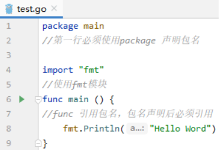
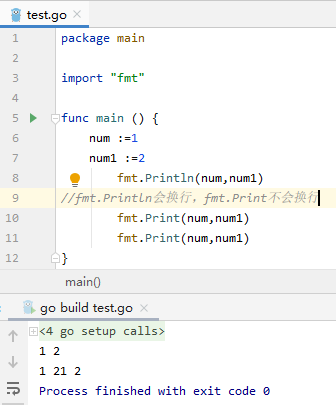

# 01 GoLang打印Hello Word



```
package main
//第一行必须使用package 声明包名
import "fmt"
//使用fmt模块
func main () {
//func 引用包名，包名声明后必须引用  
   fmt.Println("Hello Word")
}
```

在CMD中，使用go build构建包

引用mail库后，go build的文件为可执行文件

  -o ： 指定build后的包名

  -x ：显示详细的build过程

# 1 print

## 1.1 打印内容

 

```go
package main
import "fmt"
func main () {
    num :=1
    num1 :=2
        fmt.Println(num,num1)
//fmt.Println会换行，fmt.Print不会换行
        fmt.Print(num,num1)
        fmt.Print(num,num1)
}
```



## 1.2打印数据类型

```go
fmt.Printf
```

```go
package main
import "fmt"
func main () {
    num :=1
    name :="fan"
        fmt.Println(num,name)
    fmt.Printf("\n%T,%s,%d","1",name,num)
    /*
    %s：打印字符串
    %T：打印数据类型
    %d：数字
    %t:对bool类型占位
     */
}
```