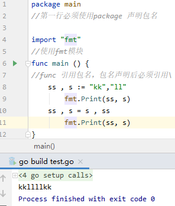
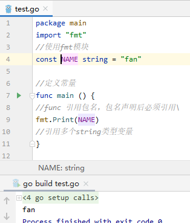
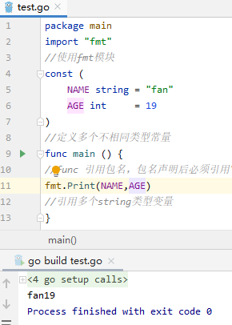
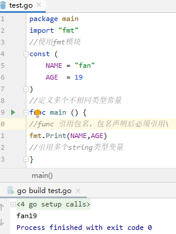
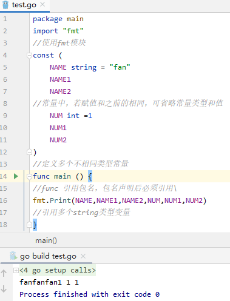
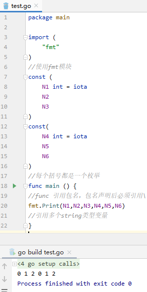
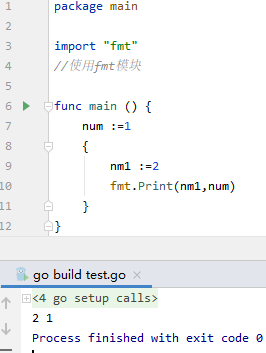

# GoLang 变量和常量

## 1 变量

除简短声明外，变量都可以定义在函数外

变量可以在函数内重新定义值

### 1.1  定义一个变量类型

```go
package main
//第一行必须使用package 声明包名
import "fmt"
//使用fmt模块
func main () {
//func 引用包名，包名声明后必须引用
    var test string
//定义一个string类型变量
/*  1. 只能由非空字母(Unicode)、数字、下划线(_)组成
    2. 只能以字母或下划线开
    3. 不能Go语言关键字
    4. 避免使用Go语言预定义标识符
    5. 建议使用驼峰式
    6. 标识符区分大小写
*/
    test = "aaa"
    fmt.Print(test)
}
```

<div align=lift></div>

### 1.2 定义多个相同 类型变量

```go
package main
//第一行必须使用package 声明包名
import "fmt"
//使用fmt模块
func main () {
//func 引用包名，包名声明后必须引用\
    var name , age string = "fanyang","19"
    fmt.Print(name , age)
    //引用多个相同类型变量
}
```

<div align=lift></div>

### 1.3 定义多个不同类型变量

```go
import "fmt"
//使用fmt模块
func main () {
//func 引用包名，包名声明后必须引用\
    var (
        name string = "fanyang"
        age int = 19
    )
    fmt.Print(name , age)
    //引用多个string类型变量
}
```

<div align=lift></div>

### 1.4 定义变量，自动推导变量类型

```go
import "fmt"
//使用fmt模块
func main () {
//func 引用包名，包名声明后必须引用\
    var (
        name = "fanyang"
        age = 19
    )
    fmt.Print(name, age)
    //引用多个string类型变量
}
```

<div align=lift></div>

### 1.5 简短声明

\#只能在函数内使用

```go
package main
//第一行必须使用package 声明包名
import "fmt"
//使用fmt模块
func main () {
//func 引用包名，包名声明后必须引用\
    var (
        name = "fanyang"
        age = 19
    )
    isBoy := true
    fmt.Print(name, age,isBoy)
//这是一个简短声明,只能在函数内使用
}
```

<div align=lift></div>

### 1.6 变量值调换

```
package main
//第一行必须使用package 声明包名
import "fmt"
//使用fmt模块
func main () {
//func 引用包名，包名声明后必须引用\
    ss , s := "kk","ll"
        fmt.Print(ss, s)
    ss , s = s , ss
        fmt.Print(ss, s)
}
```



## 2 常量

### 2.1定义一个常量

```
package main
import "fmt"
//使用fmt模块
const NAME string = "fan"
//定义常量
func main () {
//func 引用包名，包名声明后必须引用\
fmt.Print(NAME)
//引用多个string类型变量
}
```



### 2.2 定义多个相同类型常量

```
package main
import "fmt"
//使用fmt模块
const NAME,LIVE string = "fan","changping"
//定义多个相同类型常量
func main () {
//func 引用包名，包名声明后必须引用\
fmt.Print(NAME,LIVE)
//引用多个string类型变量
}
```


### 2.3 定义多个不同类型常量

```
package main
import "fmt"
//使用fmt模块
const (
    NAME string = "fan"
    AGE int     = 19
)
//定义多个不相同类型常量
func main () {
//func 引用包名，包名声明后必须引用\
fmt.Print(NAME,AGE)
//引用多个string类型变量
}
```



### 2.4定义多个常量，省略类型

```
package main
import "fmt"
//使用fmt模块
const (
    NAME = "fan"
    AGE  = 19
)
//定义多个不相同类型常量
func main () {
//func 引用包名，包名声明后必须引用\
fmt.Print(NAME,AGE)
//引用多个string类型变量
}
```



### 2.5 赋值相同内容常量

```
package main
import "fmt"
//使用fmt模块
const (
    NAME string = "fan"
    NAME1
    NAME2
//常量中，若赋值和之前的相同，可省略常量类型和值
    NUM int =1
    NUM1
    NUM2
)
//定义多个不相同类型常量
func main () {
//func 引用包名，包名声明后必须引用\
fmt.Print(NAME,NAME1,NAME2,NUM,NUM1,NUM2)
//引用多个string类型变量
}
```



### 2.6 枚举

+ go中默认没有枚举类型，可以使用const+iota

```
package main
import (
    "fmt"
)
//使用fmt模块
const (
    N1 int = iota
    N2
    N3
)
const(
    N4 int = iota
    N5
    N6
)
//每个括号都是一个枚举
func main () {
//func 引用包名，包名声明后必须引用\
fmt.Print(N1,N2,N3,N4,N5,N6)
//引用多个string类型变量
}
```



## 3 作用域

### 3.1 定义作用域

\#定义标识符使用范围

\#GO中使用{}来定义作用域范围

\#使用原则：子语句块可使用父语句块，父语句块不能使用子语句块

```
package main
import "fmt"
//使用fmt模块
func main () {
    num :=1
    {
        nm1 :=2
        fmt.Print(nm1,num)
    }
}
```



### 3.2 定义多个作用域

```
package main
import "fmt"
func main () {
    num :=1
    {
        num1 :=2
        fmt.Print(num,num1)
        {
            num2 := 3
            num1 := 4
            fmt.Print(num,num1,num2)
        }
    }
}
```