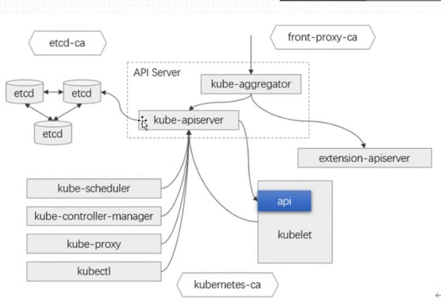
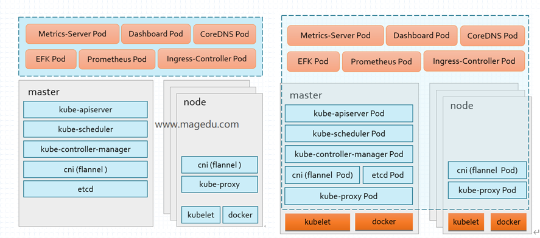
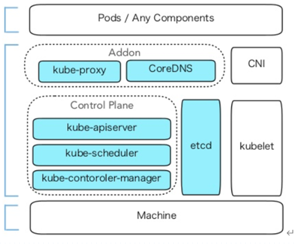
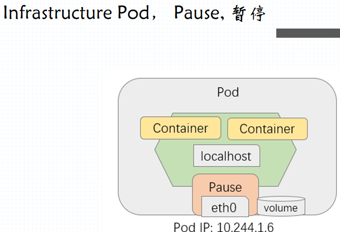
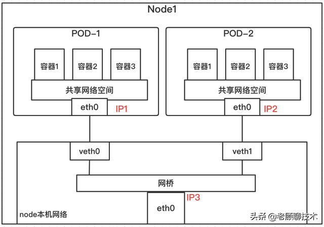
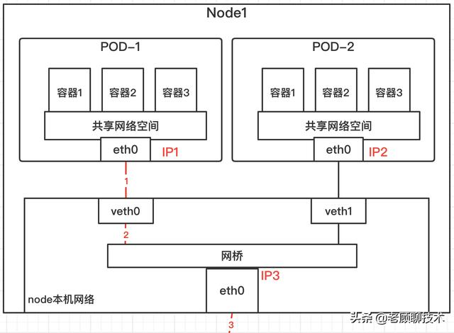
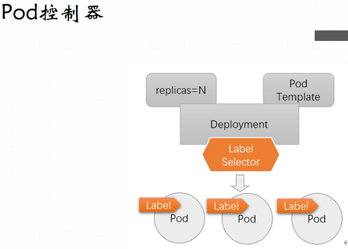
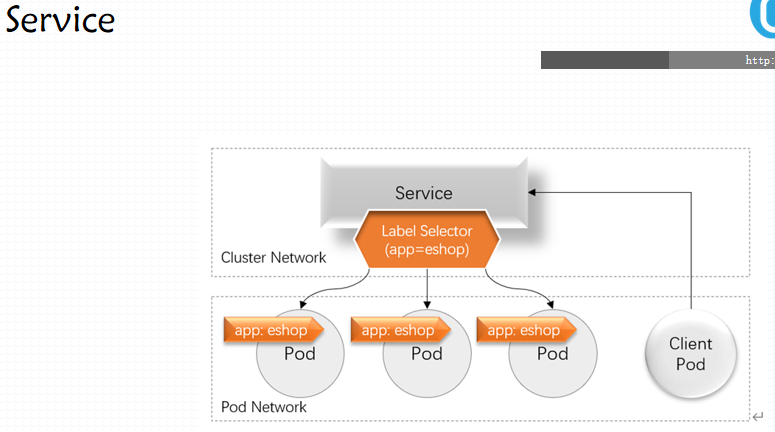

# 1 Master 组件

## API Server,scheduler, Controller-Manager Server

通过API server（k8s集群中唯一接受请求的入口 ）发送指令--->通过Controller运行指令并通过Control loop监控指令监控状态
# 2 Node 组件
## Kube-proxy,Kubelet,Container runtime(docker,rkt,cri-o,frakti),Pod

### 2.1 Kubernetes Components

>• Master Components
>• kube-apiserver
>• etcd
>• kube-scheduler
>• kube-controller-manager
>• cloud-controller-manager


### 2.2 Node Components
>• kubelet
>• kube-proxy
>• Container Runtime

### 2.3 Addons

>+ DNS
>
>+ CNI (flannel, calico, ...)
>
>+ Web UI (Dashboard)
>
>+ Container Resource Monitoring
>
>+ Cluster-level Logging
>
>+ 监控系统：prometheus
>
>+ 集群日志系统：EFK、LG
>
>+ Ingress Controller

# 3 对象式编程语言
    以数据为中心，代码服务于数据

# 4 数据式编程
     以代码为中心，数据服务于代码
     数据：对象
    代码：定义类时定义的方法

## 4.1 class：类

    属性，方法
    方法限制一类事物的操作接口
    对属性赋值的过程相当于的过程

# 5 k8s 

## 5.1 k8s api：REST API(主要依托Http/Https方法传输)

    resource(资源) --> objet（对象）
     
    method（支持的操作方法）:GET,PUT,POST.DELETE,PATCH,........

## 5.2 K8s : cluster , 容器编排系统
    核心任务：容器编排
     
    容器：应用程序
     
    Pod Controller，Deployment  #Kube-Proxy
## 5.3 功能
    用于修改节点上的ipvs或者iptables规则

## 5.4 证书
+ k8s使用双向证书认证



# 6 kuberneter部署的两种方式

+ 二进制程序部署
+ Pod部署
  + Static pod
  + Pod



# 7 k8s 两种网络类型

+ overlay：叠加网络

+ underlay：承载网络



## 7.1 Pod的组成

pod由多个容器和一个pause容器组成（pause是基础容器）



## 7.2CNI Container Network Interface

+ flannel
+ Project Calico
+ Canal（已废弃）


## 7.3 CRI Container Runtime Interface

## 7.4 CSI Container Storage Interface

## 7.5 容器存在的"关系"

+ 亲密：Pod, 同进同退，共半一组存储卷
  + conrainer to Container (共享Network，IPC,UTC)
+ 非紧密：
  + Pod to Pod:网络插件
  + Pod to Senrice: iptables或ipvs规则
  + kube-proxy:把栠群上的每一个service的定义转换力本地的ipvs或iptables规则
  + External Client -> Service or Pod

## 7.6 Pod的网络通信

### 7.6.1 pod内的容器

各容器间通过共享网络名称空间实现

### 7.6.2 **同一个Node，不同Pod**

使用linux虚拟以太网设备或者说是由两个虚拟接口组成的veth对使不同的网络命名空间链接起来，这些虚拟接口分布在多个网络命名空间上(这里是指多个Pod上)。

通过网桥把veth0和veth1组成为一个以太网，他们直接是可以直接通信的，另外这里通过veth对让pod1的eth0和veth0、pod2的eth0和veth1关联起来，从而让pod1和pod2相互通信。



### 7.7.3 **不同Node，不同Pod**




> 1)首先pod1通过自己的以太网设备eth0把数据包发送到关联到root命名空间的veth0上
>
> 2)然后数据包被Node1上的网桥设备接受到，网桥查找转发表发现找不到pod4的Mac地址，则会把包转发到默认路由(root命名空间的eth0设备)
>
> 3)然后数据包经过eth0就离开了Node1，被发送到网络。
>
> 4)数据包到达Node2后，首先会被root命名空间的eth0设备
>
> 5)然后通过网桥把数据路由到虚拟设备veth1,最终数据表会被流转到与veth1配对的另外一端(pod4的eth0)

每个Node都知道如何把数据包转发到其内部运行的Pod，当一个数据包到达Node后，其内部数据流就和Node内Pod之间的流转类似了

补充说明：对于如何来配置网络，k8s在网络这块自身并没有实现网络规划的具体逻辑，而是制定了一套CNI(Container Network Interface)接口规范，开放给社区来实现。Flannel就是k8s中比较出名的一个。

**flannel**

flannel组建一个大二层扁平网络，pod的ip分配由flannel统一分配，通讯过程也是走flannel的网桥。

每个node上面都会创建一个flannel0虚拟网卡，用于跨node之间通讯。所以容器直接可以直接使用pod id进行通讯。

跨节点通讯时，发送端数据会从docker0路由到flannel0虚拟网卡，接收端数据会从flannel0路由到docker0。

# 8 Pod控制器和Service





# 9 Kubectl 、Kube API Server

+ API Server
  + RUSTfl，资源resource
  + 资源类型：Pod，Deploymet，Service，PodList，Deployment，... ...

+ 资源创建方法：
  + 命令式命令
    + 命令， 及其选项（从选项中读取配置数据）来实现；
  + 命令式配置文件
    + 命令，从配置文件加载配置数据
  + 声明式配置文件
    + 声明式命令， 从配置文件加载配置数据

yaml文件格式

```
apiVersion: 	# 资源对象所属的API群组及版本
kind: 			# 资源类型
metadata: 		# 资源对象的原数据
... ...
spec:			# 所需状态，或称为期望状态
```

