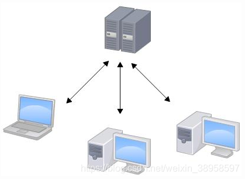
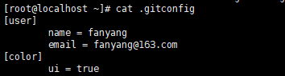

# CI/CD

# 一、什么是CI/CD

## 1 CI/CD的功能

CI/CD 是一种通过在应用开发阶段引入<font color='red'>自动化</font>来频<font color='red'>频繁</font>向客户交付应用的方法。CI/CD 的核心概念是<font color='red'>持续集成、持续交付和持续部署</font>。作为一个面向开发和运营团队的解决方案，CI/CD 主要针对在集成新代码时所引发的问题（亦称：“[集成地狱](https://www.solutionsiq.com/agile-glossary/integration-hell/)”）。

具体而言，<font color='red'>CI/CD 可让持续自动化和持续监控贯穿于应用的整个生命周期（从集成和测试阶段，到交付和部署）</font>。这些关联的事务通常被统称为“CI/CD 管道”，由[开发和运维团队](https://www.redhat.com/zh/topics/devops)以敏捷方式协同支持。

## 2 CI 是什么？CI 和 CD 有什么区别？

CI/CD 中的“CI”始终指持续集成，它属于开发人员的自动化流程。成功的 CI 意味着应用代码的新更改会定期构建、测试并合并到共享存储库中。该解决方案可以解决在一次开发中有太多应用分支，从而导致相互冲突的问题。

CI/CD 中的“CD”指的是持续交付和/或持续部署，这些相关概念有时会交叉使用。两者都事关管道后续阶段的自动化，但它们有时也会单独使用，用于说明自动化程度。

持续*交付*通常是指开发人员对应用的更改会自动进行错误测试并上传到存储库（如 [GitHub](https://redhatofficial.github.io/#!/main) 或容器注册表），然后由运维团队将其部署到实时生产环境中。这旨在解决开发和运维团队之间可见性及沟通较差的问题。因此，持续交付的目的就是确保尽可能减少部署新代码时所需的工作量。

持续*部署*（另一种“CD”）指的是自动将开发人员的更改从存储库发布到生产环境，以供客户使用。它主要为了解决因手动流程降低应用交付速度，从而使运维团队超负荷的问题。持续部署以持续交付的优势为根基，实现了管道后续阶段的自动化。


CI/CD 既可能仅指持续集成和持续交付构成的关联环节，也可以指持续集成、持续交付和持续部署这三项构成的关联环节。更为复杂的是，有时“持续交付”也包含了持续部署流程。

归根结底，我们没必要纠结于这些语义，您只需记得 CI/CD 其实就是一个流程（通常形象地表述为管道），用于实现应用开发中的高度持续自动化和持续监控。因案例而异，该术语的具体含义取决于 CI/CD 管道的自动化程度。许多企业最开始先添加 CI，然后逐步实现交付和部署的自动化（例如作为[云原生应用](https://www.redhat.com/zh/topics/cloud-native-apps)的一部分）。

------

## 3 CI 持续集成（Continuous Integration）

[现代应用开发](https://www.redhat.com/zh/solutions/cloud-native-development)的目标是让多位开发人员同时处理同一应用的不同功能。但是，如果企业安排在一天内将所有分支源代码合并在一起（称为“[合并日](https://thedailywtf.com/articles/Happy_Merge_Day!)”），最终可能造成工作繁琐、耗时，而且需要手动完成。这是因为当一位独立工作的开发人员对应用进行更改时，有可能会与其他开发人员同时进行的更改发生冲突。如果每个开发人员都自定义自己的本地[集成开发环境（IDE）](https://www.redhat.com/zh/topics/middleware/what-is-ide)，而不是让团队就一个基于云的 IDE 达成一致，那么就会让问题更加雪上加霜。

持续集成（CI）可以帮助开发人员更加频繁地（有时甚至每天）将代码更改合并到共享分支或“主干”中。一旦开发人员对应用所做的更改被合并，系统就会通过自动构建应用并运行不同级别的自动化测试（通常是单元测试和集成测试）来验证这些更改，确保这些更改没有对应用造成破坏。这意味着测试内容涵盖了从类和函数到构成整个应用的不同模块。如果自动化测试发现新代码和现有代码之间存在冲突，CI 可以更加轻松地快速修复这些错误。

[进一步了解技术细节](https://developers.redhat.com/blog/2017/09/06/continuous-integration-a-typical-process/)

------

## 4 CD 持续交付（Continuous Delivery）

完成 CI 中构建及单元测试和集成测试的自动化流程后，持续交付可自动将已验证的代码发布到存储库。为了实现高效的持续交付流程，务必要确保 CI 已内置于开发管道。持续交付的目标是拥有一个可随时部署到生产环境的代码库。

在持续交付中，每个阶段（从代码更改的合并，到生产就绪型构建版本的交付）都涉及测试自动化和代码发布自动化。在流程结束时，运维团队可以快速、轻松地将应用部署到生产环境中。

------

## 5 CD 持续部署（Continuous Deployment）

对于一个成熟的 CI/CD 管道来说，最后的阶段是持续部署。作为持续交付——自动将生产就绪型构建版本发布到代码存储库——的延伸，持续部署可以自动将应用发布到生产环境。由于在生产之前的管道阶段没有手动门控，因此持续部署在很大程度上都得依赖精心设计的测试自动化。

实际上，持续部署意味着开发人员对应用的更改在编写后的几分钟内就能生效（假设它通过了自动化测试）。这更加便于持续接收和整合用户反馈。总而言之，所有这些 CI/CD 的关联步骤都有助于降低应用的部署风险，因此更便于以小件的方式（而非一次性）发布对应用的更改。不过，由于还需要编写自动化测试以适应 CI/CD 管道中的各种测试和发布阶段，因此前期投资还是会很大。

## 6 版本控制系统

### 6.1 什么是版本控制系统

版本控制（Revision control）是一种在开发的过程中用于管理我们对文件、目录或工程等内容的修改历史，方便查看更改历史记录，备份<font color='red'>以便恢复以前的版本</font >的软件工程技术

### 6.2 版本控制系统解决的问题

1、追溯文件历史变更

2、多人团队协同开发

3、代码集中管理

### 6.4 常见的版本控制系统（集中式VS分布式）

#### 6.4.1 Subversion集中式版本控制系统

+ Subversion的特点概括起来主要由以下几条：

  > - 每个版本库有唯一的URL（官方地址），每个用户都从这个地址获取代码和数据；
  > - 获取代码的更新，也只能连接到这个唯一的版本库，同步以取得最新数据；
  > - 提交必须有网络连接（非本地版本库）；
  > - 提交需要授权，如果没有写权限，提交会失败；
  > - 提交并非每次都能够成功。如果有其他人先于你提交，会提示“改动基于过时的版本，先更新再提交”… 诸如此类；
  > - 冲突解决是一个提交速度的竞赛：手快者，先提交，平安无事；手慢者，后提交，可能遇到麻烦的冲突解决。



<font color='red'>好处：</font >每个人都可以一定程度上看到项目中的其他人正在做些什么。而管理员也可以轻松掌控每个开发者的权限。

<font color='blue'>缺点：</font >中央服务器的单点故障。

若是宕机一小时，那么在这一小时内，谁都无法提交更新、还原、对比等，也就无法协同工作。如果中央服务器的磁盘发生故障，并且没做过备份或者备份得不够及时的话，还会有丢失数据的风险。最坏的情况是彻底丢失整个项目的所有历史更改记录，被客户端提取出来的某些快照数据除外，但这样的话依然是个问题，你不能保证所有的数据都已经有人提取出来。

Subversion<font color='red'>原理上只关心文件内容的具体差异</font >。每次记录有哪些文件作了更新，以及都更新了哪些行的什么内容。

#### 6.4.2 Git属于分布式的版本控制系统

Git记录版本历史<font color='red'>只关心文件数据的整体是否发生变化</font >。Git <font color='red'>不保存文件内容前后变化的差异数据</font >。

实际上，Git 更像是把变化的文件作快照后，记录在一个微型的文件系统中。每次提交更新时，它会纵览一遍所有文件的指纹信息并对文件作一快照，然后保存一个指向这次快照的索引。为提高性能，若文件没有变化，Git 不会再次保存，而只对上次保存的快照作一连接。

在分布式版本控制系统中，客户端并不只提取最新版本的文件快照，而是把原始的代码仓库完整地镜像下来。这么一来，任何一处协同工作用的服务器发生故障，事后都可以用任何一个镜像出来的本地仓库恢复。这类系统都可以指定和若干不同的远端代码仓库进行交互。籍此，你就可以在同一个项目中，分别和不同工作小组的人相互协作。你可以根据需要设定不同的协作流程。

另外，因为Git在本地磁盘上就保存着所有有关当前项目的历史更新，并且Git中的绝大多数操作都只需要访问本地文件和资源，不用连网，所以处理起来速度飞快。用SVN的话，没有网络或者断开VPN你就无法做任何事情。但用Git的话，就算你在飞机或者火车上，都可以非常愉快地频繁提交更新，等到了有网络的时候再上传到远程的镜像仓库。换作其他版本控制系统，这么做几乎不可能，抑或是非常麻烦。

+ Git具有以下特点：

>- Git中每个克隆(clone)的版本库都是平等的。你可以从任何一个版本库的克隆来创建属于你自己的版本库，同时你的版本库也可以作为源提供给他人，只要你愿意。
>- Git的每一次提取操作，实际上都是一次对代码仓库的完整备份。
>- 提交完全在本地完成，无须别人给你授权，你的版本库你作主，并且提交总是会成功。
>- 甚至基于旧版本的改动也可以成功提交，提交会基于旧的版本创建一个新的分支。
>- Git的提交不会被打断，直到你的工作完全满意了，PUSH给他人或者他人PULL你的版本库，合并会发生在PULL和PUSH过程中，不能自动解决的冲突会提示您手工完成。
>- 冲突解决不再像是SVN一样的提交竞赛，而是在需要的时候才进行合并和冲突解决。
>- Git 也可以模拟集中式的工作模式
>- Git版本库统一放在服务器中
>- 可以为 Git 版本库进行授权：谁能创建版本库，谁能向版本库PUSH，谁能够读取（克隆）版本库
>- 团队的成员先将服务器的版本库克隆到本地；并经常的从服务器的版本库拉（PULL）最新的更新；
>- 团队的成员将自己的改动推（PUSH）到服务器的版本库中，当其他人和版本库同步（PULL）时，会自动获取改变
>- Git 的集中式工作模式非常灵活
>- 你完全可以在脱离Git服务器所在网络的情况下，如移动办公／出差时，照常使用代码库
>- 你只需要在能够接入Git服务器所在网络时，PULL和PUSH即可完成和服务器同步以及提交
>- Git提供 rebase 命令，可以让你的改动看起来是基于最新的代码实现的改动
>- Git 有更多的工作模式可以选择，远非 Subversion可比

## 7 git基本使用

### 7.1 安装git

### 7.2 配置git

+ 通常只需要配置你是谁，邮箱是什么。就可以知道是谁提交了什么内容

```shell
[root@localhost ~]# git config --global user.name "fanyang"
[root@localhost ~]# git config --global user.email "fanyang@163.com"
[root@localhost ~]# git config --global color.ui true
[root@localhost ~]# cat .gitconfig	
```



### 7.3 git如何提交目录文件到本地仓库

1、首先创建git仓库，这个目录里的所有文件都可以被git管理起来，每个文件的修改、删除、GIt都能跟踪，以便任何时刻都可以追踪历史，或者在将来某个时刻可以“还原”

```shell
# 创建git工作目录
[root@localhost ~]# mkdir /git
[root@localhost ~]# cd /git
# 初始化该目录为git仓库
[root@localhost git]# git  init


```

```bash
# 创建新的文件
[root@localhost git]# touch file{1..3}
[root@localhost git]# ls
file1  file2  file3
# 查看git状态
[root@localhost git]# git status
On branch master

No commits yet

Untracked files:
# 有三个未提交的文件
  (use "git add <file>..." to include in what will be committed)

	file1
	file2
	file3

nothing added to commit but untracked files present (use "git add" to track)
# 添加本地所有文件到本地git缓存
[root@localhost git]# git add .
# 查看git状态
[root@localhost git]# git status
On branch master

No commits yet

Changes to be committed:
  (use "git rm --cached <file>..." to unstage)
# 有三个新的文件
	new file:   file1
	new file:   file2
	new file:   file3
# 添加git描述
[root@localhost git]# git commit -m "新增file{1..3}到git仓库"
[master (root-commit) 8acf856] 新增file{1..3}到git仓库
 3 files changed, 0 insertions(+), 0 deletions(-)
 create mode 100644 file1
 create mode 100644 file2
 create mode 100644 file3
# 修改file1
[root@localhost git]# echo 1 >file1 
[root@localhost git]# git status
On branch master
Changes not staged for commit:
  (use "git add <file>..." to update what will be committed)
  (use "git checkout -- <file>..." to discard changes in working directory)

	modified:   file1

no changes added to commit (use "git add" and/or "git commit -a")
[root@localhost git]# git add .
[root@localhost git]# git commit -m "修改file1"
[master 53 30aef] 修改file1
 1 file changed, 1 insertion(+)

```


### 7.4 文件改名后重新提交到本地git仓库

```
[root@localhost git]# git mv file1 file 
[root@localhost git]# git status 
On branch master
Changes to be committed:
  (use "git reset HEAD <file>..." to unstage)

	renamed:    file1 -> file
```

### 7.5 对比文件差异

#### 7.5.1对比本地文件和暂存区文件的差异

```shell
[root@localhost git]# git diff file
[root@localhost git]# echo test >> file
[root@localhost git]# git diff file
diff --git a/file b/file
index d00491f..c0f2f8d 100644
--- a/file
+++ b/file
@@ -1 +1,2 @@
 1
+test
```

#### 7.5.2 对比暂存区文件和本地git仓库文件差异

```shell
[root@localhost git]# git add .
[root@localhost git]# git diff file
[root@localhost git]# git diff file --cache file
fatal: option '--cache' must come before non-option arguments
[root@localhost git]# git diff file --cached file
fatal: option '--cached' must come before non-option arguments
[root@localhost git]# git diff --cached file
diff --git a/file b/file
new file mode 100644
index 0000000..c0f2f8d
--- /dev/null
+++ b/file
@@ -0,0 +1,2 @@
+1
+test
[root@localhost git]# 
[root@localhost git]# git commit -m "修改file文件"
[master 8b1ecec] 修改file文件
 2 files changed, 2 insertions(+), 1 deletion(-)
 create mode 100644 file
 delete mode 100644 file1
[root@localhost git]# git diff --cached file

```

### 7.6  文件回滚

#### 7.6.1 操作导致文件被清空（本地目录与暂存区间的撤销）

```shell
# 使用以前提交到暂存区的内容覆盖本地目录
[root@localhost git]# echo > file
[root@localhost git]# git status 
On branch master
Changes not staged for commit:
  (use "git add <file>..." to update what will be committed)
  (use "git checkout -- <file>..." to discard changes in working directory)

	modified:   file

no changes added to commit (use "git add" and/or "git commit -a")
[root@localhost git]# git checkout file
[root@localhost git]# cat file
1
test
```

#### 7.6.2 本地文件误操作提交至暂存区

本地<font color='red'>仓库</font>覆盖暂存区-----> 暂存区覆盖本地<font color='red'>目录</font>

```shell
[root@localhost git]# echo ddd >> file
[root@localhost git]# git add .
[root@localhost git]# git status 
On branch master
Changes to be committed:
  (use "git reset HEAD <file>..." to unstage)

	modified:   file

[root@localhost git]# git reset HEAD file
Unstaged changes after reset:
M	file
[root@localhost git]# git status 
On branch master
Changes not staged for commit:
  (use "git add <file>..." to update what will be committed)
  (use "git checkout -- <file>..." to discard changes in working directory)

	modified:   file

no changes added to commit (use "git add" and/or "git commit -a")
[root@localhost git]# git checkout file
[root@localhost git]# git status 
On branch master
nothing to commit, working tree clean
[root@localhost git]# cat file
1
test
```

#### 7.6.3 多次提交到本地仓库后回滚

```shell
[root@localhost git]# echo test >> file
[root@localhost git]# git add  .
[root@localhost git]# ls
file  file2  file3
[root@localhost git]# git commit -m "test"
[master c691c60] test
 1 file changed, 1 insertion(+)
[root@localhost git]# echo test1 >> file
[root@localhost git]# git add .
[root@localhost git]# git commit -m "test1"
[master 3595d2b] test1
 1 file changed, 1 insertion(+)
[root@localhost git]# git log --oneline 
3595d2b (HEAD -> master) test1
c691c60 test
8b1ecec 修改file文件
5330aef 修改file1
8acf856 新增file{1..3}到git仓库
[root@localhost git]# git reset --hard c691c60
HEAD is now at c691c60 test
[root@localhost git]# git status 
On branch master
nothing to commit, working tree clean
[root@localhost git]# cat file
1
test
test

```

#### 7.6.4 git 回退后，恢复回退前版本

```shell
[root@localhost git]# git reflog 
c691c60 (HEAD -> master) HEAD@{0}: reset: moving to c691c60
3595d2b HEAD@{1}: commit: test1
c691c60 (HEAD -> master) HEAD@{2}: commit: test
8b1ecec HEAD@{3}: commit: 修改file文件
5330aef HEAD@{4}: commit: 修改file1
8acf856 HEAD@{5}: commit (initial): 新增file{1..3}到git仓库
[root@localhost git]# git re
rebase         reflog         remote         repack         replace        request-pull   reset          revert 
[root@localhost git]# git reset --hard c691c60
[root@localhost git]# git log --oneline 
c691c60 (HEAD -> master) test
8b1ecec 修改file文件
5330aef 修改file1
8acf856 新增file{1..3}到git仓库
```

### 7.7 git 分支管理

#### 7.7.1查看、创建、切换分支

```shell
# 查看分支
[root@localhost git]# git branch 
* master
# 创建分支
[root@localhost git]# git branch dev
[root@localhost git]# git branch 
  dev
* master
# 切换分支
[root@localhost git]# git checkout dev
Switched to branch 'dev'
[root@localhost git]# git branch 
* dev

```

#### 7.7.2 合并分支

master合并到dev---->测试合并后的dev分支----->dev分支合并到master

```
[root@localhost git]# git merge master
[root@localhost git]# git merge dev
```


#### 7.7.3 删除分支

```
[root@localhost git]# git branch dev -d
Deleted branch dev (was 06b4943).
[root@localhost git]# git branch 
* masterl,;
```

### 7.8 标签

#### 7.8.1 创建标签

```
# 对当前分支当前的版本打标签
[root@localhost git]# git tag -a "v1.0" -m "第一个版本"
# 查看当前分支有哪些标签
[root@localhost git]# git tag
# 查看标签内容
[root@localhost git]# git show v1.0 
# 对指定的id打标签
[root@localhost git]# git tag -a "v1.0" c691c60 -m "未发布的版本"
fatal: tag 'v1.0' already exists
```

#### 7.8.2 删除标签

```
[root@localhost git]# git tag -d v0.9 
Deleted tag 'v0.9' (was 8d74209)
```

### 7.9 git 操作远程仓库

#### 7.9.1 关联远程仓库

```
[root@localhost git]# git remote add origin git@172.18.128.4:root/git-test.git
[root@localhost git]# git remote -v
origin	git@172.18.128.4:root/git-test.git (fetch)
origin	git@172.18.128.4:root/git-test.git (push)
```

#### 7.9.2 将本地仓库内容推送到远程仓库

```
[root@localhost git]# git add .
[root@localhost git]# git commit -m "修改file文件"
[root@localhost git]# git push -u origin master 
```

#### 7.9.3  删除远程仓库

```
[root@localhost git]# git remote remove origin 
# origin ：用户名称
```

7.10 新用户加入需要做的

```
[root@localhost ~]# mkdir /test
[root@localhost ~]# cd /test
[root@localhost test]# git init 
Initialized empty Git repository in /test/.git/
[root@localhost test]# git status 
# On branch master
#
# Initial commit
#
nothing to commit (create/copy files and use "git add" to track)
[root@localhost git-test]#     git config --global user.name "Your Name"
[root@localhost git-test]#     git config --global user.email you@example.co
[root@localhost test]# git remote add origin git@172.18.128.4:root/git-test.git
[root@localhost test]# git remote -v
origin	git@172.18.128.4:root/git-test.git (fetch)
origin	git@172.18.128.4:root/git-test.git (push)
[root@localhost test]# git clone git@172.18.128.4:root/git-test.git
Cloning into 'git-test'...
remote: Enumerating objects: 16, done.
remote: Counting objects: 100% (16/16), done.
remote: Compressing objects: 100% (12/12), done.
remote: Total 16 (delta 2), reused 0 (delta 0), pack-reused 0
Receiving objects: 100% (16/16), done.
Resolving deltas: 100% (2/2), done.
[root@localhost test]# ls
git-test
[root@localhost test]# cd git-test/
[root@localhost git-test]# ls
file  file2  file3  file5  file7  file8
[root@localhost git-test]# touch file9
[root@localhost git-test]# git add .
[root@localhost git-test]# git commit -m "new file"
# On branch master
# Your branch is ahead of 'origin/master' by 1 commit.
#   (use "git push" to publish your local commits)
#
nothing to commit, working directory clean
[root@localhost git-test]# git push origin master 
Counting objects: 3, done.
Compressing objects: 100% (2/2), done.
Writing objects: 100% (2/2), 233 bytes | 0 bytes/s, done.
Total 2 (delta 1), reused 0 (delta 0)
To git@172.18.128.4:root/git-test.git
   06b4943..b3fdc9f  master -> master
```

### 7.11 同步远程仓库中否代码

```
[root@localhost git-test]# git pull origin master 
```

