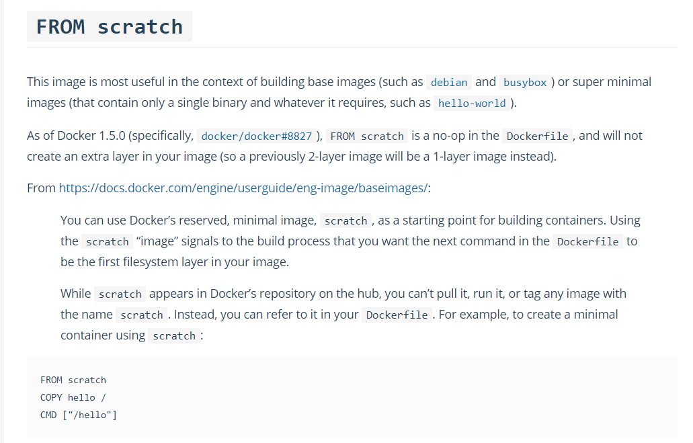

# 1 Docker 基本命令

+ **docker version** ：查看docker的版本号，包括客户端、服务端、依赖的Go等

```csharp
[root@centos7 ~]# docker version
Client:
 Version:      1.8.2-el7.centos
 API version:  1.20
 Package Version: docker-1.8.2-10.el7.centos.x86_64
 Go version:   go1.4.2
 Git commit:   a01dc02/1.8.2
 Built:        
 OS/Arch:      linux/amd64

Server:
 Version:      1.8.2-el7.centos
 API version:  1.20
 Package Version: 
 Go version:   go1.4.2
 Git commit:   a01dc02/1.8.2
 Built:        
 OS/Arch:      linux/amd64
```

+ **docker info**:查看系统(docker)层面信息，包括管理的images, containers数等

```kotlin
[root@centos7 ~]# docker info
Containers: 1
Images: 4
Storage Driver: devicemapper
 Pool Name: docker-8:3-36786088-pool
 Pool Blocksize: 65.54 kB
 Backing Filesystem: xfs
 Data file: /dev/loop0
 Metadata file: /dev/loop1
 Data Space Used: 2.059 GB
 Data Space Total: 107.4 GB
 Data Space Available: 12.93 GB
 Metadata Space Used: 1.765 MB
 Metadata Space Total: 2.147 GB
 Metadata Space Available: 2.146 GB
 Udev Sync Supported: true
 Deferred Removal Enabled: false
 Data loop file: /var/lib/docker/devicemapper/devicemapper/data
 Metadata loop file: /var/lib/docker/devicemapper/devicemapper/metadata
 Library Version: 1.02.107-RHEL7 (2015-10-14)
Execution Driver: native-0.2
Logging Driver: json-file
Kernel Version: 3.10.0-327.el7.x86_64
Operating System: CentOS Linux 7 (Core)
CPUs: 1
Total Memory: 977.9 MiB
Name: centos7
ID: BUKD:MUW2:5X2D:G7BF:6Y7G:SKIH:LD6K:VUAC:3QA4:JY5C:S3DG:LFT2
WARNING: bridge-nf-call-iptables is disabled
WARNING: bridge-nf-call-ip6tables is disabled
```

+ **search 搜索镜像**：
  + <font color='red'>OFFICIAL :表示是否是官方的</font>

```csharp
[root@centos7 ~]# docker search ubuntu
NAME                             DESCRIPTION                                     STARS     OFFICIAL   AUTOMATED
ubuntu                           Ubuntu is a Debian-based Linux operating sys…   13253     [OK]       
dorowu/ubuntu-desktop-lxde-vnc   Docker image to provide HTML5 VNC interface …   590                  [OK]
websphere-liberty                WebSphere Liberty multi-architecture images …   282       [OK]       
rastasheep/ubuntu-sshd           Dockerized SSH service, built on top of offi…   256                  [OK]
consol/ubuntu-xfce-vnc           Ubuntu container with "headless" VNC session…   242                  [OK]
ubuntu-upstart                   DEPRECATED, as is Upstart (find other proces…   112       [OK]       
```

+ **pull 下载镜像**：

```csharp
[root@centos7 ~]# docker pull ubuntu
```

+ **run 使用镜像创建容器**：

```csharp
[root@centos7 ~]# docker run ubuntu /bin/echo hello world
```

+ **run 创建容器，并交互式的运行**：
  这里会创建一个新的容器。

```ruby
[root@centos7 ~]# docker run -i -t ubuntu /bin/bash
root@c43c7d102baa:/# cat /etc/issue
Ubuntu 14.04.3 LTS \n \l
# -t 选项让Docker分配一个伪终端（pseudo-tty）并绑定到容器的标准输入上， -i 则让容器的标准输入保持打开
```

当利用 docker run 来创建容器时，Docker 在后台运行的标准操作包括：

- 检查本地是否存在指定的镜像，不存在就从公有仓库下载
- 利用镜像创建并启动一个容器
- 分配一个文件系统，并在只读的镜像层外面挂载一层可读写层
- 从宿主主机配置的网桥接口中桥接一个虚拟接口到容器中去
- 从地址池配置一个 ip 地址给容器
- 执行用户指定的应用程序
- 执行完毕后容器被终止

+ **run -d 守护态运行**：
  + 更多的时候，需要让 Docker 容器在后台以守护态（Daemonized）形式运行。此时，可以通过添加 -d 参数来实现。
    例如下面的命令会在后台运行容器。

```cpp
[root@centos7 ~]# docker run -d ubuntu /bin/bash -c "while true;do echo hello world;sleep 1;done"
```

+ **logs 查看容器的运行**：

以上个例子为前导。

```csharp
[root@centos7 ~]# docker logs 4f34f95b6abc
hello world
hello world
hello world
hello world
hello world
hello world
hello world
```

+ **ps 查看容器**：

```php
[root@centos7 ~]# docker ps -h

Usage:  docker ps [OPTIONS]

List containers

  -a, --all=false       Show all containers (default shows just running)
  --before=             Show only container created before Id or Name
  -f, --filter=[]       Filter output based on conditions provided
  --format=             Pretty-print containers using a Go template
  --help=false          Print usage
  -l, --latest=false    Show the latest created container, include non-running
  -n=-1                 Show n last created containers, include non-running
  --no-trunc=false      Don't truncate output
  -q, --quiet=false     Only 
 numeric IDs
  -s, --size=false      Display total file sizes
  --since=              Show created since Id or Name, include non-running
```

+ **attach 连接已经启动的容器 / start -i 启动并连接容器**：

```ruby
[root@centos7 ~]# docker ps -a  #查看容器ID
[root@centos7 ~]# docker start <CONTAINER ID>   #启动容器
[root@centos7 ~]# docker attach <CONTAINER ID>  #连接容器，该容器必须是启动状态
或者
[root@centos7 ~]# docker start -i <CONTAINER ID>        #启动并连接容器
```

**注**：但是使用 attach 命令有时候并不方便。当多个窗口同时 attach 到同一个容器的时候，所有窗口都会同步显示。当某个窗口因命令阻塞时,其他窗口也无法执行操作了。

+ **commit 将容器的状态保存为镜像**：

```ruby
[root@centos7 ~]# docker commit c43c7d102baa ubhttp
d47bbf8e50bace073de2b256b0360cfab029c11881f0d361fce7ae7464aa40ff
[root@centos7 ~]# docker images
REPOSITORY          TAG                 IMAGE ID            CREATED             VIRTUAL SIZE
ubhttp              latest              d47bbf8e50ba        54 seconds ago      248 MB
docker.io/ubuntu    latest              8693db7e8a00        7 days ago          187.9 MB
## 更为标准点的如下：
$ sudo docker commit -m "Added json gem" -a "Docker Newbee" 0b2616b0e5a8 ouruser/sinatra:v2
其中，-m 来指定提交的说明信息，跟我们使用的版本控制工具一样；-a 可以指定更新的用户信息；之后是用来创建镜像的容器的 ID；最后指定目标镜像的仓库名和 tag 信息。创建成功后会返回这个镜像的 ID 信息。
```

+ **diff 命令查看容器内的文件变化**：

它可以列出容器内发生变化的文件和目录。这些变化包括添加（A-add）、删除（D-delete）、修改（C-change）

```csharp
[root@centos7 ~]# docker diff c43c7d102baa
```

+ **cp 命令拷贝文件**：

```ruby
#从docker中往本地拷贝文件
[root@centos7 ~]# docker cp c43c7d102baa:/var/www/html/index.html /opt/   
[root@centos7 ~]# ls /opt/
index.html  rh
# 从本地往docker中拷贝文件
[root@centos7 ~]# docker cp aa c43c7d102baa:/var
[root@centos7 ~]# docker start -i c43c7d102baa
root@c43c7d102baa:/# ls
bin  boot  dev  etc  home  lib  lib64  media  mnt  opt  proc  root  run  sbin  srv  sys  tmp  usr  var
root@c43c7d102baa:/# ls var/
aa  backups  cache  lib  local  lock  log  mail  opt  run  spool  tmp  www
```

+ **inspect 收集有关容器和镜像的底层信息**：

Docker inspect命令可以收集有关容器和镜像的底层信息。这些信息包括：

- 容器实例的IP地址
- 端口绑定列表
- 特定端口映射的搜索
- 收集配置的详细信息

语法：

```undefined
docker inspect container/image
```

+ **kill 命令发送sigkill信号停止容器的主进程**：

语法：

```bash
docker kill [options] <container_id>
```

+ **rmi 移除一个或多个镜像**：

```bash
docker rmi <image_id>
#注意：在删除镜像之前要先用 docker rm 删掉依赖于这个镜像的所有容器
```

+ **wait 阻塞对指定容器的其它调用方法，直到容器停止后退出阻塞**

```bash
docker wait <container_id>
```

+ **tag 修改镜像的标签**

```csharp
[root@centos7 ~]# docker images 
REPOSITORY          TAG                 IMAGE ID            CREATED             VIRTUAL SIZE
<none>              <none>              f59c7e5b1817        18 hours ago        192 MB
docker.io/ubuntu    latest              8693db7e8a00        7 days ago          187.9 MB
[root@centos7 ~]# docker tag f59c7e5b1817 zwx/ub_mv:127 
[root@centos7 ~]# docker images 
REPOSITORY          TAG                 IMAGE ID            CREATED             VIRTUAL SIZE
zwx/ub_mv           127                 f59c7e5b1817        18 hours ago        192 MB
docker.io/ubuntu    latest              8693db7e8a00        7 days ago          187.9 MB
```

## 2 docker的导入导出操作

## 2.1 save 保存镜像为tar文件并发送到STDOUT

```csharp
[root@node2 ~]# docker images
REPOSITORY          TAG                 IMAGE ID            CREATED             VIRTUAL SIZE
zwx_ub              latest              f59c7e5b1817        7 seconds ago       192 MB
ubuntu              latest              8693db7e8a00        6 days ago          187.9 MB
[root@node2 ~]# docker save f59c7e5b1817 >zwx_ub.tar
# 我将zwx_ub这个镜像导出成tar包，并拷贝到centos7的测试机中导入，导入过程在下边。
```

## 2.2 load 从tar文件中载入镜像或仓库到STDIN

```ruby
[root@centos7 ~]# docker load -i zwx_ub.tar 
[root@centos7 ~]# docker images 
REPOSITORY          TAG                 IMAGE ID            CREATED             VIRTUAL SIZE
ubhttp              latest              d47bbf8e50ba        About an hour ago   248 MB
<none>              <none>              f59c7e5b1817        16 hours ago        192 MB
docker.io/ubuntu    latest              8693db7e8a00        7 days ago          187.9 MB
[root@centos7 ~]# docker run -it f59c7e5b1817
root@e17558664f8d:/# ls
bin  boot  dev  etc  home  lib  lib64  media  mnt  opt  proc  root  run  sbin  srv  sys  tmp  usr  var
root@e17558664f8d:/# ls /mnt/
zwx
# 可以看出，我导入zwx_ub这个镜像后，镜像ID并没有变化，我创建个容器并进入，发现打包前我创建的文件都在。
```

## 2.3 import 从本地文件系统导入一个镜像

比如，先下载了一个 ubuntu-14.04 的镜像，之后使用以下命令导入
tar.gz的镜像可以在`http://openvz.org/Download/template/precreated`下载。

```csharp
[root@centos7 ~]# cat ubuntu-14.04-x86_64-minimal.tar.gz  |docker import - ubuntu:zwx
23997a971195cdd826f16a50573e480e1be1679729636178146425cdd46d1b52
[root@centos7 ~]# docker images 
REPOSITORY          TAG                 IMAGE ID            CREATED             VIRTUAL SIZE
ubuntu              zwx                 23997a971195        28 seconds ago      214.9 MB
```

## 2.4 export 容器的导出

```csharp
[root@centos7 ~]# docker ps
CONTAINER ID        IMAGE               COMMAND             CREATED             STATUS              PORTS               NAMES
16f568766019        ubuntu              "/bin/bash"         52 minutes ago      Up 45 minutes                           elegant_mcclintock
[root@centos7 ~]# docker export 16f568766019 >ubuntu.tar
```

## 2.5 import 容器的导入

可以将容器的tar文件再导入为镜像

```bash
$ cat ubuntu.tar | sudo docker import - test/ubuntu:v1.0
$ sudo docker images
REPOSITORY          TAG                 IMAGE ID            CREATED              VIRTUAL SIZE
test/ubuntu         v1.0                9d37a6082e97        About a minute ago   171.3 MB
```

此外，也可以通过指定 URL 或者某个目录来导入，例如

```swift
$sudo docker import http://example.com/exampleimage.tgz example/imagerepo
```

**注**：用户既可以使用 docker load 来导入镜像存储文件到本地镜像库，也可以使用 docker import 来导入一个容器快照到本地镜像库。这两者的区别在于容器快照文件将丢弃所有的历史记录和元数据信息（即仅保存容器当时的快照状态），而镜像存储文件将保存完整记录，体积也要大。此外，从容器快照文件导入时可以重新指定标签等元数据信息。

# 3 [Dockerfile命令详解](https://www.cnblogs.com/dazhoushuoceshi/p/7066041.html)

## 3.1 **FROM**

+ 功能为指定基础镜像，并且必须是第一条指令。
+ 如果不以任何镜像为基础，那么写法为：FROM scratch。
+ 同时意味着接下来所写的指令将作为镜像的第一层开始

### 语法：

```
FROM <image>
FROM <image>:<tag>
FROM <image>:<digest> 
```

三种写法，其中<tag>和<digest> 是可选项，如果没有选择，那么默认值为latest

## 3.2 RUN

+ 功能为运行指定的命令

### 3.2.1 RUN命令两种格式

```
1. RUN <command>
2. RUN ["executable", "param1", "param2"]
```

+ 第一种后边直接跟shell命令

  - 在linux操作系统上默认 /bin/sh -c

  - 在windows操作系统上默认 cmd /S /C

+ 第二种是类似于函数调用。
  + 可将executable理解成为可执行文件，后面就是两个参数。

### 3.2.2 两种写法比对：

- ```
  RUN /bin/bash -c 'source $HOME/.bashrc; echo $HOME
  ```

- ```
  RUN ["/bin/bash", "-c", "echo hello"]
  ```

<font color='red'>注意：多行命令不要写多个RUN，原因是Dockerfile中每一个指令都会建立一层.</font>

<font color='red'>多少个RUN就构建了多少层镜像，会造成镜像的臃肿、多层，不仅仅增加了构件部署的时间，还容易出错。</font>

<font color='red'>RUN书写时的换行符是\ </font>

## 3.3 CMD

+ 功能为容器启动时要运行的命令

### 3.3.1 语法

```
1. CMD ["executable","param1","param2"]
2. CMD ["param1","param2"]
3. CMD command param1 param2
```

第三种比较好理解了，就时shell这种执行方式和写法

第一种和第二种其实都是可执行文件加上参数的形式

 

举例说明两种写法：

- ```
  CMD [ "sh", "-c", "echo $HOME" ]
  ```

- ```
  CMD [ "echo", "$HOME" ]
  ```

<font color='red'>补充细节：这里边包括参数的一定要用双引号，就是",不能是单引号。千万不能写成单引号。</font>

<font color='red'>原因是参数传递后，docker解析的是一个JSON array</font>

### 3.3.2 RUN & CMD

不要把RUN和CMD搞混

+ <font color='red'>RUN是构件容器时就运行的命令以及提交运行结果</font>

+ <font color='red'>CMD是容器启动时执行的命令，在构件时并不运行，构件时紧紧指定了这个命令到底是个什么样子</font>

## 3.4 LABEL

+ 功能是为镜像指定标签

语法：

```
LABEL <key>=<value> <key>=<value> <key>=<value> ...
```

 一个Dockerfile种可以有多个LABEL，如下：

```
LABEL "com.example.vendor"="ACME Incorporated"
LABEL com.example.label-with-value="foo"
LABEL version="1.0"
LABEL description="This text illustrates \
that label-values can span multiple lines."
```

 但是并不建议这样写，最好就写成一行，如太长需要换行的话则使用\符号

如下：

```
LABEL multi.label1="value1" \
multi.label2="value2" \
other="value3"
```

<font color='red'>说明：LABEL会继承基础镜像种的LABEL，如遇到key相同，则值覆盖</font>

## 3.5 MAINTAINER

+ 指定作者

语法：

```
MAINTAINER <name>
```

## 3.6 EXPOSE

功能为暴漏容器运行时的监听端口给外部

但是EXPOSE并不会使容器访问主机的端口

如果想使得容器与主机的端口有映射关系，必须在容器启动的时候加上 -P参数

## 3.7 ENV

+ 功能为设置环境变量

语法有两种

```
1. ENV <key> <value>
2. ENV <key>=<value> ...
```

<font color='red'>两者的区别就是第一种是一次设置一个，第二种是一次设置多个</font>

## 3.8 ADD

+  一个复制命令，把文件复制到镜像中。 

语法如下：

```
1. ADD <src>... <dest>
2. ADD ["<src>",... "<dest>"]
```

<font color='red'>\<dest>路径的填写可以是容器内的绝对路径，也可以是相对于工作目录的相对路径</font>

<font color='red'>\<src>可以是一个本地文件或者是一个本地压缩文件，还可以是一个url</font>

如以下写法都是可以的：

- ```
  ADD test relativeDir/ 
  ```

- ```
  ADD test /relativeDir
  ```

- ```
  ADD http://example.com/foobar /
  ```

<font color='red'>尽量不要把<scr>写成一个文件夹，如果<src>是一个文件夹了，复制整个目录的内容,包括文件系统元数据</font>

## 3.9 COPY

### 3.9.1 复制命令

语法如下：

```
1. COPY <src>... <dest>
2. COPY ["<src>",... "<dest>"]
```

### 3.9.2 与ADD的区别

COPY的<src>只能是本地文件，其他用法一致

## 3.10 ENTRYPOINT

### 3.10.1 语法

+ 功能是启动时的默认命令

语法如下：

```
1. ENTRYPOINT ["executable", "param1", "param2"]
2. ENTRYPOINT command param1 param2
```

+ 第二种就是写shell

+ 第一种就是可执行文件加参数

### 3.10.2 与CMD比较说明（这俩命令太像了，而且还可以配合使用）：

#### 3.10.2.1 相同点：

- 只能写一条，如果写了多条，那么只有最后一条生效
- 容器启动时才运行，运行时机相同

####  3.10.2.2 不同点：

-  ENTRYPOINT不会被运行的command覆盖，而CMD则会被覆盖
-  如果我们在Dockerfile种同时写了ENTRYPOINT和CMD，并且CMD指令不是一个完整的可执行命令，那么CMD指定的内容将会作为ENTRYPOINT的参数

如下：

```
FROM ubuntu
ENTRYPOINT ["top", "-b"]
CMD ["-c"]
```

- 如果我们在Dockerfile种同时写了ENTRYPOINT和CMD，并且CMD是一个完整的指令，那么它们两个会互相覆盖，谁在最后谁生效

如下：

```
FROM ubuntu
ENTRYPOINT ["top", "-b"]
CMD ls -al
```

那么将执行ls -al ,top -b不会执行。

 

Docker官方使用一张表格来展示了ENTRYPOINT 和CMD不同组合的执行情况

（下方表格来自docker官网）


 

 

## 3.11 VOLUME

+ 可实现挂载功能，可以将内地文件夹或者其他容器种得文件夹挂在到这个容器种

语法为：

```
VOLUME ["/data"]
```

说明：

  ["/data"]可以是一个JsonArray ，也可以是多个值。所以如下几种写法都是正确的

```
VOLUME ["/var/log/"]
VOLUME /var/log
VOLUME /var/log /var/db
```

+ 一般的使用场景为需要持久化存储数据时容器使用的是AUFS，这种文件系统不能持久化数据，当容器关闭后，所有的更改都会丢失。所以当数据需要持久化时用这个命令。

## 3.12 USER

设置启动容器的用户，可以是用户名或UID，所以，只有下面的两种写法是正确的

- ```
  USER daemo
  ```

- ```
  USER UID
  ```

注意：如果设置了容器以daemon用户去运行，那么RUN, CMD 和 ENTRYPOINT 都会以这个用户去运行

## 3.13 WORKDIR

语法：

```
WORKDIR /path/to/workdir
```

设置工作目录，对RUN,CMD,ENTRYPOINT,COPY,ADD生效。如果不存在则会创建，也可以设置多次。

如：

```
WORKDIR /a
WORKDIR b
WORKDIR c
RUN pwd
```

pwd执行的结果是/a/b/c

WORKDIR也可以解析环境变量

如：

```
ENV DIRPATH /path
WORKDIR $DIRPATH/$DIRNAME
RUN pwd
```

pwd的执行结果是/path/$DIRNAME

## 3.14 ARG

语法：

```
ARG <name>[=<default value>]
```

设置变量命令，ARG命令定义了一个变量，在docker build创建镜像的时候，使用 --build-arg <varname>=<value>来指定参数

如果用户在build镜像时指定了一个参数没有定义在Dockerfile种，那么将有一个Warning

提示如下：

```
[Warning] One or more build-args [foo] were not consumed.
```

我们可以定义一个或多个参数，如下：

```
FROM busybox
ARG user1
ARG buildno
...
```

也可以给参数一个默认值：

```
FROM busybox
ARG user1=someuser
ARG buildno=1
...
```

如果我们给了ARG定义的参数默认值，那么当build镜像时没有指定参数值，将会使用这个默认值

## 3.15 ONBUILD

语法：

```
ONBUILD [INSTRUCTION]
```

这个命令只对当前镜像的子镜像生效。

比如当前镜像为A，在Dockerfile种添加：

```
ONBUILD RUN ls -al
```

这个 ls -al 命令不会在A镜像构建或启动的时候执行

此时有一个镜像B是基于A镜像构建的，那么这个ls -al 命令会在B镜像构建的时候被执行。

## 3.16 STOPSIGNAL

语法：

```
STOPSIGNAL signal
```

STOPSIGNAL命令是的作用是当容器推出时给系统发送什么样的指令

## 3.17 HEALTHCHECK

 容器健康状况检查命令

语法有两种：

```
1. HEALTHCHECK [OPTIONS] CMD command
2. HEALTHCHECK NONE
```

第一个的功能是在容器内部运行一个命令来检查容器的健康状况

第二个的功能是在基础镜像中取消健康检查命令

[OPTIONS]的选项支持以下三中选项：

  ***--interval=DURATION 两次检查默认的时间间隔为30秒***

  ***--timeout=DURATION 健康检查命令运行超时时长，默认30秒***

  ***--retries=N 当连续失败指定次数后，则容器被认为是不健康的，状态为unhealthy，默认次数是3***

注意：

HEALTHCHECK命令只能出现一次，如果出现了多次，只有最后一个生效。

CMD后边的命令的返回值决定了本次健康检查是否成功，具体的返回值如下：

***0: success - 表示容器是健康的***

***1: unhealthy - 表示容器已经不能工作了***

***2: reserved - 保留值***

 

例子：

```
HEALTHCHECK --interval=5m --timeout=3s \
CMD curl -f http://localhost/ || exit 1
```

健康检查命令是：curl -f http://localhost/ || exit 1

两次检查的间隔时间是5秒

命令超时时间为3秒

# 4 镜像优化

## 4.1 基础镜像选择

+ 一定不要使用centos镜像
  + Alpine，busybox，scratch，Debian
  + 带Glibc的镜像推荐： node:slim python:slim net

## 4.2 使用多阶段构建

+ 编译应用时，使用多阶段构建减少镜像大小

```doc
# build step
FROM golang:1.14.4-alpine as builder
# as builder：对当前层起一个别名
WORKDIR /opt
COPY main.go /opt
RUN go build /opt/main.go 
CMD "./main"

# create real app image
FROM alpine:3.8
COPY --from=builder /opt/main /
# 复制指定镜像中的文件到当前镜像的指定位置
CMD "./opt/main"
```

## 4.3 Scratch镜像

+ **官方说明：该镜像是一个空的镜像，可以用于构建busybox等超小镜像，可以说是真正的从零开始构建属于自己的镜像。要知道，一个官方的ubuntu镜像有60MB+，CentOS镜像有70MB+**

+ **可以把一个可执行文件扔进来直接执行**

[](https://raw.githubusercontent.com/52cto/PictureGo/master/img/20191121131913.png)

### 4.3.1scratch不可用被pull

+ **FROM scratch专门用于构建最小镜像，直接pull会报以下错误，scratch是一个保留名称**

```bash
[root@es-master1 ~]# docker pull scratch
Using default tag: latest
Error response from daemon: 'scratch' is a reserved name
```


### 4.3.2 如何制作大小为0 的镜像

+ **既然scratch不能被拉取，如何做到`docker image ls`看到一个0字节的镜像**

+ 官方给出了下面方法：

```bash
$ tar cv --files-from /dev/null | docker import - scratch
$ docker image ls
REPOSITORY              TAG                 IMAGE ID            CREATED             SIZE
scratch                 latest              775bfce21429        9 minutes ago       0B
```

### 4.3.3 如何跑一个helloworld

可以参考：https://github.com/docker-library/hello-world/

#### 4.3.3.1 C语言不行，docker是go语言写的，跑的话报错[#](https://www.cnblogs.com/uscWIFI/p/11917662.html#163692949)

```c
Copy[root@es-master1 ~]# cat hello.c 
#include <stdio.h>

main() {
  printf("hello world\n");
}
Copy[root@es-master1 ~]# gcc hello.c -o hello
[root@es-master1 ~]# ll hello
-rwxr-xr-x 1 root root 8440 Nov 21 03:36 hello
```

##### **Dockerfile**

```dockerfile
CopyFROM scratch
COPY hello /
CMD ["/hello"]
Copy[root@es-master1 ~]# docker build -t hello .
[root@es-master1 ~]# docker image ls hello 
REPOSITORY          TAG                 IMAGE ID            CREATED             SIZE
hello               latest              3b89b5056a03        5 minutes ago       8.44kB
```

##### **果然报错**

```bash
Copy[root@es-master1 ~]# docker run --rm hello
standard_init_linux.go:211: exec user process caused "no such file or directory"
```

##### **ubuntu当然可以**

```bash
Copy[root@es-master1 ~]# cat Dockerfile 
FROM ubuntu
COPY hello /
CMD ["/hello"]
[root@es-master1 ~]# docker build -t hello .
Sending build context to Docker daemon  24.63MB
Step 1/3 : FROM ubuntu
 ---> 775349758637
Step 2/3 : COPY hello /
 ---> 33de2082f11a
Step 3/3 : CMD ["/hello"]
 ---> Running in 3d347f62b926
Removing intermediate container 3d347f62b926
 ---> 1829a7bd40fe
Successfully built 1829a7bd40fe
Successfully tagged hello:latest
[root@es-master1 ~]# docker run --rm hello
hello world
```

##### **官方的这个竟然有点看不懂了，c语言：https://github.com/docker-library/hello-world**

```bash
Copy[root@es-master1 tmp]# git clone https://github.com/docker-library/hello-world.git
[root@es-master1 tmp]# cd hello-world/
[root@es-master1 hello-world]# make all
[root@es-master1 hello-world]# amd64/hello-world/hello 

Hello from Docker!
......
```

#### 4.3.3.2 **使用go语言写：https://github.com/adriaandejonge/helloworld**

```bash
Copy[root@es-master1 hello-world]# tree -C .
.
├── Dockerfile
└── hello.go
0 directories, 2 files
Copy[root@es-master1 hello-world]# cat hello.go 
package main
import "fmt"

func main(){
    fmt.Printf("hello world\n")
}
Copy[root@es-master1 hello-world]# cat Dockerfile 
FROM google/golang as builder
WORKDIR /go/src/app
COPY hello.go .
RUN go build hello.go

FROM scratch
COPY --from=builder /go/src/app/hello /
CMD ["/hello"]
```

##### **一个helloworld都这么大...**

```bash
Copy[root@es-master1 hello-world]# docker build -t hello .
[root@es-master1 hello-world]# docker image ls hello
REPOSITORY          TAG                 IMAGE ID            CREATED             SIZE
hello               latest              27eca431407a        2 minutes ago       2.36MB
[root@es-master1 hello-world]# docker run --rm hello
hello world
Copy[root@es-master1 hello-world]# docker image history hello
IMAGE               CREATED             CREATED BY                                      SIZE                COMMENT
27eca431407a        3 minutes ago       /bin/sh -c #(nop)  CMD ["/hello"]               0B                  
1a35249e8575        3 minutes ago       /bin/sh -c #(nop) COPY file:7b1994197d7b5310…   2.36MB       
```

##### **也没用过go，网上了解到加个选项就能变小：https://www.jianshu.com/p/1405b0c2c5a3**

```bash
Copy[root@es-master1 hello-world]# cat Dockerfile 
FROM google/golang as builder
WORKDIR /go/src/app
COPY hello.go .
RUN go build -ldflags="-w -s"  hello.go

FROM scratch
COPY --from=builder /go/src/app/hello /
CMD ["/hello"]
[root@es-master1 hello-world]# docker build -t hello .
[root@es-master1 hello-world]# docker image ls hello
REPOSITORY          TAG                 IMAGE ID            CREATED             SIZE
hello               latest              df8b3c8897f9        8 seconds ago       1.65MB
```

### 4.3.4 补充

- gcc -D可以定义宏，起到替换、条件编译的功能；即hello.c中定义了一个宏，我可以在gcc编译时使用-D替换该宏。就好像我docker镜像定义了一些变量，但是docker run仍可以-e传递变量，覆盖原有的变量
- gcc -static指定强制使用静态库，
- -O 对程序进行**优化编译、链接**。采用这个选项，整个源代码会在编译、链接过程中进行优化处理，这样产生的可执行文件的执行效率可以提高，但是编译、链接的速度就相应地要慢一些，而且对执行文件的调试会产生一定的影响，造成一些执行效果与对应源文件代码不一致等一些令人“困惑”的情况。因此，**一般在编译输出软件发行版时使用此选项**。
- -Os 使用了所有-O2的优化选项，但又不缩减代码尺寸的方法 https://www.cnblogs.com/luolizhi/p/5737091.html
- -nostartfiles 连接的使用不使用标准系统库。只有你指定的库才能够传递给连接器。不链接系统标准启动文件,而标准库文件仍然正常使用
- -fno-asynchronous-unwind-tables 用来不生成CFI指令
- -o 输出文件名
- stribe 给文件脱裤子。具体就是从特定文件中**剥掉**一些**符号信息**和**调试信息**。 在strip之后， 文件变小了， 仍然可以执行， 这就就节省了很多空间。

