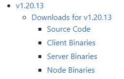
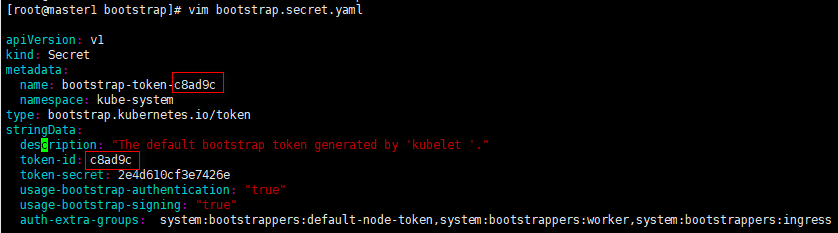
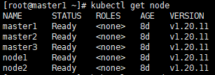
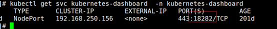
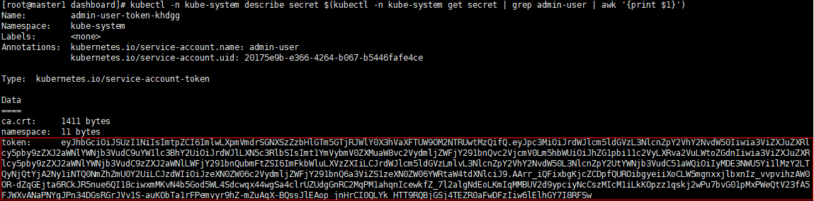
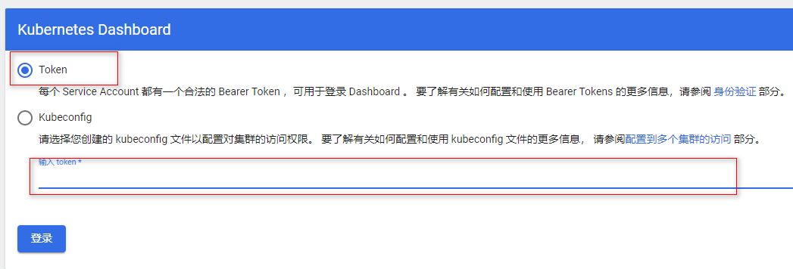

1 安装前必读

+ **本文档适用于k8s 1.17+**

+ **请不要使用带中文的服务器和克隆的虚拟机**

+ 本文章将演示CentOS 7二进制方式安装高可用k8s 1.17+，相对于其他版本，二进制安装方式并无太大区别，只需要区分每个组件版本的对应关系即可。生产环境中，建议使用小版本大于5的Kubernetes版本，比如1.19.5以后的才可用于生产环境。

| IP地址        | 主机名                                                       | 配置     |
| ------------- | ------------------------------------------------------------ | -------- |
| 172.18.20.1   | master1                                                      | 2C2G 40G |
| 172.18.20.2   | master2                                                      | 2C2G 40G |
| 172.18.20.3   | master3                                                      | 2C2G 40G |
| 172.18.20.11  | node1                                                        | 2C2G 40G |
| 172.18.20.12  | node2                                                        | 2C2G 40G |
| 172.18.20.0   | k8s-master-lb \# VIP不占用机器资源 ,若不是高可用集群，该IP为master1的IP |          |
| 10.96.0.0/12  | K8s Service网段                                              |          |
| 172.16.0.0/12 | K8s Pod网段                                                  |          |

# 2 集群安装

## 2.1 基本环境配置

### 2.1.1 配置成静态IP

### 2.1.2 系统环境

```shell
[root@node2 ~]# cat /etc/redhat-release

CentOS Linux release 7.9.2009 (Core)
```

### 2.1.3 配置dns解析

配置所有节点hosts文件或dns解析

## 2.2  yum源配置

### 2.2.1 配置yum源

```shell
curl -o /etc/yum.repos.d/CentOS-Base.repo <https://mirrors.aliyun.com/repo/Centos-7.repo>
yum install -y yum-utils device-mapper-persistent-data lvm2
yum-config-manager \--add-repo <https://mirrors.aliyun.com/docker-ce/linux/centos/docker-ce.repo>
sed -i -e \'/mirrors.cloud.aliyuncs.com/d\' -e \'/mirrors.aliyuncs.com/d\' /etc/yum.repos.d/CentOS-Base.repo
```

### 2.2.2 必备工具安装

```shell
yum install wget jq psmisc vim net-tools telnet yum-utils device-mapper-persistent-data lvm2 git -y
# 所有节点关闭firewalld 、dnsmasq、selinux(CentOS7需要关闭NetworkManager，CentOS8不需要)
systemctl disable --now firewalld dnsmasq NetworkManager
setenforce 0
sed -i 's#SELINUX=enforcing#SELINUX=disabled#g' /etc/sysconfig/selinux
sed -i 's#SELINUX=enforcing#SELINUX=disabled#g' /etc/selinux/config
```

## 2.3 关闭swap分区

```SHELL
swapoff -a && sysctl -w vm.swappiness=0
sed -ri '/^[^#]*swap/s@^@#@' /etc/fstab
```

## 2.4 chrony自动同步时间

### 2.4.1 安装chrony

```shell
yum -y install chrony  
#系统默认已经安装，如未安装，请执行以下命令安装
```

### 2.4.2 启动并加入开机自启动

```shell
systemctl enable --now chronyd.service
```

### 2.4.3 配置chrony

```shell
cat /etc/chrony.conf
#下方是默认的四个同步时间的服务器，不过该服务器同步时间略慢，可以按照格式修改成本地的时间服务器
server 0.centos.pool.ntp.org iburst
server 1.centos.pool.ntp.org iburst
server 2.centos.pool.ntp.org iburst
server 3.centos.pool.ntp.org iburst
......
# 指定一台主机、子网，或者网络以允许或拒绝NTP连接到扮演时钟服务器的机器
#allow 192.168.0.0/16
#deny 192.168/16
......
# 指定日志文件的目录
logdir /var/log/chrony
......
```

## 2.4.4 设置时区

```shell
timedatectl 
#查看系统的当前的时区
				Local time: 日 2019-05-26 10:42:00 CST
				Universal time: 日 2019-05-26 02:42:00 UTC
				RTC time: 日 2019-05-26 02:42:00
				Time zone: Asia/Shanghai (CST, +0800)
				NTP enabled: yes
				NTP synchronized: no
				RTC in local TZ: no
				DST active: n/a
```

如果当前时区不是亚洲/上海时区，可以用如下命令设置

```html
timedatectl set-timezone Asia/Shanghai
```

## 2.5 服务器集群之间的系统时间同步

```shell
服务器端：
注释掉默认的时间服务器
#server 0.centos.pool.ntp.org iburst
#server 1.centos.pool.ntp.org iburst
#server 2.centos.pool.ntp.org iburst
#server 3.centos.pool.ntp.org iburst
并添加以下内容：（内网的时间同步器或互联网中的时间同步器）
server 172.22.0.1 iburst 
配置完成后重启服务，这样我们需求的一台内网时间服务器已经配置完毕。
1.2.3.4.5.6.7.8.9.
客户端：
同样注释掉其他server，并在客户端（192.168.1.10）添加刚配置的时间服务器的IP地址：
server 192.168.1.9 iburst
#将这一行取消注释，当无法从时间服务器中获得正确的时间时，可以让本服务器充当网络内的时间服务器
# Allow NTP client access from local network.
allow 192.168.0.0/24
到此已经完成系统时间的同步。如有多台机器，操作亦是如此
```

## 2.6 常用chrony命令

```shell
查看时间同步源：
chronyc sources -v
查看时间同步源状态：
chronyc sourcestats -v
设置硬件时间
硬件时间默认为UTC：
timedatectl set-local-rtc 1
启用NTP时间同步：
timedatectl set-ntp yes
校准时间服务器：
chronyc tracking
```

## 2.7 所有节点配置limit

```shell
ulimit -SHn 65535
vim /etc/security/limits.conf
# 末尾添加如下内容
* soft nofile 65536
* hard nofile 131072
* soft nproc 65535
* hard nproc 655350
* soft memlock unlimited
* hard memlock unlimited　
```

## 2.8 配置master1节点免密钥登录其他节点

```shell
[root@master1 ~]# ssh-keygen -t rsa
[root@master1 ~]# for i in master1 master2 master3 node1 node2;do ssh-copy-id -i .ssh/id_rsa.pub $i;done
```

## 2.9 所有节点安装基本工具

```shell
yum install wget jq psmisc vim net-tools yum-utils device-mapper-persistent-data lvm2 git -y
```

## 2.10 master1下载安装文件

```shell
[root@master1 ~]# cd ~ ; git clone https://gitee.com/dukuan/k8s-ha-install.git
```

## 2.11 所有节点更新系统并重启

```shell
yum update -y --exclude=kernel* && reboot 
#CentOS7需要升级，CentOS8可以按需升级系统
```

## 2.12 内核升级

+ CentOS7 需要升级内核至4.18+，本地升级的版本为4.19

### 2.12.1 所有节点下载并安装内核：

```shell
wget http://193.49.22.109/elrepo/kernel/el7/x86_64/RPMS/kernel-ml-devel-4.19.12-1.el7.elrepo.x86_64.rpm
wget http://193.49.22.109/elrepo/kernel/el7/x86_64/RPMS/kernel-ml-4.19.12-1.el7.elrepo.x86_64.rpm
yum localinstall -y kernel-ml*
```

### 2.12.2 所有节点更改内核启动顺序

```shell
grub2-set-default 0 && grub2-mkconfig -o /etc/grub2.cfg
grubby --args="user_namespace.enable=1" --update-kernel="\$(grubby --default-kernel)"
```

### 2.12.3 检查默认内核是不是4.19

```shell
[root@master2 ~]# grubby --default-kernel
/boot/vmlinuz-4.19.12-1.el7.elrepo.x86_64
# 所有节点重启，然后检查内核是不是4.19
[root@master2 ~]# uname -a
Linux master2 4.19.12-1.el7.elrepo.x86_64 #1 SMP Fri Dec 21 11:06:36 EST 2018 x86_64 x86_64 x86_64 GNU/Linux
```

## 2.12 所有节点安装ipvsadm

### 2.12.1 安装ipvsadm

```shell
yum install ipvsadm ipset sysstat conntrack libseccomp -y
```

### 2.12.2 所有节点配置ipvs模块

+ <font color='red'>在内核4.19+版本nf_conntrack_ipv4已经改为nf_conntrack， 4.18以下使用nf_conntrack_ipv4即可</font>

```shell
modprobe -- ip_vs
modprobe -- ip_vs_rr
modprobe -- ip_vs_wrr
modprobe -- ip_vs_sh
modprobe -- nf_conntrack
```

### 2.12.3 修改ipvs.conf 

```shell
vim /etc/modules-load.d/ipvs.conf 
# 加入以下内容
ip_vs
ip_vs_lc
ip_vs_wlc
ip_vs_rr
ip_vs_wrr
ip_vs_lblc
ip_vs_lblcr
ip_vs_dh
ip_vs_sh
ip_vs_fo
ip_vs_nq
ip_vs_sed
ip_vs_ftp
ip_vs_sh
nf_conntrack
ip_tables
ip_set
xt_set
ipt_set
ipt_rpfilter
ipt_REJECT
ipip
#启动systemd-modules-load
~]# systemctl enable --now systemd-modules-load.service
```

### 2.12.4 检查是否加载

```shell
[root@master1 ~]# lsmod | grep -e ip_vs -e nf_conntrack
nf_conntrack_ipv4      16384  23 
nf_defrag_ipv4         16384  1 nf_conntrack_ipv4
nf_conntrack          135168  10 xt_conntrack,nf_conntrack_ipv6,nf_conntrack_ipv4,nf_nat,nf_nat_ipv6,ipt_MASQUERADE,nf_nat_ipv4,xt_nat,nf_conntrack_netlink,ip_vs
```

## 2.13 修改内核参数

```shell
cat <<EOF > /etc/sysctl.d/k8s.conf
net.ipv4.ip_forward = 1
net.bridge.bridge-nf-call-iptables = 1
net.bridge.bridge-nf-call-ip6tables = 1
fs.may_detach_mounts = 1
vm.overcommit_memory=1
vm.panic_on_oom=0
fs.inotify.max_user_watches=89100
fs.file-max=52706963
fs.nr_open=52706963
net.netfilter.nf_conntrack_max=2310720

net.ipv4.tcp_keepalive_time = 600
net.ipv4.tcp_keepalive_probes = 3
net.ipv4.tcp_keepalive_intvl =15
net.ipv4.tcp_max_tw_buckets = 36000
net.ipv4.tcp_tw_reuse = 1
net.ipv4.tcp_max_orphans = 327680
net.ipv4.tcp_orphan_retries = 3
net.ipv4.tcp_syncookies = 1
net.ipv4.tcp_max_syn_backlog = 16384
net.ipv4.ip_conntrack_max = 65536
net.ipv4.tcp_max_syn_backlog = 16384
net.ipv4.tcp_timestamps = 0
net.core.somaxconn = 16384
EOF
~]# sysctl --system
~]# reboot
~]# lsmod | grep --color=auto -e ip_vs -e nf_conntrack
```

# 3 基本组件安装

本节主要安装的是集群中用到的各种组件，比如Docker-ce、Kubernetes各组件等。

## 3.1 Docker安装

+ 所有节点安装Docker-ce 19.03

```shell
~]# yum install docker-ce-19.03.\* -y
```

+ <font color='red'>由于新版kubelet建议使用systemd，所以可以把docker的CgroupDriver改成systemd</font>

```
mkdir /etc/docker
cat > /etc/docker/daemon.json <<EOF
{
  "exec-opts": ["native.cgroupdriver=systemd"]
}
EOF
```

+ 所有节点设置开机自启动Docker：

```shell
~]# systemctl daemon-reload && systemctl enable --now docker
```

## 3.2 K8s及etcd安装

### 3.2.1 master1下载kubernetes安装包

+ <font color='red'>注意目前版本是1.20.0学员安装时需要下载最新的1.20.x版本</font>

https://github.com/kubernetes/kubernetes/blob/master/CHANGELOG/CHANGELOG-1.20.md



```shell
master1 ~]\# wget https://dl.k8s.io/v1.20.13/kubernetes-server-linux-amd64.tar.gz
```

### 3.2.2 master1下载etcd安装包

```shell
master1 ~]# wget https://github.com/etcd-io/etcd/releases/download/v3.4.13/etcd-v3.4.13-linux-amd64.tar.gz
```

### 3.2.3 解压kubernetes和etcd安装文件

```shell
master1 ~]# tar -xf kubernetes-server-linux-amd64.tar.gz  --strip-components=3 -C /usr/local/bin kubernetes/server/bin/kube{let,ctl,-apiserver,-controller-manager,-scheduler,-proxy}
master1 ~]#  tar -zxvf etcd-v3.4.13-linux-amd64.tar.gz --strip-components=1 -C /usr/local/bin etcd-v3.4.13-linux-amd64/etcd{,ctl}
```

### 3.2.4 验证kubernetes和etcd版本

```shell
master1 ~]# kubelet --version
Kubernetes v1.20.0
master1 ~]# etcdctl version
etcdctl version: 3.4.13
API version: 3.4 
```

### 3.2.5 将组件发送到其他节点

+ k8s github : <https://github.com/kubernetes/kubernetes/

```shell
master1 ~]# MasterNodes='master2 master3'
master1 ~]# WorkNodes='node1 node2'
master1 ~]# for NODE in $MasterNodes; do echo $NODE; scp /usr/local/bin/kube{let,ctl,-apiserver,-controller-manager,-scheduler,-proxy} master1 ~]# $NODE:/usr/local/bin/; scp /usr/local/bin/etcd* $NODE:/usr/local/bin/; done
master1 ~]# for NODE in $WorkNodes; do     scp /usr/local/bin/kube{let,-proxy} $NODE:/usr/local/bin/ ; done
```

### 3.2.6 所有节点创建/opt/cni/bin目录

```shell
mkdir -p /opt/cni/bin
```

切换分支

master1切换到1.20.x分支（其他版本可以切换到其他分支）

cd k8s-ha-install && git checkout manual-installation-v1.20.x

# 4 生成证书

## 4.1 master1下载生成证书工具

```shell
wget "https://pkg.cfssl.org/R1.2/cfssl_linux-amd64" -O /usr/local/bin/cfssl
wget "https://pkg.cfssl.org/R1.2/cfssljson_linux-amd64" -O /usr/local/bin/cfssljson
chmod +x /usr/local/bin/cfssl /usr/local/bin/cfssljson
```

##  4.2 etcd证书

### 4.2.1 所有Master节点创建目录

```shell
master1 ~]# mkdir -p /etc/etcd/ssl
master1 ~]# mkdir -p /etc/kubernetes/pki
```

### 4.2.2 master1节点生成etcd证书

+ 生成证书的CSR文件：证书签名请求文件，配置了一些域名、公司、单位

```json
]# cat etcd-ca-csr.json 
{
  "CN": "etcd",
  "key": {
    "algo": "rsa",
    "size": 2048
  },
  "names": [
    {
      "C": "CN",
      "ST": "Beijing",
      "L": "Beijing",
      "O": "etcd",
      "OU": "Etcd Security"
    }
  ],
  "ca": {
    "expiry": "876000h"
  }
}
]# cat ca-config.json
{
  "signing": {
    "default": {
      "expiry": "876000h"
    },
    "profiles": {
      "kubernetes": {
        "usages": [
            "signing",
            "key encipherment",
            "server auth",
            "client auth"
        ],
        "expiry": "876000h"
      }
    }
  }
}

```

```shell
]# cd /root/k8s-ha-install/pki

# 生成etcd CA证书和CA证书的key
]# cfssl gencert -initca etcd-ca-csr.json | cfssljson -bare /etc/etcd/ssl/etcd-ca

]# cfssl gencert \
   -ca=/etc/etcd/ssl/etcd-ca.pem \
   -ca-key=/etc/etcd/ssl/etcd-ca-key.pem \
   -config=ca-config.json \
   -hostname=127.0.0.1,master1,master2,master3,172.18.20.1,172.18.20.2,172.18.20.3 \
   -profile=kubernetes \
   etcd-csr.json | cfssljson -bare /etc/etcd/ssl/etcd

# 执行结果
2019/12/26 22:48:00 [INFO] generate received request
2019/12/26 22:48:00 [INFO] received CSR
2019/12/26 22:48:00 [INFO] generating key: rsa-2048
2019/12/26 22:48:01 [INFO] encoded CSR
2019/12/26 22:48:01 [INFO] signed certificate with serial number 250230878926052708909595617022917808304837732033
```

### 4.2.3 将证书复制到其他节点

```shell
]# MasterNodes='master2 master3'
]# WorkNodes='node1 node2'
]# for NODE in $MasterNodes; do
     ssh $NODE "mkdir -p /etc/etcd/ssl"
     for FILE in etcd-ca-key.pem  etcd-ca.pem  etcd-key.pem  etcd.pem; do
       scp /etc/etcd/ssl/${FILE} $NODE:/etc/etcd/ssl/${FILE}
     done
 done

```

##  4.3 k8s组件证书

### 4.3.1 master1生成kubernetes证书

```json
]# cat ca-csr.json
{
  "CN": "kubernetes",
  "key": {
    "algo": "rsa",
    "size": 2048
  },
  "names": [
    {
      "C": "CN",
      "ST": "Beijing",
      "L": "Beijing",
      "O": "Kubernetes",
      "OU": "Kubernetes-manual"
    }
  ],
  "ca": {
    "expiry": "876000h"
  }
}

]# cat ca-config.json
{
  "signing": {
    "default": {
      "expiry": "876000h"
    },
    "profiles": {
      "kubernetes": {
        "usages": [
            "signing",
            "key encipherment",
            "server auth",
            "client auth"
        ],
        "expiry": "876000h"
      }
    }
  }
}

]# cat apiserver-csr.json
{
  "CN": "kube-apiserver",
  "key": {
    "algo": "rsa",
    "size": 2048
  },
  "names": [
    {
      "C": "CN",
      "ST": "Beijing",
      "L": "Beijing",
      "O": "Kubernetes",
      "OU": "Kubernetes-manual"
    }
  ]
}

```

```shell
]# cfssl gencert -initca ca-csr.json | cfssljson -bare /etc/kubernetes/pki/ca
]# cfssl gencert   -ca=/etc/kubernetes/pki/ca.pem   -ca-key=/etc/kubernetes/pki/ca-key.pem   -config=ca-config.json   -hostname=10.96.0.1,172.18.20.0,127.0.0.1,kubernetes,kubernetes.default,kubernetes.default.svc,kubernetes.default.svc.cluster,kubernetes.default.svc.cluster.local,172.18.20.1,172.18.20.2,172.18.20.3   -profile=kubernetes   apiserver-csr.json | cfssljson -bare /etc/kubernetes/pki/apiserver
```

+ 10.96.0.是k8s service的网段，如果说需要更改k8s service网段，那就需要更改10.96.0.1，

+ 如果不是高可用集群，172.18.20.0为master1的IP

### 4.3.2 生成apiserver的聚合证书

```json
]# cat front-proxy-ca-csr.json
{
  "CN": "kubernetes",
  "key": {
     "algo": "rsa",
     "size": 2048
  }
}
]# cat ca-config.json
{
  "signing": {
    "default": {
      "expiry": "876000h"
    },
    "profiles": {
      "kubernetes": {
        "usages": [
            "signing",
            "key encipherment",
            "server auth",
            "client auth"
        ],
        "expiry": "876000h"
      }
    }
  }
}

]# cat front-proxy-client-csr.json 
{
  "CN": "front-proxy-client",
  "key": {
     "algo": "rsa",
     "size": 2048
  }
}

```

```shell
]# cfssl gencert   -initca front-proxy-ca-csr.json | cfssljson -bare /etc/kubernetes/pki/front-proxy-ca 
]# cfssl gencert   -ca=/etc/kubernetes/pki/front-proxy-ca.pem   -ca-key=/etc/kubernetes/pki/front-proxy-ca-key.pem   -config=ca-config.json   -profile=kubernetes   front-proxy-client-csr.json | cfssljson -bare /etc/kubernetes/pki/front-proxy-client

# 返回结果（忽略警告）
2020/12/11 18:15:28 [INFO] generate received request
2020/12/11 18:15:28 [INFO] received CSR
2020/12/11 18:15:28 [INFO] generating key: rsa-2048

2020/12/11 18:15:28 [INFO] encoded CSR
2020/12/11 18:15:28 [INFO] signed certificate with serial number 597484897564859295955894546063479154194995827845
2020/12/11 18:15:28 [WARNING] This certificate lacks a "hosts" field. This makes it unsuitable for
websites. For more information see the Baseline Requirements for the Issuance and Management
of Publicly-Trusted Certificates, v.1.1.6, from the CA/Browser Forum (https://cabforum.org);
specifically, section 10.2.3 ("Information Requirements").
```

### 4.3.3 生成controller-manage的证书

```json
]# cat ca-config.json
{
  "signing": {
    "default": {
      "expiry": "876000h"
    },
    "profiles": {
      "kubernetes": {
        "usages": [
            "signing",
            "key encipherment",
            "server auth",
            "client auth"
        ],
        "expiry": "876000h"
      }
    }
  }
}
]# cat scheduler-csr.json 
{
  "CN": "system:kube-scheduler",
  "key": {
    "algo": "rsa",
    "size": 2048
  },
  "names": [
    {
      "C": "CN",
      "ST": "Beijing",
      "L": "Beijing",
      "O": "system:kube-scheduler",
      "OU": "Kubernetes-manual"
    }
  ]
}
]# cat admin-csr.json
{
  "CN": "admin",
  "key": {
    "algo": "rsa",
    "size": 2048
  },
  "names": [
    {
      "C": "CN",
      "ST": "Beijing",
      "L": "Beijing",
      "O": "system:masters",
      "OU": "Kubernetes-manual"
    }
  ]
}
```


```shell
cfssl gencert \
   -ca=/etc/kubernetes/pki/ca.pem \
   -ca-key=/etc/kubernetes/pki/ca-key.pem \
   -config=ca-config.json \
   -profile=kubernetes \
   manager-csr.json | cfssljson -bare /etc/kubernetes/pki/controller-manager

# 注意，如果不是高可用集群，172.18.20.0:8443改为master01的地址，8443改为apiserver的端口，默认是6443
# set-cluster：设置一个集群项，

kubectl config set-cluster kubernetes \
     --certificate-authority=/etc/kubernetes/pki/ca.pem \
     --embed-certs=true \
     --server=https://172.18.20.0:8443 \
     --kubeconfig=/etc/kubernetes/controller-manager.kubeconfig

# 设置一个环境项，一个上下文
kubectl config set-context system:kube-controller-manager@kubernetes \
    --cluster=kubernetes \
    --user=system:kube-controller-manager \
    --kubeconfig=/etc/kubernetes/controller-manager.kubeconfig

# set-credentials 设置一个用户项

kubectl config set-credentials system:kube-controller-manager \
     --client-certificate=/etc/kubernetes/pki/controller-manager.pem \
     --client-key=/etc/kubernetes/pki/controller-manager-key.pem \
     --embed-certs=true \
     --kubeconfig=/etc/kubernetes/controller-manager.kubeconfig


# 使用某个环境当做默认环境

kubectl config use-context system:kube-controller-manager@kubernetes \
     --kubeconfig=/etc/kubernetes/controller-manager.kubeconfig


cfssl gencert \
   -ca=/etc/kubernetes/pki/ca.pem \
   -ca-key=/etc/kubernetes/pki/ca-key.pem \
   -config=ca-config.json \
   -profile=kubernetes \
   scheduler-csr.json | cfssljson -bare /etc/kubernetes/pki/scheduler

# 注意，如果不是高可用集群，172.18.20.0:8443改为master01的地址，8443改为apiserver的端口，默认是6443

kubectl config set-cluster kubernetes \
     --certificate-authority=/etc/kubernetes/pki/ca.pem \
     --embed-certs=true \
     --server=https://172.18.20.0:8443 \
     --kubeconfig=/etc/kubernetes/scheduler.kubeconfig


kubectl config set-credentials system:kube-scheduler \
     --client-certificate=/etc/kubernetes/pki/scheduler.pem \
     --client-key=/etc/kubernetes/pki/scheduler-key.pem \
     --embed-certs=true \
     --kubeconfig=/etc/kubernetes/scheduler.kubeconfig

kubectl config set-context system:kube-scheduler@kubernetes \
     --cluster=kubernetes \
     --user=system:kube-scheduler \
     --kubeconfig=/etc/kubernetes/scheduler.kubeconfig


kubectl config use-context system:kube-scheduler@kubernetes \
     --kubeconfig=/etc/kubernetes/scheduler.kubeconfig


cfssl gencert \
   -ca=/etc/kubernetes/pki/ca.pem \
   -ca-key=/etc/kubernetes/pki/ca-key.pem \
   -config=ca-config.json \
   -profile=kubernetes \
   admin-csr.json | cfssljson -bare /etc/kubernetes/pki/admin

# 注意，如果不是高可用集群，172.18.20.0:8443改为master01的地址，8443改为apiserver的端口，默认是6443

kubectl config set-cluster kubernetes     --certificate-authority=/etc/kubernetes/pki/ca.pem     --embed-certs=true     --server=https://172.18.20.0:8443     --kubeconfig=/etc/kubernetes/admin.kubeconfig
kubectl config set-credentials kubernetes-admin     --client-certificate=/etc/kubernetes/pki/admin.pem     --client-key=/etc/kubernetes/pki/admin-key.pem     --embed-certs=true     --kubeconfig=/etc/kubernetes/admin.kubeconfig


kubectl config set-context kubernetes-admin@kubernetes     --cluster=kubernetes     --user=kubernetes-admin     --kubeconfig=/etc/kubernetes/admin.kubeconfig


kubectl config use-context kubernetes-admin@kubernetes     --kubeconfig=/etc/kubernetes/admin.kubeconfig
```

### 4.3.4 创建ServiceAccount Key secret

```shell
openssl genrsa -out /etc/kubernetes/pki/sa.key 2048
#返回结果
Generating RSA private key, 2048 bit long modulus (2 primes)
...................................................................................+++++
...............+++++
e is 65537 (0x010001)
```

### 4.3.5 发送证书至其他节点

```shell
]# for NODE in master2 master3; do 
for FILE in $(ls /etc/kubernetes/pki | grep -v etcd); do 
scp /etc/kubernetes/pki/${FILE} $NODE:/etc/kubernetes/pki/${FILE};
done; 
]# for FILE in admin.kubeconfig controller-manager.kubeconfig scheduler.kubeconfig; do 
scp /etc/kubernetes/${FILE} $NODE:/etc/kubernetes/${FILE};
done;
done

```

### 4.3.6 查看证书文件

```shell
~]# ls /etc/kubernetes/pki/
admin.csr      apiserver.csr      ca.csr      controller-manager.csr      front-proxy-ca.csr      front-proxy-client.csr      sa.key         scheduler-key.pem
admin-key.pem  apiserver-key.pem  ca-key.pem  controller-manager-key.pem  front-proxy-ca-key.pem  front-proxy-client-key.pem  sa.pub         scheduler.pem
admin.pem      apiserver.pem      ca.pem      controller-manager.pem      front-proxy-ca.pem      front-proxy-client.pem      scheduler.csr
~]# ls /etc/kubernetes/pki/ |wc -l
23
```

# 5 Kubernetes系统组件配置

## 5.1 Etcd配置

+ etcd配置大致相同，注意修改每个Master节点的etcd配置的主机名和IP地址

### 5.1.1 master1

```yaml
]# vim /etc/etcd/etcd.config.yml
name: 'master1'
data-dir: /var/lib/etcd
wal-dir: /var/lib/etcd/wal
snapshot-count: 5000
heartbeat-interval: 100
election-timeout: 1000
quota-backend-bytes: 0
listen-peer-urls: 'https://172.18.20.1:2380'
listen-client-urls: 'https://172.18.20.1:2379,http://127.0.0.1:2379'
max-snapshots: 3
max-wals: 5
cors:
initial-advertise-peer-urls: 'https://172.18.20.1:2380'
advertise-client-urls: 'https://172.18.20.1:2379'
discovery:
discovery-fallback: 'proxy'
discovery-proxy:
discovery-srv:
initial-cluster: 'master1=https://172.18.20.1:2380,master2=https://172.18.20.2:2380,master3=https://172.18.20.3:2380'
initial-cluster-token: 'etcd-k8s-cluster'
initial-cluster-state: 'new'
strict-reconfig-check: false
enable-v2: true
enable-pprof: true
proxy: 'off'
proxy-failure-wait: 5000
proxy-refresh-interval: 30000
proxy-dial-timeout: 1000
proxy-write-timeout: 5000
proxy-read-timeout: 0
client-transport-security:
  cert-file: '/etc/kubernetes/pki/etcd/etcd.pem'
  key-file: '/etc/kubernetes/pki/etcd/etcd-key.pem'
  client-cert-auth: true
  trusted-ca-file: '/etc/kubernetes/pki/etcd/etcd-ca.pem'
  auto-tls: true
peer-transport-security:
  cert-file: '/etc/kubernetes/pki/etcd/etcd.pem'
  key-file: '/etc/kubernetes/pki/etcd/etcd-key.pem'
  peer-client-cert-auth: true
  trusted-ca-file: '/etc/kubernetes/pki/etcd/etcd-ca.pem'
  auto-tls: true
debug: false
log-package-levels:
log-outputs: [default]
force-new-cluster: false
```

### 5.1.2 master2 

```yaml
]# vim /etc/etcd/etcd.config.yml
name: 'master2'
data-dir: /var/lib/etcd
wal-dir: /var/lib/etcd/wal
snapshot-count: 5000
heartbeat-interval: 100
election-timeout: 1000
quota-backend-bytes: 0
listen-peer-urls: 'https://172.18.20.2:2380'
listen-client-urls: 'https://172.18.20.2:2379,http://127.0.0.1:2379'
max-snapshots: 3
max-wals: 5
cors:
initial-advertise-peer-urls: 'https://172.18.20.2:2380'
advertise-client-urls: 'https://172.18.20.2:2379'
discovery:
discovery-fallback: 'proxy'
discovery-proxy:
discovery-srv:
initial-cluster: 'master1=https://172.18.20.1:2380,master2=https://172.18.20.2:2380,master3=https://172.18.20.3:2380'
initial-cluster-token: 'etcd-k8s-cluster'
initial-cluster-state: 'new'
strict-reconfig-check: false
enable-v2: true
enable-pprof: true
proxy: 'off'
proxy-failure-wait: 5000
proxy-refresh-interval: 30000
proxy-dial-timeout: 1000
proxy-write-timeout: 5000
proxy-read-timeout: 0
client-transport-security:
  cert-file: '/etc/kubernetes/pki/etcd/etcd.pem'
  key-file: '/etc/kubernetes/pki/etcd/etcd-key.pem'
  client-cert-auth: true
  trusted-ca-file: '/etc/kubernetes/pki/etcd/etcd-ca.pem'
  auto-tls: true
peer-transport-security:
  cert-file: '/etc/kubernetes/pki/etcd/etcd.pem'
  key-file: '/etc/kubernetes/pki/etcd/etcd-key.pem'
  peer-client-cert-auth: true
  trusted-ca-file: '/etc/kubernetes/pki/etcd/etcd-ca.pem'
  auto-tls: true
debug: false
log-package-levels:
log-outputs: [default]
force-new-cluster: false

```

### 5.1.3 master3 

```shell
]# vim /etc/etcd/etcd.config.yml
name: 'master3'
data-dir: /var/lib/etcd
wal-dir: /var/lib/etcd/wal
snapshot-count: 5000
heartbeat-interval: 100
election-timeout: 1000
quota-backend-bytes: 0
listen-peer-urls: 'https://172.18.20.3:2380'
listen-client-urls: 'https://172.18.20.3:2379,http://127.0.0.1:2379'
max-snapshots: 3
max-wals: 5
cors:
initial-advertise-peer-urls: 'https://172.18.20.3:2380'
advertise-client-urls: 'https://172.18.20.3:2379'
discovery:
discovery-fallback: 'proxy'
discovery-proxy:
discovery-srv:
initial-cluster: 'master1=https://172.18.20.1:2380,master2=https://172.18.20.2:2380,master3=https://172.18.20.3:2380'
initial-cluster-token: 'etcd-k8s-cluster'
initial-cluster-state: 'new'
strict-reconfig-check: false
enable-v2: true
enable-pprof: true
proxy: 'off'
proxy-failure-wait: 5000
proxy-refresh-interval: 30000
proxy-dial-timeout: 1000
proxy-write-timeout: 5000
proxy-read-timeout: 0
client-transport-security:
  cert-file: '/etc/kubernetes/pki/etcd/etcd.pem'
  key-file: '/etc/kubernetes/pki/etcd/etcd-key.pem'
  client-cert-auth: true
  trusted-ca-file: '/etc/kubernetes/pki/etcd/etcd-ca.pem'
  auto-tls: true
peer-transport-security:
  cert-file: '/etc/kubernetes/pki/etcd/etcd.pem'
  key-file: '/etc/kubernetes/pki/etcd/etcd-key.pem'
  peer-client-cert-auth: true
  trusted-ca-file: '/etc/kubernetes/pki/etcd/etcd-ca.pem'
  auto-tls: true
debug: false
log-package-levels:
log-outputs: [default]
force-new-cluster: false
```

### 5.1.4 创建System文件

+ 所有Master节点创建etcd service并启动

```
~]# vim /usr/lib/systemd/system/etcd.service
[Unit]
Description=Etcd Service
Documentation=https://coreos.com/etcd/docs/latest/
After=network.target

[Service]
Type=notify
ExecStart=/usr/local/bin/etcd --config-file=/etc/etcd/etcd.config.yml
Restart=on-failure
RestartSec=10
LimitNOFILE=65536

[Install]
WantedBy=multi-user.target
Alias=etcd3.service
```

### 5.1.5 所有Master节点创建etcd的证书目录

```shell
~]# mkdir /etc/kubernetes/pki/etcd
~]# ln -s /etc/etcd/ssl/* /etc/kubernetes/pki/etcd/
~]# systemctl daemon-reload
~]# systemctl enable --now etcd
```

### 5.1.6 查看etcd状态

```shell
export ETCDCTL_API=3
etcdctl --endpoints="172.18.20.3:2379,172.18.20.2:2379,172.18.20.1:2379" --cacert=/etc/kubernetes/pki/etcd/etcd-ca.pem --cert=/etc/kubernetes/pki/etcd/etcd.pem --key=/etc/kubernetes/pki/etcd/etcd-key.pem  endpoint status --write-out=table
```


# 6 高可用配置

高可用配置（注意：如果不是高可用集群，haproxy和keepalived无需安装）

## 6.1 所有master安装keepalived和haproxy

```shell
yum install keepalived haproxy -y
```

+ 所有Master配置HAProxy，配置一样

```shell
vim /etc/haproxy/haproxy.cfg
global
  maxconn  2000
  ulimit-n  16384
  log  127.0.0.1 local0 err
  stats timeout 30s

defaults
  log global
  mode  http
  option  httplog
  timeout connect 5000
  timeout client  50000
  timeout server  50000
  timeout http-request 15s
  timeout http-keep-alive 15s

frontend k8s-master
  bind 0.0.0.0:8443
  bind 127.0.0.1:8443
  mode tcp
  option tcplog
  tcp-request inspect-delay 5s
  default_backend k8s-master

backend k8s-master
  mode tcp
  option tcplog
  option tcp-check
  balance roundrobin
  default-server inter 10s downinter 5s rise 2 fall 2 slowstart 60s maxconn 250 maxqueue 256 weight 100
  server master1    172.18.20.1:6443  check
  server master2    172.18.20.2:6443  check
  server master3    172.18.20.3:6443  check

```

## 6.2 keepalived配置

### 6.2.1 master1

+ 所有Master节点配置KeepAlived，注意每个节点的IP和网卡（interface参数）

```shell
~]# vim /etc/keepalived/keepalived.conf
! Configuration File for keepalived
global_defs {
    router_id LVS_DEVEL
}
vrrp_script chk_apiserver {
    script "/etc/keepalived/check_apiserver.sh"
    interval 5 
    weight -5
    fall 2
    rise 1
}
vrrp_instance VI_1 {
    state MASTER
    interface ens33
    mcast_src_ip 172.18.20.1
    virtual_router_id 51
    priority 101
    nopreempt
    advert_int 2
    authentication {
        auth_type PASS
        auth_pass K8SHA_KA_AUTH
    }
    virtual_ipaddress {
        172.18.20.0
    }
    track_script {
      chk_apiserver 
} }
```

### 6.2.2 master2

```shell
~]# vim /etc/keepalived/keepalived.conf
! Configuration File for keepalived
global_defs {
    router_id LVS_DEVEL
}
vrrp_script chk_apiserver {
    script "/etc/keepalived/check_apiserver.sh"
    interval 5 
    weight -5
    fall 2
    rise 1
 
}
vrrp_instance VI_1 {
    state BACKUP
    interface ens33
    mcast_src_ip 172.18.20.2
    virtual_router_id 51
    priority 100
    nopreempt
    advert_int 2
    authentication {
        auth_type PASS
        auth_pass K8SHA_KA_AUTH
    }
    virtual_ipaddress {
        172.18.20.0
    }
    track_script {
      chk_apiserver 
} }
```

### 6.2.3 master3

```shell
~]# vim /etc/keepalived/keepalived.conf
! Configuration File for keepalived
global_defs {
    router_id LVS_DEVEL
}
vrrp_script chk_apiserver {
    script "/etc/keepalived/check_apiserver.sh"
    interval 5
    weight -5
    fall 2  
    rise 1
}
vrrp_instance VI_1 {
    state BACKUP
    interface ens33
    mcast_src_ip 172.18.20.3
    virtual_router_id 51
    priority 100
    nopreempt
    advert_int 2
    authentication {
        auth_type PASS
        auth_pass K8SHA_KA_AUTH
    }
    virtual_ipaddress {
        172.18.20.0
    }
    track_script {
      chk_apiserver 
} }
```

## 6.3 健康检查配置

+ 所有master节点

```shell
~]# cat /etc/keepalived/check_apiserver.sh 

#!/bin/bash

err=0
for k in $(seq 1 3)
do
    check_code=$(pgrep haproxy)
    if [[ $check_code == "" ]]; then
        err=$(expr $err + 1)
        sleep 1
        continue
    else
        err=0
        break
    fi
done

if [[ $err != "0" ]]; then
    echo "systemctl stop keepalived"
    /usr/bin/systemctl stop keepalived
    exit 1
else
    exit 0
fi

~]# chmod +x /etc/keepalived/check_apiserver.sh
```

## 6.4 所有master节点启动haproxy和keepalived

```shell
~]# systemctl daemon-reload
~]# systemctl enable --now haproxy keepalived
```

## 6.5 VIP测试

```shell
~]# ping 172.18.20.0
```

+ <font color='red'>重要：如果安装了keepalived和haproxy，需要测试keepalived是否是正常的</font>

```shell
~]# telnet 172.18.20.0 8443
```

# 7 Kubernetes组件配置

## 7.1 所有节点创建相关目录

```shell
~]# mkdir -p /etc/kubernetes/manifests/ /etc/systemd/system/kubelet.service.d /var/lib/kubelet /var/log/kubernetes
```

## 7.2 Apiserver

所有Master节点创建kube-apiserver service

+ <font color='red'>注意，如果不是高可用集群，172.18.20.0改为master1的地址</font>

#### 7.2.1 master1配置

+ <font color='red'>注意本文档使用的k8s service网段为10.96.0.0/12，该网段不能和宿主机的网段、Pod网段的重复，请按需修改</font>

```shell
~]# cat /usr/lib/systemd/system/kube-apiserver.service 

[Unit]
Description=Kubernetes API Server
Documentation=https://github.com/kubernetes/kubernetes
After=network.target

[Service]
ExecStart=/usr/local/bin/kube-apiserver \
      --v=2  \
      --logtostderr=true  \
      --allow-privileged=true  \
      --bind-address=0.0.0.0  \
      --secure-port=6443  \
      --insecure-port=0  \
      --advertise-address=172.18.20.1 \
      --service-cluster-ip-range=10.96.0.0/12  \
      --service-node-port-range=30000-32767  \
      --etcd-servers=https://172.18.20.1:2379,https://172.18.20.2:2379,https://172.18.20.3:2379 \
      --etcd-cafile=/etc/etcd/ssl/etcd-ca.pem  \
      --etcd-certfile=/etc/etcd/ssl/etcd.pem  \
      --etcd-keyfile=/etc/etcd/ssl/etcd-key.pem  \
      --client-ca-file=/etc/kubernetes/pki/ca.pem  \
      --tls-cert-file=/etc/kubernetes/pki/apiserver.pem  \
      --tls-private-key-file=/etc/kubernetes/pki/apiserver-key.pem  \
      --kubelet-client-certificate=/etc/kubernetes/pki/apiserver.pem  \
      --kubelet-client-key=/etc/kubernetes/pki/apiserver-key.pem  \
      --service-account-key-file=/etc/kubernetes/pki/sa.pub  \
      --service-account-signing-key-file=/etc/kubernetes/pki/sa.key  \
      --service-account-issuer=https://kubernetes.default.svc.cluster.local \
      --kubelet-preferred-address-types=InternalIP,ExternalIP,Hostname  \
      --enable-admission-plugins=NamespaceLifecycle,LimitRanger,ServiceAccount,DefaultStorageClass,DefaultTolerationSeconds,NodeRestriction,ResourceQuota  \
      --authorization-mode=Node,RBAC  \
      --enable-bootstrap-token-auth=true  \
      --requestheader-client-ca-file=/etc/kubernetes/pki/front-proxy-ca.pem  \
      --proxy-client-cert-file=/etc/kubernetes/pki/front-proxy-client.pem  \
      --proxy-client-key-file=/etc/kubernetes/pki/front-proxy-client-key.pem  \
      --requestheader-allowed-names=aggregator  \
      --requestheader-group-headers=X-Remote-Group  \
      --requestheader-extra-headers-prefix=X-Remote-Extra-  \
      --requestheader-username-headers=X-Remote-User
      # --token-auth-file=/etc/kubernetes/token.csv

Restart=on-failure
RestartSec=10s
LimitNOFILE=65535

[Install]
WantedBy=multi-user.target
```

#### 7.2.2 master2配置

+ <font color='red'>注意本文档使用的k8s service网段为10.96.0.0/12，该网段不能和宿主机的网段、Pod网段的重复，请按需修改</font>

```shell
~]# cat /usr/lib/systemd/system/kube-apiserver.service 

[Unit]
Description=Kubernetes API Server
Documentation=https://github.com/kubernetes/kubernetes
After=network.target

[Service]
ExecStart=/usr/local/bin/kube-apiserver \
      --v=2  \
      --logtostderr=true  \
      --allow-privileged=true  \
      --bind-address=0.0.0.0  \
      --secure-port=6443  \
      --insecure-port=0  \
      --advertise-address=172.18.20.2 \
      --service-cluster-ip-range=10.96.0.0/12  \
      --service-node-port-range=30000-32767  \
      --etcd-servers=https://172.18.20.1:2379,https://172.18.20.2:2379,https://172.18.20.3:2379 \
      --etcd-cafile=/etc/etcd/ssl/etcd-ca.pem  \
      --etcd-certfile=/etc/etcd/ssl/etcd.pem  \
      --etcd-keyfile=/etc/etcd/ssl/etcd-key.pem  \
      --client-ca-file=/etc/kubernetes/pki/ca.pem  \
      --tls-cert-file=/etc/kubernetes/pki/apiserver.pem  \
      --tls-private-key-file=/etc/kubernetes/pki/apiserver-key.pem  \
      --kubelet-client-certificate=/etc/kubernetes/pki/apiserver.pem  \
      --kubelet-client-key=/etc/kubernetes/pki/apiserver-key.pem  \
      --service-account-key-file=/etc/kubernetes/pki/sa.pub  \
      --service-account-signing-key-file=/etc/kubernetes/pki/sa.key  \
      --service-account-issuer=https://kubernetes.default.svc.cluster.local \
      --kubelet-preferred-address-types=InternalIP,ExternalIP,Hostname  \
      --enable-admission-plugins=NamespaceLifecycle,LimitRanger,ServiceAccount,DefaultStorageClass,DefaultTolerationSeconds,NodeRestriction,ResourceQuota  \
      --authorization-mode=Node,RBAC  \
      --enable-bootstrap-token-auth=true  \
      --requestheader-client-ca-file=/etc/kubernetes/pki/front-proxy-ca.pem  \
      --proxy-client-cert-file=/etc/kubernetes/pki/front-proxy-client.pem  \
      --proxy-client-key-file=/etc/kubernetes/pki/front-proxy-client-key.pem  \
      --requestheader-allowed-names=aggregator  \
      --requestheader-group-headers=X-Remote-Group  \
      --requestheader-extra-headers-prefix=X-Remote-Extra-  \
      --requestheader-username-headers=X-Remote-User
      # --token-auth-file=/etc/kubernetes/token.csv

Restart=on-failure
RestartSec=10s
LimitNOFILE=65535

[Install]
WantedBy=multi-user.target
```

#### 7.2.3 master3配置

+ <font color='red'>注意本文档使用的k8s service网段为10.96.0.0/12，该网段不能和宿主机的网段、Pod网段的重复，请按需修改</font>

```shell
~]# cat /usr/lib/systemd/system/kube-apiserver.service 

[Unit]
Description=Kubernetes API Server
Documentation=https://github.com/kubernetes/kubernetes
After=network.target

[Service]
ExecStart=/usr/local/bin/kube-apiserver \
      --v=2  \
      --logtostderr=true  \
      --allow-privileged=true  \
      --bind-address=0.0.0.0  \
      --secure-port=6443  \
      --insecure-port=0  \
      --advertise-address=172.18.20.3 \
      --service-cluster-ip-range=10.96.0.0/12  \
      --service-node-port-range=30000-32767  \
      --etcd-servers=https://172.18.20.1:2379,https://172.18.20.2:2379,https://172.18.20.3:2379 \
      --etcd-cafile=/etc/etcd/ssl/etcd-ca.pem  \
      --etcd-certfile=/etc/etcd/ssl/etcd.pem  \
      --etcd-keyfile=/etc/etcd/ssl/etcd-key.pem  \
      --client-ca-file=/etc/kubernetes/pki/ca.pem  \
      --tls-cert-file=/etc/kubernetes/pki/apiserver.pem  \
      --tls-private-key-file=/etc/kubernetes/pki/apiserver-key.pem  \
      --kubelet-client-certificate=/etc/kubernetes/pki/apiserver.pem  \
      --kubelet-client-key=/etc/kubernetes/pki/apiserver-key.pem  \
      --service-account-key-file=/etc/kubernetes/pki/sa.pub  \
      --service-account-signing-key-file=/etc/kubernetes/pki/sa.key  \
      --service-account-issuer=https://kubernetes.default.svc.cluster.local \
      --kubelet-preferred-address-types=InternalIP,ExternalIP,Hostname  \
      --enable-admission-plugins=NamespaceLifecycle,LimitRanger,ServiceAccount,DefaultStorageClass,DefaultTolerationSeconds,NodeRestriction,ResourceQuota  \
      --authorization-mode=Node,RBAC  \
      --enable-bootstrap-token-auth=true  \
      --requestheader-client-ca-file=/etc/kubernetes/pki/front-proxy-ca.pem  \
      --proxy-client-cert-file=/etc/kubernetes/pki/front-proxy-client.pem  \
      --proxy-client-key-file=/etc/kubernetes/pki/front-proxy-client-key.pem  \
      --requestheader-allowed-names=aggregator  \
      --requestheader-group-headers=X-Remote-Group  \
      --requestheader-extra-headers-prefix=X-Remote-Extra-  \
      --requestheader-username-headers=X-Remote-User
      # --token-auth-file=/etc/kubernetes/token.csv

Restart=on-failure
RestartSec=10s
LimitNOFILE=65535

[Install]
WantedBy=multi-user.target

```

#### 7.2.4 启动apiserver

+ 所有Master节点开启kube-apiserver

```shell
systemctl daemon-reload && systemctl enable \--now kube-apiserver
```

### 7.2.5 检测kube-server状态

```shell'
# systemctl status kube-apiserver

● kube-apiserver.service - Kubernetes API Server
   Loaded: loaded (/usr/lib/systemd/system/kube-apiserver.service; enabled; vendor preset: disabled)
   Active: active (running) since Sat 2020-08-22 21:26:49 CST; 26s ago 
```

### 7.2.6 系统日志的这些提示可以忽略

Dec 11 20:51:15 master1 kube-apiserver: I1211 20:51:15.004739 7450 clientconn.go:948\] ClientConn switching balancer to \"pick_first\"

Dec 11 20:51:15 master1 kube-apiserver: I1211 20:51:15.004843 7450 balancer_conn_wrappers.go:78\] pickfirstBalancer: HandleSubConnStateChange: 0xc011bd4c80, {CONNECTING \<nil>}

Dec 11 20:51:15 master1 kube-apiserver: I1211 20:51:15.010725 7450 balancer_conn_wrappers.go:78\] pickfirstBalancer: HandleSubConnStateChange: 0xc011bd4c80, {READY \<nil>}

Dec 11 20:51:15 master1 kube-apiserver: I1211 20:51:15.011370 7450 controlbuf.go:508\] transport: loopyWriter.run returning. connection error: desc = \"transport is closing\"

## 7.3 ControllerManager

7.3.1 所有Master节点配置kube-controller-manager service

+ <font color='red'>注意本文档使用的k8s Pod网段为172.16.0.0/12，该网段不能和宿主机的网段、k8s Service网段的重复，请按需修改</font>

```shell
~]# cat /usr/lib/systemd/system/kube-controller-manager.service
[Unit]
Description=Kubernetes Controller Manager
Documentation=https://github.com/kubernetes/kubernetes
After=network.target

[Service]
ExecStart=/usr/local/bin/kube-controller-manager \
      --v=2 \
      --logtostderr=true \
      --address=127.0.0.1 \
      --root-ca-file=/etc/kubernetes/pki/ca.pem \
      --cluster-signing-cert-file=/etc/kubernetes/pki/ca.pem \
      --cluster-signing-key-file=/etc/kubernetes/pki/ca-key.pem \
      --service-account-private-key-file=/etc/kubernetes/pki/sa.key \
      --kubeconfig=/etc/kubernetes/controller-manager.kubeconfig \
      --leader-elect=true \
      --use-service-account-credentials=true \
      --node-monitor-grace-period=40s \
      --node-monitor-period=5s \
      --pod-eviction-timeout=2m0s \
      --controllers=*,bootstrapsigner,tokencleaner \
      --allocate-node-cidrs=true \
      --cluster-cidr=172.16.0.0/12 \
      --requestheader-client-ca-file=/etc/kubernetes/pki/front-proxy-ca.pem \
      --node-cidr-mask-size=24
      
Restart=always
RestartSec=10s

[Install]
WantedBy=multi-user.target
```

### 7.3.2所有Master节点启动kube-controller-manager

```shell
~]# systemctl daemon-reload
~]# systemctl enable --now kube-controller-manager
Created symlink /etc/systemd/system/multi-user.target.wants/kube-controller-manager.service → /usr/lib/systemd/system/kube-controller-manager.service.
```

### 7.3.3 查看启动状态

```shell
~]# systemctl enable --now kube-controller-manager
Created symlink from /etc/systemd/system/multi-user.target.wants/kube-controller-manager.service to /usr/lib/systemd/system/kube-controller-manager.service.
~]# systemctl status kube-controller-manager
● kube-controller-manager.service - Kubernetes Controller Manager
   Loaded: loaded (/usr/lib/systemd/system/kube-controller-manager.service; enabled; vendor preset: disabled)
   Active: active (running) since Fri 2020-12-11 20:53:05 CST; 8s ago
     Docs: https://github.com/kubernetes/kubernetes
 Main PID: 7518 (kube-controller)

```

## 7.4 Scheduler

7.4.4 所有Master节点配置kube-scheduler service

```shell
~]# cat /usr/lib/systemd/system/kube-scheduler.service 
[Unit]
Description=Kubernetes Scheduler
Documentation=https://github.com/kubernetes/kubernetes
After=network.target

[Service]
ExecStart=/usr/local/bin/kube-scheduler \
      --v=2 \
      --logtostderr=true \
      --address=127.0.0.1 \
      --leader-elect=true \
      --kubeconfig=/etc/kubernetes/scheduler.kubeconfig

Restart=always
RestartSec=10s

[Install]
WantedBy=multi-user.target

~]# systemctl daemon-reload
~]# systemctl enable --now kube-scheduler
Created symlink /etc/systemd/system/multi-user.target.wants/kube-scheduler.service → /usr/lib/systemd/system/kube-scheduler.service.

```

## 7.5 TLS Bootstrapping配置

7.5.1 在master1创建bootstrap

+ <font color='red'>注意，如果不是高可用集群，172.18.20.0:8443改为master1的地址，8443改为apiserver的端口，默认是6443</font>

```yaml
~]# cat /root/k8s-ha-install/bootstrap/bootstrap.secret.yaml
apiVersion: v1
kind: Secret
metadata:
  name: bootstrap-token-c8ad9c
  namespace: kube-system
type: bootstrap.kubernetes.io/token
stringData:
  description: "The default bootstrap token generated by 'kubelet '."
  token-id: c8ad9c
  token-secret: 2e4d610cf3e7426e
  usage-bootstrap-authentication: "true"
  usage-bootstrap-signing: "true"
  auth-extra-groups:  system:bootstrappers:default-node-token,system:bootstrappers:worker,system:bootstrappers:ingress
 
---
apiVersion: rbac.authorization.k8s.io/v1
kind: ClusterRoleBinding
metadata:
  name: kubelet-bootstrap
roleRef:
  apiGroup: rbac.authorization.k8s.io
  kind: ClusterRole
  name: system:node-bootstrapper
subjects:
- apiGroup: rbac.authorization.k8s.io
  kind: Group
  name: system:bootstrappers:default-node-token
---
apiVersion: rbac.authorization.k8s.io/v1
kind: ClusterRoleBinding
metadata:
  name: node-autoapprove-bootstrap
roleRef:
  apiGroup: rbac.authorization.k8s.io
  kind: ClusterRole
  name: system:certificates.k8s.io:certificatesigningrequests:nodeclient
subjects:
- apiGroup: rbac.authorization.k8s.io
  kind: Group
  name: system:bootstrappers:default-node-token
---
apiVersion: rbac.authorization.k8s.io/v1
kind: ClusterRoleBinding
metadata:
  name: node-autoapprove-certificate-rotation
roleRef:
  apiGroup: rbac.authorization.k8s.io
  kind: ClusterRole
  name: system:certificates.k8s.io:certificatesigningrequests:selfnodeclient
subjects:
- apiGroup: rbac.authorization.k8s.io
  kind: Group
  name: system:nodes
---
apiVersion: rbac.authorization.k8s.io/v1
kind: ClusterRole
metadata:
  annotations:
    rbac.authorization.kubernetes.io/autoupdate: "true"
  labels:
    kubernetes.io/bootstrapping: rbac-defaults
  name: system:kube-apiserver-to-kubelet
rules:
  - apiGroups:
      - ""
    resources:
      - nodes/proxy
      - nodes/stats
      - nodes/log
      - nodes/spec
      - nodes/metrics
    verbs:
      - "*"
---
apiVersion: rbac.authorization.k8s.io/v1
kind: ClusterRoleBinding
metadata:
  name: system:kube-apiserver
  namespace: ""
roleRef:
  apiGroup: rbac.authorization.k8s.io
  kind: ClusterRole
  name: system:kube-apiserver-to-kubelet
subjects:
  - apiGroup: rbac.authorization.k8s.io
    kind: User
    name: kube-apiserver
```


```shell
~]# cd /root/k8s-ha-install/bootstrap
~]# kubectl config set-cluster kubernetes     --certificate-authority=/etc/kubernetes/pki/ca.pem     --embed-certs=true     --server=https://172.18.20.0:8443     --kubeconfig=/etc/kubernetes/bootstrap-kubelet.kubeconfig
~]# kubectl config set-credentials tls-bootstrap-token-user     --token=c8ad9c.2e4d610cf3e7426e --kubeconfig=/etc/kubernetes/bootstrap-kubelet.kubeconfig
~]# kubectl config set-context tls-bootstrap-token-user@kubernetes     --cluster=kubernetes     --user=tls-bootstrap-token-user     --kubeconfig=/etc/kubernetes/bootstrap-kubelet.kubeconfig
~]# kubectl config use-context tls-bootstrap-token-user@kubernetes     --kubeconfig=/etc/kubernetes/bootstrap-kubelet.kubeconfig
```


+ <font color='red'>注意：如果要修改bootstrap.secret.yaml的token-id和token-secret，需要保证下图红圈内的字符串一致的，并且位数是一样的。还要保证上个命令的黄色字体：c8ad9c.2e4d610cf3e7426e与你修改的字符串要一致</font>



```shell
~]# mkdir -p /root/.kube ; cp /etc/kubernetes/admin.kubeconfig /root/.kube/config
~]# kubectl create -f /root/k8s-ha-install/bootstrap/bootstrap.secret.yaml 
secret/bootstrap-token-c8ad9c created
clusterrolebinding.rbac.authorization.k8s.io/kubelet-bootstrap created
clusterrolebinding.rbac.authorization.k8s.io/node-autoapprove-bootstrap created
clusterrolebinding.rbac.authorization.k8s.io/node-autoapprove-certificate-rotation created

```

# 8 Node节点配置

## 8.1 master1节点复制证书至Node节点

```shell
cd /etc/kubernetes/

for NODE in master2 master3 node1 node2; do
     ssh $NODE mkdir -p /etc/kubernetes/pki /etc/etcd/ssl /etc/etcd/ssl
     for FILE in etcd-ca.pem etcd.pem etcd-key.pem; do
       scp /etc/etcd/ssl/$FILE $NODE:/etc/etcd/ssl/
     done
     for FILE in pki/ca.pem pki/ca-key.pem pki/front-proxy-ca.pem bootstrap-kubelet.kubeconfig; do
       scp /etc/kubernetes/$FILE $NODE:/etc/kubernetes/${FILE}
 done
 done
```

## 8.2 Kubelet配置

8.2.1 所有节点创建相关目录

```shell
mkdir -p /var/lib/kubelet /var/log/kubernetes /etc/systemd/system/kubelet.service.d /etc/kubernetes/manifests/
```

8.2.3 所有节点配置kubelet system文件

```shell
~]# vim  /usr/lib/systemd/system/kubelet.service

[Unit]
Description=Kubernetes Kubelet
Documentation=https://github.com/kubernetes/kubernetes
After=docker.service
Requires=docker.service

[Service]
ExecStart=/usr/local/bin/kubelet

Restart=always
StartLimitInterval=0
RestartSec=10

[Install]
WantedBy=multi-user.target
```

### 8.2.4 所有节点配置kubelet system的配置文件

```shell
~]# vim /etc/systemd/system/kubelet.service.d/10-kubelet.conf
[Service]
Environment="KUBELET_KUBECONFIG_ARGS=--bootstrap-kubeconfig=/etc/kubernetes/bootstrap-kubelet.kubeconfig --kubeconfig=/etc/kubernetes/kubelet.kubeconfig"
Environment="KUBELET_SYSTEM_ARGS=--network-plugin=cni --cni-conf-dir=/etc/cni/net.d --cni-bin-dir=/opt/cni/bin"
Environment="KUBELET_CONFIG_ARGS=--config=/etc/kubernetes/kubelet-conf.yml --pod-infra-container-image=registry.cn-hangzhou.aliyuncs.com/google_containers/pause-amd64:3.2"
Environment="KUBELET_EXTRA_ARGS=--node-labels=node.kubernetes.io/node='' "
ExecStart=
ExecStart=/usr/local/bin/kubelet $KUBELET_KUBECONFIG_ARGS $KUBELET_CONFIG_ARGS $KUBELET_SYSTEM_ARGS $KUBELET_EXTRA_ARGS
```

8.2.5 创建kubelet的配置文件

+ <font color='red'>注意：如果更改了k8s的service网段，需要更改kubelet-conf.yml 的clusterDNS:配置，改成k8s Service网段的第十个地址，比如10.96.0.10</font>

```shell
[root@master1 bootstrap]# vim /etc/kubernetes/kubelet-conf.yml


apiVersion: kubelet.config.k8s.io/v1beta1
kind: KubeletConfiguration
address: 0.0.0.0
port: 10250
readOnlyPort: 10255
authentication:
  anonymous:
    enabled: false
  webhook:
    cacheTTL: 2m0s
    enabled: true
  x509:
    clientCAFile: /etc/kubernetes/pki/ca.pem
authorization:
  mode: Webhook
  webhook:
    cacheAuthorizedTTL: 5m0s
    cacheUnauthorizedTTL: 30s
cgroupDriver: systemd
cgroupsPerQOS: true
clusterDNS:
- 10.96.0.10
clusterDomain: cluster.local
containerLogMaxFiles: 5
containerLogMaxSize: 10Mi
contentType: application/vnd.kubernetes.protobuf
cpuCFSQuota: true
cpuManagerPolicy: none
cpuManagerReconcilePeriod: 10s
enableControllerAttachDetach: true
enableDebuggingHandlers: true
enforceNodeAllocatable:
- pods
eventBurst: 10
eventRecordQPS: 5
evictionHard:
  imagefs.available: 15%
  memory.available: 100Mi
  nodefs.available: 10%
  nodefs.inodesFree: 5%
evictionPressureTransitionPeriod: 5m0s
failSwapOn: true
fileCheckFrequency: 20s
hairpinMode: promiscuous-bridge
healthzBindAddress: 127.0.0.1
healthzPort: 10248
httpCheckFrequency: 20s
imageGCHighThresholdPercent: 85
imageGCLowThresholdPercent: 80
imageMinimumGCAge: 2m0s
iptablesDropBit: 15
iptablesMasqueradeBit: 14
kubeAPIBurst: 10
kubeAPIQPS: 5
makeIPTablesUtilChains: true
maxOpenFiles: 1000000
maxPods: 110
nodeStatusUpdateFrequency: 10s
oomScoreAdj: -999
podPidsLimit: -1
registryBurst: 10
registryPullQPS: 5
resolvConf: /etc/resolv.conf
rotateCertificates: true
runtimeRequestTimeout: 2m0s
serializeImagePulls: true
staticPodPath: /etc/kubernetes/manifests
streamingConnectionIdleTimeout: 4h0m0s
syncFrequency: 1m0s
volumeStatsAggPeriod: 1m0s
```

### 8.2.6 启动所有节点kubelet

```shell
systemctl daemon-reload
systemctl enable --now kubelet
```

### 8.2.7 查看集群状态

```shell
 ~]# kubectl get node
```



## 8.3 kube-proxy配置

+ <font color='red'>注意，如果不是高可用集群，172.18.20.0:8443改为master1的地址，8443改为apiserver的端口，默认是6443</font>

### 8.3.1 在master1执行

```shell
cd /root/k8s-ha-install
kubectl -n kube-system create serviceaccount kube-proxy
kubectl create clusterrolebinding system:kube-proxy --clusterrole system:node-proxier --serviceaccount kube-system:kube-proxy
SECRET=$(kubectl -n kube-system get sa/kube-proxy \
    --output=jsonpath='{.secrets[0].name}')
JWT_TOKEN=$(kubectl -n kube-system get secret/$SECRET \
--output=jsonpath='{.data.token}' | base64 -d)
PKI_DIR=/etc/kubernetes/pki
K8S_DIR=/etc/kubernetes
kubectl config set-cluster kubernetes     --certificate-authority=/etc/kubernetes/pki/ca.pem     --embed-certs=true     --server=https://172.18.20.0:8443     --kubeconfig=${K8S_DIR}/kube-proxy.kubeconfig
kubectl config set-credentials kubernetes     --token=${JWT_TOKEN}     --kubeconfig=/etc/kubernetes/kube-proxy.kubeconfig
kubectl config set-context kubernetes     --cluster=kubernetes     --user=kubernetes     --kubeconfig=/etc/kubernetes/kube-proxy.kubeconfig
kubectl config use-context kubernetes     --kubeconfig=/etc/kubernetes/kube-proxy.kubeconfig
```

### 8.3.2 将master1的kube-proxy的systemd文件发送到其他节点

+ <font color='red'>如果更改了集群Pod的网段，需要更改kube-proxy/kube-proxy.conf的clusterCIDR: 172.16.0.0/12参数为pod的网段。</font>

```shell
for NODE in master1 master2 master3; do
     scp ${K8S_DIR}/kube-proxy.kubeconfig $NODE:/etc/kubernetes/kube-proxy.kubeconfig
     scp kube-proxy/kube-proxy.conf $NODE:/etc/kubernetes/kube-proxy.conf
     scp kube-proxy/kube-proxy.service $NODE:/usr/lib/systemd/system/kube-proxy.service
 done


for NODE in node1 node2; do
     scp /etc/kubernetes/kube-proxy.kubeconfig $NODE:/etc/kubernetes/kube-proxy.kubeconfig
     scp kube-proxy/kube-proxy.conf $NODE:/etc/kubernetes/kube-proxy.conf
     scp kube-proxy/kube-proxy.service $NODE:/usr/lib/systemd/system/kube-proxy.service
 done
```

### 8.3.3 所有节点启动kube-proxy

```shell
~]# systemctl daemon-reload
~]# systemctl enable --now kube-proxy
Created symlink /etc/systemd/system/multi-user.target.wants/kube-proxy.service → /usr/lib/systemd/system/kube-proxy.service.
```

# 9 安装Calico

## 9.1 在master1执行

```yaml
~]# cat calico/calico-etcd.yaml 
---
# Source: calico/templates/calico-etcd-secrets.yaml
# The following contains k8s Secrets for use with a TLS enabled etcd cluster.
# For information on populating Secrets, see http://kubernetes.io/docs/user-guide/secrets/
apiVersion: v1
kind: Secret
type: Opaque
metadata:
  name: calico-etcd-secrets
  namespace: kube-system
data:
  # Populate the following with etcd TLS configuration if desired, but leave blank if
  # not using TLS for etcd.
  # The keys below should be uncommented and the values populated with the base64
  # encoded contents of each file that would be associated with the TLS data.
  # Example command for encoding a file contents: cat <file> | base64 -w 0
  etcd-key: LS0tLS1CRUdJTiBSU0EgUFJJVkFURSBLRVktLS0tLQpNSUlFcFFJQkFBS0NBUUVBdlV0VDRLcm1oZVZxaGQyNXBDdUttZmJkUjBVYzRVN2RkRkloL2w2TTBtUC96WjVDCnhza1htSTd1ZUd0SW1ZNlM4SUR1cFliT3RsTUJkWVVnMEt6MlNWT2pTT1lzeUlublBSSEduWDlvVmYzWXR3VkMKWHJ1OTZ4dnpCRC9rTEdMRitLTm1GNnBSZ1F1MGRHUTdmK1FQUlh0djd2eWs0YnMvMjVVTGlZOUdKUjhWUTFseQo4a2hDN3NxZk8vc1d5dWtia0JBRjBkdlpNYzJVaWdTU3Q4U0xtUVdRdEJjb3RDV0dNOFNnVFdmZTlqeitFQ1FmCmRzSlNpM2FhZzlURFIvRWozd2FlMWR5dVJkVzYrck85L1BPOENlMVMxUDh4L3hHN3FodHVaZDgyeFJFNG9IYlYKaGMwRktzVkJiL2RmdEIraE04MHpGNTFWWVQxM0x5Mm13YVFBcFFJREFRQUJBb0lCQUJSVXhlS0ltSS9qRHlqbgpvcXZHWFhHaCtTeFJlUU9lRTkwTmdVY3Y0cElxV1d3OVJsRFJnbTVKVThXdFNEUHVBMHcvbk9JOGMzRlR3d0ZiClZpWHpuZFJNWG1wVEJwWlhjWFcydGcxdWhNZFBwM29vMzNNTFdSK3FkZFNNQkRiY09RVTJqNTJWRm9IMHZ1SU4KYmZLVGpTeGFVTEJyaEU0V2JZcHBITDhlbTFzYkp4V0RVcHBjWWZHbk1nZk9aQ1o3cnNuaTY3empZa1l6aVFuVgpMK3JCdDg0dTBiOGxKYW50SXZQYm94Ynh3SENNREwrcUFwL0c4QUo4NlNDTE9IT0hReHhGdS9LRmVtUm9OZk9QClNqZFpqclZjV0Z0MG1kcHBvNVFTVVhGdTYrS2Z4RElCSVE1YjdTQ2lqVEhjbkJIeWhLcHRQUE8zRW9NWHZCRWMKU1FFVnA5VUNnWUVBeVlSOVFJbzAyVW1OZ3lRcUVUY3BxVldMZEVlOVMya3B6S3JZa3hTWWNlSmRyMTl5UVhTKwpTR0RXU2tvMnVOUDVIQ3JLQ05EREJ1ekFXdFBlYU8rMk1SMUxsb01qaHNTbjA4cmRBNDFTVmcvbWkvYXhQV3Y2Cm1KamVOSEJhMFFPSXFYRTVNenZZelpmMHFKVDhkVjloYUtPRWRERExtLzFUeGRVSHRGOERhTk1DZ1lFQThIalYKM1ZDbnBBMXVKWG5qUjg4dU56ZTZYeU9wL0dWNERvWGcxVmV2RkpiUGM3ZGpxaVU1bW1IOEF6ZEhJMXZrVksrdQpLYVFEVGNBUW82WU9ydzZGYUlrdXlWSzFNWGxOUFd6M1NWZVpVb1czazJudEJYTCt4U3h5WVAzbnRZZUFZZ1hYClhOZlVUYytQK2RZQk5hcTczdjAvbzhXdnRnblJnSEVWaWxJWGhhY0NnWUVBa09UVWNsMXRWbmJPYTJiTFlJbDcKU1NnYkYwYWwwdDBRa3ZxY3NsUnlzQ0FGSUozT04wWkxzeHI5dVhqWEU5cEdHWHlpdStmdThzRzBKUnFGcG9vRgpSQmMrVEVDS2dOSlJvYlVSYVFacUZ6dGpsMnVQVVF5Y3FLL3h4VjZyemZGdWgvYkRIQldCODRHNUJxWHBTRE9HCmhJaGVLblVUVVZ1NnFscGNLZExQVHNVQ2dZRUFpOVRvSDZxUDRRQ0NSVDZNWUN4a1ptMThiV2hTcDFibHFpUkYKYWlsendKZzFoOGRqS0FRL2E3dUFqT291N3F1M3FWc0MvbW5HRmdjU1plYmc4UUNUcVFia2N1TXFROXVTZzU2QwphVjZMNUlXbkN3eDBiRS9EUUNxcFZDY3cvc2tOYVhLV0dnSFREWEFkKzV4cTFhY3pXZWFQaEE4bkxzYWswWGh3Cm14OURXRThDZ1lFQXgreEVQM0lQejNXZU1ucGY2VjdEQXVodFk4QXh6ZnVwckdSM0NWemk0dGhtNjJxVlRtbnkKZmw4YTk3Mm9FOGxCaC9TWDQxWVdWcmRQNGxsdHY0Y0NzbEJib0dqc2Z6TmJxQXdDQmhVazZGZ1NVeW8wZldRbgpmK3h0amtIdzNuWXdTaG5qNk9ITzBpNlA4Y3dnSnNYOHZZbys5VU1kbWF6YjArR2ZLL3diNzBFPQotLS0tLUVORCBSU0EgUFJJVkFURSBLRVktLS0tLQo=
  etcd-cert: LS0tLS1CRUdJTiBDRVJUSUZJQ0FURS0tLS0tCk1JSUVIVENDQXdXZ0F3SUJBZ0lVQkFmVy9UYVNKMGpuWEFIWktGaXlPRlJJajZvd0RRWUpLb1pJaHZjTkFRRUwKQlFBd1p6RUxNQWtHQTFVRUJoTUNRMDR4RURBT0JnTlZCQWdUQjBKbGFXcHBibWN4RURBT0JnTlZCQWNUQjBKbAphV3BwYm1jeERUQUxCZ05WQkFvVEJHVjBZMlF4RmpBVUJnTlZCQXNURFVWMFkyUWdVMlZqZFhKcGRIa3hEVEFMCkJnTlZCQU1UQkdWMFkyUXdJQmNOTWpFeE1USXlNRE0wTURBd1doZ1BNakV5TVRFd01qa3dNelF3TURCYU1HY3gKQ3pBSkJnTlZCQVlUQWtOT01SQXdEZ1lEVlFRSUV3ZENaV2xxYVc1bk1SQXdEZ1lEVlFRSEV3ZENaV2xxYVc1bgpNUTB3Q3dZRFZRUUtFd1JsZEdOa01SWXdGQVlEVlFRTEV3MUZkR05rSUZObFkzVnlhWFI1TVEwd0N3WURWUVFECkV3UmxkR05rTUlJQklqQU5CZ2txaGtpRzl3MEJBUUVGQUFPQ0FROEFNSUlCQ2dLQ0FRRUF2VXRUNEtybWhlVnEKaGQyNXBDdUttZmJkUjBVYzRVN2RkRkloL2w2TTBtUC96WjVDeHNrWG1JN3VlR3RJbVk2UzhJRHVwWWJPdGxNQgpkWVVnMEt6MlNWT2pTT1lzeUlublBSSEduWDlvVmYzWXR3VkNYcnU5Nnh2ekJEL2tMR0xGK0tObUY2cFJnUXUwCmRHUTdmK1FQUlh0djd2eWs0YnMvMjVVTGlZOUdKUjhWUTFseThraEM3c3FmTy9zV3l1a2JrQkFGMGR2Wk1jMlUKaWdTU3Q4U0xtUVdRdEJjb3RDV0dNOFNnVFdmZTlqeitFQ1FmZHNKU2kzYWFnOVREUi9FajN3YWUxZHl1UmRXNgorck85L1BPOENlMVMxUDh4L3hHN3FodHVaZDgyeFJFNG9IYlZoYzBGS3NWQmIvZGZ0QitoTTgwekY1MVZZVDEzCkx5Mm13YVFBcFFJREFRQUJvNEcrTUlHN01BNEdBMVVkRHdFQi93UUVBd0lGb0RBZEJnTlZIU1VFRmpBVUJnZ3IKQmdFRkJRY0RBUVlJS3dZQkJRVUhBd0l3REFZRFZSMFRBUUgvQkFJd0FEQWRCZ05WSFE0RUZnUVVnQTJ6UXlNVgo1a3NzbnNGai90L1VzVENZL2RNd0h3WURWUjBqQkJnd0ZvQVVXTXgrVlliUVhnNExLVHp2ZVNZSWFKdVB2aTh3ClBBWURWUjBSQkRVd000SUhiV0Z6ZEdWeU1ZSUhiV0Z6ZEdWeU1vSUhiV0Z6ZEdWeU00Y0Vmd0FBQVljRXJCSVUKQVljRXJCSVVBb2NFckJJVUF6QU5CZ2txaGtpRzl3MEJBUXNGQUFPQ0FRRUFiM2ptWXllcHEyVUVpeHdsazlsNwpmRWVuMm85T0p2Y3g0NHRqb0JIUzhSbVRZMFBLdnJENlRPbFBxcmp4NENyeHQ3UkVTM04wMElxVU41OE1QSk5DCjZnMXlISFcrNnJNRHNXSWFyUTVqb0kybTVtK0VUcENSMmgyNEdpUk9XQlhYZWxScFVlNEJvV1N4TVh1Y2Z0enMKNWo3WDMxMmhkVHd1KzNuSUt5VjNubEFsZ2NlR1RVVTRua0NQM0NxL0ptUlRrcXlJUEtPV2V4eW85NHVPaDltVwovck13bExYbTlnNkVwZTc3WVZzTkQ5Ry9wWDF6UmdUNUxJTEc4dnc5cGhldm9JSnhMZmUxd0ExaEdZRXVmYmpyCjNKNFZHSDA1M3B1ZUh2UlMrSThlSk1KNDVod1FzZlJBcHRrUTdTNnFDU3RSZDhVSzgrSmJHNEhha3VrV1dZb0wKb2c9PQotLS0tLUVORCBDRVJUSUZJQ0FURS0tLS0tCg==
  etcd-ca: LS0tLS1CRUdJTiBDRVJUSUZJQ0FURS0tLS0tCk1JSUR4RENDQXF5Z0F3SUJBZ0lVTmo5MU53aUw5U0xPRHZoU0JFb2lqYUFWZHBrd0RRWUpLb1pJaHZjTkFRRUwKQlFBd1p6RUxNQWtHQTFVRUJoTUNRMDR4RURBT0JnTlZCQWdUQjBKbGFXcHBibWN4RURBT0JnTlZCQWNUQjBKbAphV3BwYm1jeERUQUxCZ05WQkFvVEJHVjBZMlF4RmpBVUJnTlZCQXNURFVWMFkyUWdVMlZqZFhKcGRIa3hEVEFMCkJnTlZCQU1UQkdWMFkyUXdJQmNOTWpFeE1USXlNRE0wTURBd1doZ1BNakV5TVRFd01qa3dNelF3TURCYU1HY3gKQ3pBSkJnTlZCQVlUQWtOT01SQXdEZ1lEVlFRSUV3ZENaV2xxYVc1bk1SQXdEZ1lEVlFRSEV3ZENaV2xxYVc1bgpNUTB3Q3dZRFZRUUtFd1JsZEdOa01SWXdGQVlEVlFRTEV3MUZkR05rSUZObFkzVnlhWFI1TVEwd0N3WURWUVFECkV3UmxkR05rTUlJQklqQU5CZ2txaGtpRzl3MEJBUUVGQUFPQ0FROEFNSUlCQ2dLQ0FRRUF2by8rZHdEYnpiemkKU294TDJQVFp2RFJQeVVKWThnRU8wbXoyamt4THFmMzFiTUx4Q2pXdThpWFk1N1ZCNEJ5TGlNZk84bXpZZllTcQpsWHNJMU5MdTRFQ0kraG5MWENBQXEzK2lzYUVIMHQ2S3FsRnFMYTVPNXE3NzVWRVNoMXBiUjNNN3RuOWdMOGN3CmhuSDV0RVB4OWVqenVJY3BnSXNvWE56MkNaK2lnbndHb0t1Z3k3OUxaVk9hMTVJMTlTMmJmcEtwWE5yVHNJTWkKS0NsWjVCclNXYXd3VGpNaC9XTUR2SzJhdlJRRWQyMVhDM3dVSm04WVU5WHNKbnppbkt3S0FoMWlUMGFGRnp2aApBZjR5aGZpWVpBV0l0V0pLOXluODc0QnlOcnFqcUNxRWhuTWZkemoyZWdEYnVmYnduYk9nQ25BWmw2K2NkYkRpCnphN1NsUXJWeFFJREFRQUJvMll3WkRBT0JnTlZIUThCQWY4RUJBTUNBUVl3RWdZRFZSMFRBUUgvQkFnd0JnRUIKL3dJQkFqQWRCZ05WSFE0RUZnUVVXTXgrVlliUVhnNExLVHp2ZVNZSWFKdVB2aTh3SHdZRFZSMGpCQmd3Rm9BVQpXTXgrVlliUVhnNExLVHp2ZVNZSWFKdVB2aTh3RFFZSktvWklodmNOQVFFTEJRQURnZ0VCQURTdFhUUlpEV2RRCm9oTU5pTjhBMDUybjhBTWY4aXY4K3ptZnBTOUVhd2E4RmZKRVM2M0J5V3hLZ3oyc0RFdWZzWUtlOFR1cG5LNG4KU0FMaFJ3US91VDVOY01sVk05UU5haDlST3UvZFd1b0F3cGZuc0ZUMnJJaWgrdHhpS3ZFQkJwaVJoM1h0UjhrVgpBM29QSGMvam1NUG5hN3lURnV0QlV3dDh2MTlnUTJaM0JmQlErZStaTXY3ZTdIUnoyVXE4ZHBZWmpwREtlMFZjCjljYlNTVUdETmVQZWV6eWh1b1NGbzZvRjhrcUpyd1pIazBFRnlLcXowUHJUN0s4SkRqMjhRQjNjM1U1djQ5WEQKaHllV2tLYjBLa2Q0MktrdU1YeXNkWGxTUW5pWnI1TW9DdGh0emxJM1ptbEcvb0JtNXkxNTVOY1FNSE5JZ015TgoyUUFrY3F2Z2Fhdz0KLS0tLS1FTkQgQ0VSVElGSUNBVEUtLS0tLQo=
---
# Source: calico/templates/calico-config.yaml
# This ConfigMap is used to configure a self-hosted Calico installation.
kind: ConfigMap
apiVersion: v1
metadata:
  name: calico-config
  namespace: kube-system
data:
  # Configure this with the location of your etcd cluster.
  etcd_endpoints: "https://172.18.20.1:2379,https://172.18.20.2:2379,https://172.18.20.3:2379"
  # If you're using TLS enabled etcd uncomment the following.
  # You must also populate the Secret below with these files.
  etcd_ca: "/calico-secrets/etcd-ca"   # "/calico-secrets/etcd-ca"
  etcd_cert: "/calico-secrets/etcd-cert" # "/calico-secrets/etcd-cert"
  etcd_key: "/calico-secrets/etcd-key"  # "/calico-secrets/etcd-key"
  # Typha is disabled.
  typha_service_name: "none"
  # Configure the backend to use.
  calico_backend: "bird"
  # Configure the MTU to use for workload interfaces and tunnels.
  # - If Wireguard is enabled, set to your network MTU - 60
  # - Otherwise, if VXLAN or BPF mode is enabled, set to your network MTU - 50
  # - Otherwise, if IPIP is enabled, set to your network MTU - 20
  # - Otherwise, if not using any encapsulation, set to your network MTU.
  veth_mtu: "1440"

  # The CNI network configuration to install on each node. The special
  # values in this config will be automatically populated.
  cni_network_config: |-
    {
      "name": "k8s-pod-network",
      "cniVersion": "0.3.1",
      "plugins": [
        {
          "type": "calico",
          "log_level": "info",
          "etcd_endpoints": "__ETCD_ENDPOINTS__",
          "etcd_key_file": "__ETCD_KEY_FILE__",
          "etcd_cert_file": "__ETCD_CERT_FILE__",
          "etcd_ca_cert_file": "__ETCD_CA_CERT_FILE__",
          "mtu": __CNI_MTU__,
          "ipam": {
              "type": "calico-ipam"
          },
          "policy": {
              "type": "k8s"
          },
          "kubernetes": {
              "kubeconfig": "__KUBECONFIG_FILEPATH__"
          }
        },
        {
          "type": "portmap",
          "snat": true,
          "capabilities": {"portMappings": true}
        },
        {
          "type": "bandwidth",
          "capabilities": {"bandwidth": true}
        }
      ]
    }

---
# Source: calico/templates/calico-kube-controllers-rbac.yaml

# Include a clusterrole for the kube-controllers component,
# and bind it to the calico-kube-controllers serviceaccount.
kind: ClusterRole
apiVersion: rbac.authorization.k8s.io/v1
metadata:
  name: calico-kube-controllers
rules:
  # Pods are monitored for changing labels.
  # The node controller monitors Kubernetes nodes.
  # Namespace and serviceaccount labels are used for policy.
  - apiGroups: [""]
    resources:
      - pods
      - nodes
      - namespaces
      - serviceaccounts
    verbs:
      - watch
      - list
      - get
  # Watch for changes to Kubernetes NetworkPolicies.
  - apiGroups: ["networking.k8s.io"]
    resources:
      - networkpolicies
    verbs:
      - watch
      - list
---
kind: ClusterRoleBinding
apiVersion: rbac.authorization.k8s.io/v1
metadata:
  name: calico-kube-controllers
roleRef:
  apiGroup: rbac.authorization.k8s.io
  kind: ClusterRole
  name: calico-kube-controllers
subjects:
- kind: ServiceAccount
  name: calico-kube-controllers
  namespace: kube-system
---

---
# Source: calico/templates/calico-node-rbac.yaml
# Include a clusterrole for the calico-node DaemonSet,
# and bind it to the calico-node serviceaccount.
kind: ClusterRole
apiVersion: rbac.authorization.k8s.io/v1
metadata:
  name: calico-node
rules:
  # The CNI plugin needs to get pods, nodes, and namespaces.
  - apiGroups: [""]
    resources:
      - pods
      - nodes
      - namespaces
    verbs:
      - get
  - apiGroups: [""]
    resources:
      - endpoints
      - services
    verbs:
      # Used to discover service IPs for advertisement.
      - watch
      - list
  # Pod CIDR auto-detection on kubeadm needs access to config maps.
  - apiGroups: [""]
    resources:
      - configmaps
    verbs:
      - get
  - apiGroups: [""]
    resources:
      - nodes/status
    verbs:
      # Needed for clearing NodeNetworkUnavailable flag.
      - patch

---
apiVersion: rbac.authorization.k8s.io/v1
kind: ClusterRoleBinding
metadata:
  name: calico-node
roleRef:
  apiGroup: rbac.authorization.k8s.io
  kind: ClusterRole
  name: calico-node
subjects:
- kind: ServiceAccount
  name: calico-node
  namespace: kube-system

---
# Source: calico/templates/calico-node.yaml
# This manifest installs the calico-node container, as well
# as the CNI plugins and network config on
# each master and worker node in a Kubernetes cluster.
kind: DaemonSet
apiVersion: apps/v1
metadata:
  name: calico-node
  namespace: kube-system
  labels:
    k8s-app: calico-node
spec:
  selector:
    matchLabels:
      k8s-app: calico-node
  updateStrategy:
    type: RollingUpdate
    rollingUpdate:
      maxUnavailable: 1
  template:
    metadata:
      labels:
        k8s-app: calico-node
    spec:
      nodeSelector:
        kubernetes.io/os: linux
      hostNetwork: true
      tolerations:
        # Make sure calico-node gets scheduled on all nodes.
        - effect: NoSchedule
          operator: Exists
        # Mark the pod as a critical add-on for rescheduling.
        - key: CriticalAddonsOnly
          operator: Exists
        - effect: NoExecute
          operator: Exists
      serviceAccountName: calico-node
      # Minimize downtime during a rolling upgrade or deletion; tell Kubernetes to do a "force
      # deletion": https://kubernetes.io/docs/concepts/workloads/pods/pod/#termination-of-pods.
      terminationGracePeriodSeconds: 0
      priorityClassName: system-node-critical
      initContainers:
        # This container installs the CNI binaries
        # and CNI network config file on each node.
        - name: install-cni
          image: registry.cn-beijing.aliyuncs.com/dotbalo/cni:v3.15.3
          command: ["/install-cni.sh"]
          env:
            # Name of the CNI config file to create.
            - name: CNI_CONF_NAME
              value: "10-calico.conflist"
            # The CNI network config to install on each node.
            - name: CNI_NETWORK_CONFIG
              valueFrom:
                configMapKeyRef:
                  name: calico-config
                  key: cni_network_config
            # The location of the etcd cluster.
            - name: ETCD_ENDPOINTS
              valueFrom:
                configMapKeyRef:
                  name: calico-config
                  key: etcd_endpoints
            # CNI MTU Config variable
            - name: CNI_MTU
              valueFrom:
                configMapKeyRef:
                  name: calico-config
                  key: veth_mtu
            # Prevents the container from sleeping forever.
            - name: SLEEP
              value: "false"
          volumeMounts:
            - mountPath: /host/opt/cni/bin
              name: cni-bin-dir
            - mountPath: /host/etc/cni/net.d
              name: cni-net-dir
            - mountPath: /calico-secrets
              name: etcd-certs
          securityContext:
            privileged: true
        # Adds a Flex Volume Driver that creates a per-pod Unix Domain Socket to allow Dikastes
        # to communicate with Felix over the Policy Sync API.
        - name: flexvol-driver
          image: registry.cn-beijing.aliyuncs.com/dotbalo/pod2daemon-flexvol:v3.15.3
          volumeMounts:
          - name: flexvol-driver-host
            mountPath: /host/driver
          securityContext:
            privileged: true
      containers:
        # Runs calico-node container on each Kubernetes node. This
        # container programs network policy and routes on each
        # host.
        - name: calico-node
          image: registry.cn-beijing.aliyuncs.com/dotbalo/node:v3.15.3
          env:
            # The location of the etcd cluster.
            - name: ETCD_ENDPOINTS
              valueFrom:
                configMapKeyRef:
                  name: calico-config
                  key: etcd_endpoints
            # Location of the CA certificate for etcd.
            - name: ETCD_CA_CERT_FILE
              valueFrom:
                configMapKeyRef:
                  name: calico-config
                  key: etcd_ca
            # Location of the client key for etcd.
            - name: ETCD_KEY_FILE
              valueFrom:
                configMapKeyRef:
                  name: calico-config
                  key: etcd_key
            # Location of the client certificate for etcd.
            - name: ETCD_CERT_FILE
              valueFrom:
                configMapKeyRef:
                  name: calico-config
                  key: etcd_cert
            # Set noderef for node controller.
            - name: CALICO_K8S_NODE_REF
              valueFrom:
                fieldRef:
                  fieldPath: spec.nodeName
            # Choose the backend to use.
            - name: CALICO_NETWORKING_BACKEND
              valueFrom:
                configMapKeyRef:
                  name: calico-config
                  key: calico_backend
            # Cluster type to identify the deployment type
            - name: CLUSTER_TYPE
              value: "k8s,bgp"
            # Auto-detect the BGP IP address.
            - name: IP
              value: "autodetect"
            # Enable IPIP
            - name: CALICO_IPV4POOL_IPIP
              value: "Always"
            # Enable or Disable VXLAN on the default IP pool.
            - name: CALICO_IPV4POOL_VXLAN
              value: "Never"
            # Set MTU for tunnel device used if ipip is enabled
            - name: FELIX_IPINIPMTU
              valueFrom:
                configMapKeyRef:
                  name: calico-config
                  key: veth_mtu
            # Set MTU for the VXLAN tunnel device.
            - name: FELIX_VXLANMTU
              valueFrom:
                configMapKeyRef:
                  name: calico-config
                  key: veth_mtu
            # Set MTU for the Wireguard tunnel device.
            - name: FELIX_WIREGUARDMTU
              valueFrom:
                configMapKeyRef:
                  name: calico-config
                  key: veth_mtu
            # The default IPv4 pool to create on startup if none exists. Pod IPs will be
            # chosen from this range. Changing this value after installation will have
            # no effect. This should fall within `--cluster-cidr`.
            - name: CALICO_IPV4POOL_CIDR
            #   value: "192.168.0.0/16"
            # Disable file logging so `kubectl logs` works.
            - name: CALICO_DISABLE_FILE_LOGGING
              value: "true"
            # Set Felix endpoint to host default action to ACCEPT.
            - name: FELIX_DEFAULTENDPOINTTOHOSTACTION
              value: "ACCEPT"
            # Disable IPv6 on Kubernetes.
            - name: FELIX_IPV6SUPPORT
              value: "false"
            # Set Felix logging to "info"
            - name: FELIX_LOGSEVERITYSCREEN
              value: "info"
            - name: FELIX_HEALTHENABLED
              value: "true"
          securityContext:
            privileged: true
          resources:
            requests:
              cpu: 250m
          livenessProbe:
            exec:
              command:
              - /bin/calico-node
              - -felix-live
              - -bird-live
            periodSeconds: 10
            initialDelaySeconds: 10
            failureThreshold: 6
          readinessProbe:
            exec:
              command:
              - /bin/calico-node
              - -felix-ready
              - -bird-ready
            periodSeconds: 10
          volumeMounts:
            - mountPath: /lib/modules
              name: lib-modules
              readOnly: true
            - mountPath: /run/xtables.lock
              name: xtables-lock
              readOnly: false
            - mountPath: /var/run/calico
              name: var-run-calico
              readOnly: false
            - mountPath: /var/lib/calico
              name: var-lib-calico
              readOnly: false
            - mountPath: /calico-secrets
              name: etcd-certs
            - name: policysync
              mountPath: /var/run/nodeagent
      volumes:
        # Used by calico-node.
        - name: lib-modules
          hostPath:
            path: /lib/modules
        - name: var-run-calico
          hostPath:
            path: /var/run/calico
        - name: var-lib-calico
          hostPath:
            path: /var/lib/calico
        - name: xtables-lock
          hostPath:
            path: /run/xtables.lock
            type: FileOrCreate
        # Used to install CNI.
        - name: cni-bin-dir
          hostPath:
            path: /opt/cni/bin
        - name: cni-net-dir
          hostPath:
            path: /etc/cni/net.d
        # Mount in the etcd TLS secrets with mode 400.
        # See https://kubernetes.io/docs/concepts/configuration/secret/
        - name: etcd-certs
          secret:
            secretName: calico-etcd-secrets
            defaultMode: 0400
        # Used to create per-pod Unix Domain Sockets
        - name: policysync
          hostPath:
            type: DirectoryOrCreate
            path: /var/run/nodeagent
        # Used to install Flex Volume Driver
        - name: flexvol-driver-host
          hostPath:
            type: DirectoryOrCreate
            path: /usr/libexec/kubernetes/kubelet-plugins/volume/exec/nodeagent~uds
---

apiVersion: v1
kind: ServiceAccount
metadata:
  name: calico-node
  namespace: kube-system

---
# Source: calico/templates/calico-kube-controllers.yaml
# See https://github.com/projectcalico/kube-controllers
apiVersion: apps/v1
kind: Deployment
metadata:
  name: calico-kube-controllers
  namespace: kube-system
  labels:
    k8s-app: calico-kube-controllers
spec:
  # The controllers can only have a single active instance.
  replicas: 1
  selector:
    matchLabels:
      k8s-app: calico-kube-controllers
  strategy:
    type: Recreate
  template:
    metadata:
      name: calico-kube-controllers
      namespace: kube-system
      labels:
        k8s-app: calico-kube-controllers
    spec:
      nodeSelector:
        kubernetes.io/os: linux
      tolerations:
        # Mark the pod as a critical add-on for rescheduling.
        - key: CriticalAddonsOnly
          operator: Exists
        - key: node-role.kubernetes.io/master
          effect: NoSchedule
      serviceAccountName: calico-kube-controllers
      priorityClassName: system-cluster-critical
      # The controllers must run in the host network namespace so that
      # it isn't governed by policy that would prevent it from working.
      hostNetwork: true
      containers:
        - name: calico-kube-controllers
          image: registry.cn-beijing.aliyuncs.com/dotbalo/kube-controllers:v3.15.3
          env:
            # The location of the etcd cluster.
            - name: ETCD_ENDPOINTS
              valueFrom:
                configMapKeyRef:
                  name: calico-config
                  key: etcd_endpoints
            # Location of the CA certificate for etcd.
            - name: ETCD_CA_CERT_FILE
              valueFrom:
                configMapKeyRef:
                  name: calico-config
                  key: etcd_ca
            # Location of the client key for etcd.
            - name: ETCD_KEY_FILE
              valueFrom:
                configMapKeyRef:
                  name: calico-config
                  key: etcd_key
            # Location of the client certificate for etcd.
            - name: ETCD_CERT_FILE
              valueFrom:
                configMapKeyRef:
                  name: calico-config
                  key: etcd_cert
            # Choose which controllers to run.
            - name: ENABLED_CONTROLLERS
              value: policy,namespace,serviceaccount,workloadendpoint,node
          volumeMounts:
            # Mount in the etcd TLS secrets.
            - mountPath: /calico-secrets
              name: etcd-certs
          readinessProbe:
            exec:
              command:
              - /usr/bin/check-status
              - -r
      volumes:
        # Mount in the etcd TLS secrets with mode 400.
        # See https://kubernetes.io/docs/concepts/configuration/secret/
        - name: etcd-certs
          secret:
            secretName: calico-etcd-secrets
            defaultMode: 0400

---

apiVersion: v1
kind: ServiceAccount
metadata:
  name: calico-kube-controllers
  namespace: kube-system

---
# Source: calico/templates/calico-typha.yaml

---
# Source: calico/templates/configure-canal.yaml

---
# Source: calico/templates/kdd-crds.yaml

```

## 9.2修改calico-etcd.yaml

```shell
~]# sed -i 's#etcd_endpoints: "http://<ETCD_IP>:<ETCD_PORT>"#etcd_endpoints: "https://172.18.20.1:2379,https://172.18.20.2:2379,https://172.18.20.3:2379"#g' calico-etcd.yaml
~]# ETCD_CA=`cat /etc/kubernetes/pki/etcd/etcd-ca.pem | base64 | tr -d '\n'`
~]# ETCD_CERT=`cat /etc/kubernetes/pki/etcd/etcd.pem | base64 | tr -d '\n'`
~]# ETCD_KEY=`cat /etc/kubernetes/pki/etcd/etcd-key.pem | base64 | tr -d '\n'`
~]# sed -i "s@# etcd-key: null@etcd-key: ${ETCD_KEY}@g; s@# etcd-cert: null@etcd-cert: ${ETCD_CERT}@g; s@# etcd-ca: null@etcd-ca: ${ETCD_CA}@g" calico-etcd.yaml
~]# sed -i 's#etcd_ca: ""#etcd_ca: "/calico-secrets/etcd-ca"#g; s#etcd_cert: ""#etcd_cert: "/calico-secrets/etcd-cert"#g; s#etcd_key: "" #etcd_key: "/calico-secrets/etcd-key" #g' calico-etcd.yaml
# 更改此处为自己的pod网段
~]# POD_SUBNET="172.16.0.0/12"
```

+ <font color='red'>注意下面的这个步骤是把calico-etcd.yaml文件里面的CALICO_IPV4POOL_CIDR下的网段改成自己的Pod网段，也就是把192.168.x.x/16改成自己的集群网段，并打开注释</font>

```shell
sed -i 's@# - name: CALICO_IPV4POOL_CIDR@- name: CALICO_IPV4POOL_CIDR@g; s@#   value: "192.168.0.0/16"@  value: '"${POD_SUBNET}"'@g' calico-etcd.yaml
```

创建pod并验证

```shell
kubectl apply -f calico-etcd.yaml
kubectl get po -n kube-system
```

# 10 安装CoreDNS

## 10.1 安装对应版本（推荐）

### 10.1.1 创建并修改yaml文件

```yaml
~]# cat CoreDNS/coredns.yaml 
apiVersion: v1
kind: ServiceAccount
metadata:
  name: coredns
  namespace: kube-system
---
apiVersion: rbac.authorization.k8s.io/v1
kind: ClusterRole
metadata:
  labels:
    kubernetes.io/bootstrapping: rbac-defaults
  name: system:coredns
rules:
- apiGroups:
  - ""
  resources:
  - endpoints
  - services
  - pods
  - namespaces
  verbs:
  - list
  - watch
---
apiVersion: rbac.authorization.k8s.io/v1
kind: ClusterRoleBinding
metadata:
  annotations:
    rbac.authorization.kubernetes.io/autoupdate: "true"
  labels:
    kubernetes.io/bootstrapping: rbac-defaults
  name: system:coredns
roleRef:
  apiGroup: rbac.authorization.k8s.io
  kind: ClusterRole
  name: system:coredns
subjects:
- kind: ServiceAccount
  name: coredns
  namespace: kube-system
---
apiVersion: v1
kind: ConfigMap
metadata:
  name: coredns
  namespace: kube-system
data:
  Corefile: |
    .:53 {
        errors
        health {
          lameduck 5s
        }
        ready
        kubernetes cluster.local in-addr.arpa ip6.arpa {
          fallthrough in-addr.arpa ip6.arpa
        }
        prometheus :9153
        forward . /etc/resolv.conf {
          max_concurrent 1000
        }
        cache 30
        loop
        reload
        loadbalance
    }
---
apiVersion: apps/v1
kind: Deployment
metadata:
  name: coredns
  namespace: kube-system
  labels:
    k8s-app: kube-dns
    kubernetes.io/name: "CoreDNS"
spec:
  # replicas: not specified here:
  # 1. Default is 1.
  # 2. Will be tuned in real time if DNS horizontal auto-scaling is turned on.
  strategy:
    type: RollingUpdate
    rollingUpdate:
      maxUnavailable: 1
  selector:
    matchLabels:
      k8s-app: kube-dns
  template:
    metadata:
      labels:
        k8s-app: kube-dns
    spec:
      priorityClassName: system-cluster-critical
      serviceAccountName: coredns
      tolerations:
        - key: "CriticalAddonsOnly"
          operator: "Exists"
      nodeSelector:
        kubernetes.io/os: linux
      affinity:
         podAntiAffinity:
           preferredDuringSchedulingIgnoredDuringExecution:
           - weight: 100
             podAffinityTerm:
               labelSelector:
                 matchExpressions:
                   - key: k8s-app
                     operator: In
                     values: ["kube-dns"]
               topologyKey: kubernetes.io/hostname
      containers:
      - name: coredns
        image: registry.cn-beijing.aliyuncs.com/dotbalo/coredns:1.7.0
        imagePullPolicy: IfNotPresent
        resources:
          limits:
            memory: 170Mi
          requests:
            cpu: 100m
            memory: 70Mi
        args: [ "-conf", "/etc/coredns/Corefile" ]
        volumeMounts:
        - name: config-volume
          mountPath: /etc/coredns
          readOnly: true
        ports:
        - containerPort: 53
          name: dns
          protocol: UDP
        - containerPort: 53
          name: dns-tcp
          protocol: TCP
        - containerPort: 9153
          name: metrics
          protocol: TCP
        securityContext:
          allowPrivilegeEscalation: false
          capabilities:
            add:
            - NET_BIND_SERVICE
            drop:
            - all
          readOnlyRootFilesystem: true
        livenessProbe:
          httpGet:
            path: /health
            port: 8080
            scheme: HTTP
          initialDelaySeconds: 60
          timeoutSeconds: 5
          successThreshold: 1
          failureThreshold: 5
        readinessProbe:
          httpGet:
            path: /ready
            port: 8181
            scheme: HTTP
      dnsPolicy: Default
      volumes:
        - name: config-volume
          configMap:
            name: coredns
            items:
            - key: Corefile
              path: Corefile
---
apiVersion: v1
kind: Service
metadata:
  name: kube-dns
  namespace: kube-system
  annotations:
    prometheus.io/port: "9153"
    prometheus.io/scrape: "true"
  labels:
    k8s-app: kube-dns
    kubernetes.io/cluster-service: "true"
    kubernetes.io/name: "CoreDNS"
spec:
  selector:
    k8s-app: kube-dns
  clusterIP: 10.96.0.10
  ports:
  - name: dns
    port: 53
    protocol: UDP
  - name: dns-tcp
    port: 53
    protocol: TCP
  - name: metrics
    port: 9153
    protocol: TCP
```

+ <font color='red'>如果更改了k8s service的网段需要将coredns的serviceIP改成k8s service网段的第十个IP</font>

```shell
sed -i "s#10.96.0.10#10.96.0.10#g" CoreDNS/coredns.yaml
```

### 10.1.2 安装coredns

```shell
[root@master1 k8s-ha-install]# kubectl  create -f CoreDNS/coredns.yaml 
serviceaccount/coredns created
clusterrole.rbac.authorization.k8s.io/system:coredns created
clusterrolebinding.rbac.authorization.k8s.io/system:coredns created
configmap/coredns created
deployment.apps/coredns created
service/kube-dns created

```

##  10.2 安装最新版CoreDNS

```shell
~]# git clone https://github.com/coredns/deployment.git
~]# cd deployment/kubernetes
~]# ./deploy.sh -s -i 10.96.0.10 | kubectl apply -f -
serviceaccount/coredns created
clusterrole.rbac.authorization.k8s.io/system:coredns created
clusterrolebinding.rbac.authorization.k8s.io/system:coredns created
configmap/coredns created
deployment.apps/coredns created
service/kube-dns created
#查看状态
~]# kubectl get po -n kube-system -l k8s-app=kube-dns
NAME                       READY   STATUS    RESTARTS   AGE
coredns-85b4878f78-h29kh   1/1     Running   0          8h
```

# 11 安装Metrics Server

+ <font color='red'>在新版的Kubernetes中系统资源的采集均使用Metrics-server，可以通过Metrics采集节点和Pod的内存、磁盘、CPU和网络的使用率。</font>

11.1 创建metrics server的yaml文件

```shell
~]# cat comp.yaml 
apiVersion: v1
kind: ServiceAccount
metadata:
  labels:
    k8s-app: metrics-server
  name: metrics-server
  namespace: kube-system
---
apiVersion: rbac.authorization.k8s.io/v1
kind: ClusterRole
metadata:
  labels:
    k8s-app: metrics-server
    rbac.authorization.k8s.io/aggregate-to-admin: "true"
    rbac.authorization.k8s.io/aggregate-to-edit: "true"
    rbac.authorization.k8s.io/aggregate-to-view: "true"
  name: system:aggregated-metrics-reader
rules:
  - apiGroups:
      - metrics.k8s.io
    resources:
      - pods
      - nodes
    verbs:
      - get
      - list
      - watch
---
apiVersion: rbac.authorization.k8s.io/v1
kind: ClusterRole
metadata:
  labels:
    k8s-app: metrics-server
  name: system:metrics-server
rules:
  - apiGroups:
      - ""
    resources:
      - pods
      - nodes
      - nodes/stats
      - namespaces
      - configmaps
    verbs:
      - get
      - list
      - watch
---
apiVersion: rbac.authorization.k8s.io/v1
kind: RoleBinding
metadata:
  labels:
    k8s-app: metrics-server
  name: metrics-server-auth-reader
  namespace: kube-system
roleRef:
  apiGroup: rbac.authorization.k8s.io
  kind: Role
  name: extension-apiserver-authentication-reader
subjects:
  - kind: ServiceAccount
    name: metrics-server
    namespace: kube-system
---
apiVersion: rbac.authorization.k8s.io/v1
kind: ClusterRoleBinding
metadata:
  labels:
    k8s-app: metrics-server
  name: metrics-server:system:auth-delegator
roleRef:
  apiGroup: rbac.authorization.k8s.io
  kind: ClusterRole
  name: system:auth-delegator
subjects:
  - kind: ServiceAccount
    name: metrics-server
    namespace: kube-system
---
apiVersion: rbac.authorization.k8s.io/v1
kind: ClusterRoleBinding
metadata:
  labels:
    k8s-app: metrics-server
  name: system:metrics-server
roleRef:
  apiGroup: rbac.authorization.k8s.io
  kind: ClusterRole
  name: system:metrics-server
subjects:
  - kind: ServiceAccount
    name: metrics-server
    namespace: kube-system
---
apiVersion: v1
kind: Service
metadata:
  labels:
    k8s-app: metrics-server
  name: metrics-server
  namespace: kube-system
spec:
  ports:
    - name: https
      port: 443
      protocol: TCP
      targetPort: https
  selector:
    k8s-app: metrics-server
---
apiVersion: apps/v1
kind: Deployment
metadata:
  labels:
    k8s-app: metrics-server
  name: metrics-server
  namespace: kube-system
spec:
  selector:
    matchLabels:
      k8s-app: metrics-server
  strategy:
    rollingUpdate:
      maxUnavailable: 0
  template:
    metadata:
      labels:
        k8s-app: metrics-server
    spec:
      containers:
        - args:
            - --cert-dir=/tmp
            - --secure-port=4443
            - --metric-resolution=30s
            - --kubelet-insecure-tls
            - --kubelet-preferred-address-types=InternalIP,ExternalIP,Hostname
            - --requestheader-client-ca-file=/etc/kubernetes/pki/front-proxy-ca.pem # change to front-proxy-ca.crt for kubeadm
            - --requestheader-username-headers=X-Remote-User
            - --requestheader-group-headers=X-Remote-Group
            - --requestheader-extra-headers-prefix=X-Remote-Extra-
          image: registry.cn-beijing.aliyuncs.com/dotbalo/metrics-server:v0.4.1
          imagePullPolicy: IfNotPresent
          livenessProbe:
            failureThreshold: 3
            httpGet:
              path: /livez
              port: https
              scheme: HTTPS
            periodSeconds: 10
          name: metrics-server
          ports:
            - containerPort: 4443
              name: https
              protocol: TCP
          readinessProbe:
            failureThreshold: 3
            httpGet:
              path: /readyz
              port: https
              scheme: HTTPS
            periodSeconds: 10
          securityContext:
            readOnlyRootFilesystem: true
            runAsNonRoot: true
            runAsUser: 1000
          volumeMounts:
            - mountPath: /tmp
              name: tmp-dir
            - name: ca-ssl
              mountPath: /etc/kubernetes/pki
      nodeSelector:
        kubernetes.io/os: linux
      priorityClassName: system-cluster-critical
      serviceAccountName: metrics-server
      volumes:
        - emptyDir: {}
          name: tmp-dir
        - name: ca-ssl
          hostPath:
            path: /etc/kubernetes/pki
---
apiVersion: apiregistration.k8s.io/v1
kind: APIService
metadata:
  labels:
    k8s-app: metrics-server
  name: v1beta1.metrics.k8s.io
spec:
  group: metrics.k8s.io
  groupPriorityMinimum: 100
  insecureSkipTLSVerify: true
  service:
    name: metrics-server
    namespace: kube-system
  version: v1beta1
  versionPriority: 100

```

11.2 创建metrics-server

```shell
kubectl  create -f comp.yaml
```

# 12 集群验证

 集群验证请参考视频的集群验证，必须要做！！！

12.1 安装busybox

```shell
cat<<EOF | kubectl apply -f -
apiVersion: v1
kind: Pod
metadata:
  name: busybox
  namespace: default
spec:
  containers:
  - name: busybox
    image: busybox:1.28
    command:
      - sleep
      - "3600"
    imagePullPolicy: IfNotPresent
  restartPolicy: Always
EOF
```

1.  Pod必须能解析Service

2.  Pod必须能解析跨namespace的Service

3.  每个节点都必须要能访问Kubernetes的kubernetes svc 443和kube-dns的service 53

4.  Pod和Pod之前要能通

    a.  同namespace能通信

    b.  跨namespace能通信

    c.  跨机器能通信

12.2 验证解析

```shell
~]# kubectl exec  busybox -n default -- nslookup kubernetes
Server:    192.168.0.10
Address 1: 192.168.0.10 kube-dns.kube-system.svc.cluster.local

Name:      kubernetes
Address 1: 192.168.0.1 kubernetes.default.svc.cluster.local

~]# kubectl exec  busybox -n default -- nslookup kube-dns.kube-system
Server:    192.168.0.10
Address 1: 192.168.0.10 kube-dns.kube-system.svc.cluster.local

Name:      kube-dns.kube-system
Address 1: 192.168.0.10 kube-dns.kube-system.svc.cluster.local


```

# 13 安装dashboard

Dashboard用于展示集群中的各类资源，同时也可以通过Dashboard实时查看Pod的日志和在容器中执行一些命令等。

### 13.1 安装指定版本dashboard

### 13.1.1 创建yaml文件

```shell
~]# cat admin.yaml 
apiVersion: v1
kind: ServiceAccount
metadata:
  name: admin-user
  namespace: kube-system
---
apiVersion: rbac.authorization.k8s.io/v1
kind: ClusterRoleBinding 
metadata: 
  name: admin-user
  annotations:
    rbac.authorization.kubernetes.io/autoupdate: "true"
roleRef:
  apiGroup: rbac.authorization.k8s.io
  kind: ClusterRole
  name: cluster-admin
subjects:
- kind: ServiceAccount
  name: admin-user
  namespace: kube-system

~]# cat dashboard.yaml 
# Copyright 2017 The Kubernetes Authors.
#
# Licensed under the Apache License, Version 2.0 (the "License");
# you may not use this file except in compliance with the License.
# You may obtain a copy of the License at
#
#     http://www.apache.org/licenses/LICENSE-2.0
#
# Unless required by applicable law or agreed to in writing, software
# distributed under the License is distributed on an "AS IS" BASIS,
# WITHOUT WARRANTIES OR CONDITIONS OF ANY KIND, either express or implied.
# See the License for the specific language governing permissions and
# limitations under the License.

apiVersion: v1
kind: Namespace
metadata:
  name: kubernetes-dashboard

---

apiVersion: v1
kind: ServiceAccount
metadata:
  labels:
    k8s-app: kubernetes-dashboard
  name: kubernetes-dashboard
  namespace: kubernetes-dashboard

---

kind: Service
apiVersion: v1
metadata:
  labels:
    k8s-app: kubernetes-dashboard
  name: kubernetes-dashboard
  namespace: kubernetes-dashboard
spec:
  ports:
    - port: 443
      targetPort: 8443
  selector:
    k8s-app: kubernetes-dashboard

---

apiVersion: v1
kind: Secret
metadata:
  labels:
    k8s-app: kubernetes-dashboard
  name: kubernetes-dashboard-certs
  namespace: kubernetes-dashboard
type: Opaque

---

apiVersion: v1
kind: Secret
metadata:
  labels:
    k8s-app: kubernetes-dashboard
  name: kubernetes-dashboard-csrf
  namespace: kubernetes-dashboard
type: Opaque
data:
  csrf: ""

---

apiVersion: v1
kind: Secret
metadata:
  labels:
    k8s-app: kubernetes-dashboard
  name: kubernetes-dashboard-key-holder
  namespace: kubernetes-dashboard
type: Opaque

---

kind: ConfigMap
apiVersion: v1
metadata:
  labels:
    k8s-app: kubernetes-dashboard
  name: kubernetes-dashboard-settings
  namespace: kubernetes-dashboard

---

kind: Role
apiVersion: rbac.authorization.k8s.io/v1
metadata:
  labels:
    k8s-app: kubernetes-dashboard
  name: kubernetes-dashboard
  namespace: kubernetes-dashboard
rules:
  # Allow Dashboard to get, update and delete Dashboard exclusive secrets.
  - apiGroups: [""]
    resources: ["secrets"]
    resourceNames: ["kubernetes-dashboard-key-holder", "kubernetes-dashboard-certs", "kubernetes-dashboard-csrf"]
    verbs: ["get", "update", "delete"]
    # Allow Dashboard to get and update 'kubernetes-dashboard-settings' config map.
  - apiGroups: [""]
    resources: ["configmaps"]
    resourceNames: ["kubernetes-dashboard-settings"]
    verbs: ["get", "update"]
    # Allow Dashboard to get metrics.
  - apiGroups: [""]
    resources: ["services"]
    resourceNames: ["heapster", "dashboard-metrics-scraper"]
    verbs: ["proxy"]
  - apiGroups: [""]
    resources: ["services/proxy"]
    resourceNames: ["heapster", "http:heapster:", "https:heapster:", "dashboard-metrics-scraper", "http:dashboard-metrics-scraper"]
    verbs: ["get"]

---

kind: ClusterRole
apiVersion: rbac.authorization.k8s.io/v1
metadata:
  labels:
    k8s-app: kubernetes-dashboard
  name: kubernetes-dashboard
rules:
  # Allow Metrics Scraper to get metrics from the Metrics server
  - apiGroups: ["metrics.k8s.io"]
    resources: ["pods", "nodes"]
    verbs: ["get", "list", "watch"]

---

apiVersion: rbac.authorization.k8s.io/v1
kind: RoleBinding
metadata:
  labels:
    k8s-app: kubernetes-dashboard
  name: kubernetes-dashboard
  namespace: kubernetes-dashboard
roleRef:
  apiGroup: rbac.authorization.k8s.io
  kind: Role
  name: kubernetes-dashboard
subjects:
  - kind: ServiceAccount
    name: kubernetes-dashboard
    namespace: kubernetes-dashboard

---

apiVersion: rbac.authorization.k8s.io/v1
kind: ClusterRoleBinding
metadata:
  name: kubernetes-dashboard
roleRef:
  apiGroup: rbac.authorization.k8s.io
  kind: ClusterRole
  name: kubernetes-dashboard
subjects:
  - kind: ServiceAccount
    name: kubernetes-dashboard
    namespace: kubernetes-dashboard

---

kind: Deployment
apiVersion: apps/v1
metadata:
  labels:
    k8s-app: kubernetes-dashboard
  name: kubernetes-dashboard
  namespace: kubernetes-dashboard
spec:
  replicas: 1
  revisionHistoryLimit: 10
  selector:
    matchLabels:
      k8s-app: kubernetes-dashboard
  template:
    metadata:
      labels:
        k8s-app: kubernetes-dashboard
    spec:
      containers:
        - name: kubernetes-dashboard
          image: registry.cn-beijing.aliyuncs.com/dotbalo/dashboard:v2.0.4
          imagePullPolicy: Always
          ports:
            - containerPort: 8443
              protocol: TCP
          args:
            - --auto-generate-certificates
            - --namespace=kubernetes-dashboard
            # Uncomment the following line to manually specify Kubernetes API server Host
            # If not specified, Dashboard will attempt to auto discover the API server and connect
            # to it. Uncomment only if the default does not work.
            # - --apiserver-host=http://my-address:port
          volumeMounts:
            - name: kubernetes-dashboard-certs
              mountPath: /certs
              # Create on-disk volume to store exec logs
            - mountPath: /tmp
              name: tmp-volume
          livenessProbe:
            httpGet:
              scheme: HTTPS
              path: /
              port: 8443
            initialDelaySeconds: 30
            timeoutSeconds: 30
          securityContext:
            allowPrivilegeEscalation: false
            readOnlyRootFilesystem: true
            runAsUser: 1001
            runAsGroup: 2001
      volumes:
        - name: kubernetes-dashboard-certs
          secret:
            secretName: kubernetes-dashboard-certs
        - name: tmp-volume
          emptyDir: {}
      serviceAccountName: kubernetes-dashboard
      nodeSelector:
        "kubernetes.io/os": linux
      # Comment the following tolerations if Dashboard must not be deployed on master
      tolerations:
        - key: node-role.kubernetes.io/master
          effect: NoSchedule

---

kind: Service
apiVersion: v1
metadata:
  labels:
    k8s-app: dashboard-metrics-scraper
  name: dashboard-metrics-scraper
  namespace: kubernetes-dashboard
spec:
  ports:
    - port: 8000
      targetPort: 8000
  selector:
    k8s-app: dashboard-metrics-scraper

---

kind: Deployment
apiVersion: apps/v1
metadata:
  labels:
    k8s-app: dashboard-metrics-scraper
  name: dashboard-metrics-scraper
  namespace: kubernetes-dashboard
spec:
  replicas: 1
  revisionHistoryLimit: 10
  selector:
    matchLabels:
      k8s-app: dashboard-metrics-scraper
  template:
    metadata:
      labels:
        k8s-app: dashboard-metrics-scraper
      annotations:
        seccomp.security.alpha.kubernetes.io/pod: 'runtime/default'
    spec:
      containers:
        - name: dashboard-metrics-scraper
          image: registry.cn-beijing.aliyuncs.com/dotbalo/metrics-scraper:v1.0.4
          ports:
            - containerPort: 8000
              protocol: TCP
          livenessProbe:
            httpGet:
              scheme: HTTP
              path: /
              port: 8000
            initialDelaySeconds: 30
            timeoutSeconds: 30
          volumeMounts:
            - mountPath: /tmp
              name: tmp-volume
          securityContext:
            allowPrivilegeEscalation: false
            readOnlyRootFilesystem: true
            runAsUser: 1001
            runAsGroup: 2001
      serviceAccountName: kubernetes-dashboard
      nodeSelector:
        "kubernetes.io/os": linux
      # Comment the following tolerations if Dashboard must not be deployed on master
      tolerations:
        - key: node-role.kubernetes.io/master
          effect: NoSchedule
      volumes:
        - name: tmp-volume
          emptyDir: {}
~]# cat dashboard-user.yaml 
apiVersion: v1
kind: ServiceAccount
metadata:
  name: admin-user
  namespace: kube-system
---
apiVersion: rbac.authorization.k8s.io/v1 
kind: ClusterRoleBinding 
metadata: 
  name: admin-user
  annotations:
    rbac.authorization.kubernetes.io/autoupdate: "true"
roleRef:
  apiGroup: rbac.authorization.k8s.io
  kind: ClusterRole
  name: cluster-admin
subjects:
- kind: ServiceAccount
  name: admin-user
  namespace: kube-system

```

### 13.1.2 创建pod

````
kubectl create -f admin.yaml  dashboard-user.yaml  dashboard.yaml
````

## 13.2 安装最新版

+ 官方GitHub地址：<https://github.com/kubernetes/dashboard>

### 13.2.1 创建pod

可以在官方dashboard查看到最新版dashboard


```shell
kubectl apply -f https://raw.githubusercontent.com/kubernetes/dashboard/v2.4.0/aio/deploy/recommended.yaml
```

### 13.2.2  创建管理员用户admin.yaml

```yaml
~]# cat admin.yaml 
apiVersion: v1
kind: ServiceAccount
metadata:
  name: admin-user
  namespace: kube-system
---
apiVersion: rbac.authorization.k8s.io/v1
kind: ClusterRoleBinding 
metadata: 
  name: admin-user
  annotations:
    rbac.authorization.kubernetes.io/autoupdate: "true"
roleRef:
  apiGroup: rbac.authorization.k8s.io
  kind: ClusterRole
  name: cluster-admin
subjects:
- kind: ServiceAccount
  name: admin-user
  namespace: kube-system

```

### 13.2.3 创建pod

```shell
kubectl apply -f admin.yaml -n kube-system
```

### 13.3 登录dashboard

13.3.1 更改dashboard的svc为NodePort：

```shell
kubectl edit svc kubernetes-dashboard -n kubernetes-dashboard
# 将ClusterIP更改为NodePort（如果已经为NodePort忽略此步骤）：
```


### 13.3.2 查看端口号

根据自己的实例端口号，通过任意安装了kube-proxy的宿主机或者VIP的IP+端口即可访问到dashboard：

```shell
kubectl edit svc kubernetes-dashboard -n kubernetes-dashboard
```



### 13.3.3 查看token值

```shell
~]# kubectl -n kube-system describe secret $(kubectl -n kube-system get secret | grep admin-user | awk '{print $1}')
```



### 13.3.4 访问Dashboard

+ 选择登录方式为令牌（即token方式）

+ 将token值输入到令牌后，单击登录即可访问Dashboard



